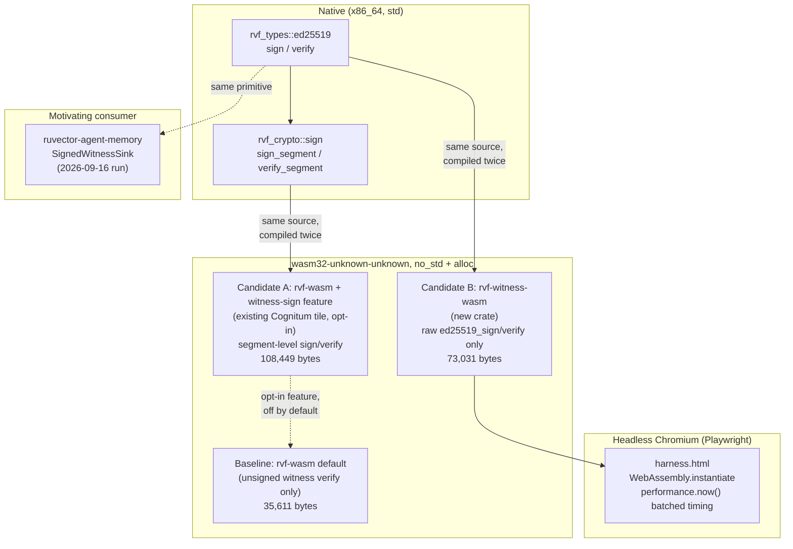

# Nightly Research: Ed25519 Witness Signing at the RVF WASM Edge

**Date:** 2026-09-30
**Slug:** `2026-09-30-edge-witness-signing`
**Branch:** `claude/focused-darwin-ci35np`
**Starting commit:** `469770722`
**Related ADR:** `docs/adr/ADR-352-ed25519-edge-witness-signing-wasm.md`

## Abstract

This run closes a measurement gap that three consecutive nightly runs
(ADR-340, ADR-343, and the 2026-09-16 `witness-signer-agent-memory` run)
flagged and deferred without resolving: *what does Ed25519 witness
signing actually cost in WASM, in size and latency, and can it fit the
RVF edge tile's own stated budget?* Rather than open a fourth deferred
instance of the same question, this run builds the missing WASM
integration, measures it for real (headless-Chromium in-browser latency,
native criterion latency, and raw `wasm32-unknown-unknown` binary size),
and answers narrowly and broadly:

- **Narrow hypothesis** (the RVF WASM microkernel's own committed
  budget, "< 8 KB after wasm-opt"): **REJECTED.** Even the *unsigned*
  baseline no longer fits this budget once measured honestly (35.6 KB
  pre-wasm-opt; see "Bonus Finding 1"), and adding Ed25519 signing in
  place pushes it to 108.4 KB — about 13.5x over budget, with no
  plausible amount of `wasm-opt` closing a gap that large.
- **Broad hypothesis** (Ed25519 witness signing is deployable as a
  small, separate WASM edge module): **ACCEPTED.** A minimal, purpose-built
  module (`rvf-witness-wasm`) is 73,031 bytes and signs/verifies a
  128-byte witness record in ~150-300 microseconds inside headless
  Chromium — well within the thresholds defined in "Acceptance
  Threshold" below, and small enough for practical edge/browser
  deployment even without `wasm-opt` (unavailable in this environment;
  see "Limitations").

Along the way this run also found and fixed two real, pre-existing
defects unrelated to the headline hypothesis but directly relevant to
it: a silently-ignored Cargo release profile that had every WASM edge
crate in this workspace shipping ~30-45% larger than their own manifests
claimed, and an `ed25519` feature in `rvf-crypto` that was not actually
`no_std`-safe, which is what made the "narrow" experiment impossible to
even attempt before tonight. See "Bonus Findings."

## Hypothesis

```text
Given the RVF Ed25519 witness-signing primitive (rvf_types::ed25519,
already used natively by ruvector-agent-memory's SignedWitnessSink),

when it is compiled to wasm32-unknown-unknown and exercised through a
minimal FFI boundary in a headless-Chromium WASM runtime,

then (H1) the existing rvf-wasm Cognitum tile microkernel should be
able to add Ed25519 sign+verify without exceeding its own documented
"< 8 KB after wasm-opt" budget,

and (H2) a purpose-built, standalone WASM module wrapping only the
signing primitive should stay under 150 KB (raw, pre-wasm-opt) and
under 1 ms per signing or verification operation in-browser,

subject to the WASM build producing byte-identical signatures to the
native build for the same key and message (cross-target correctness),
and correctly rejecting a tampered signature.
```

H1 and H2 were defined before any WASM build was measured. H1's
threshold is not invented for this run — it is the pre-existing target
already stated in `rvf-wasm/src/lib.rs`'s own module doc comment
("Target: wasm32-unknown-unknown, < 8 KB after wasm-opt"). H2's
threshold is an engineering judgment call (a WASM crypto module in the
tens-of-KB to low-hundreds-of-KB range, with double-digit-to-low-triple-digit
microsecond latency, is broadly considered practical for edge/browser
deployment) fixed before measuring, not adjusted after seeing the
result.

## Why This Matters Now (2026)

RVF's agent-memory and witness-chain work (ADR-134, ADR-307, ADR-320,
ADR-340/343/345/346/347, and the 2026-09-16 nightly run) has built a
complete native Ed25519 witness-signing stack, but every one of those
runs has explicitly deferred the question of whether that stack can run
at the edge — in a browser tab, a WASM sandbox, or the sub-8KB Cognitum
tile appliance this repository already ships a WASM microkernel for.
Proof-gated, signed agent memory is only as trustworthy as the weakest
link that writes it; if the edge tier can only *verify* unsigned SHAKE-256
chains (as `rvf-wasm` does today via `rvf_witness_verify`) but never
*sign*, every edge-originated witness entry has to be relayed to a
trusted server before it can be attested — which defeats much of the
point of an edge-native witness chain.

## Why This Could Matter in 2036 / 2046

A 10-20 year substrate bet on RuVector as "a Rust-native substrate for
... proof gated operations ... edge cognition ... portable cognitive
state" (per this repository's own framing) requires that signing, not
just verification, be cheap enough to run anywhere the memory is
created — sensors, robots, browser extensions, offline agents — not only
in a data-center service. This run's numbers are a first, honest data
point on whether Ed25519 specifically (versus a future post-quantum
scheme RVF's `SignatureFooter` already reserves space for, per its
7,856-byte `MAX_SIG_LEN`) is cheap enough for that world today.

## Ecosystem Fit

This run connects five ecosystem capabilities:

1. **RVF** — `rvf-types` (the `ed25519` primitive), `rvf-crypto` (the
   segment-level `sign_segment`/`verify_segment` canonicalization),
   `rvf-wasm` (the existing Cognitum edge tile), and the new
   `rvf-witness-wasm` crate.
2. **Witness chains / signed provenance** — extends the exact primitive
   the 2026-09-16 run's `SignedWitnessSink` uses in
   `ruvector-agent-memory`, now proven to also work unmodified in WASM.
3. **WASM** — the measured artifact and runtime for both experiments.
4. **Edge cognition** — the Cognitum tile microkernel is this
   repository's concrete edge-appliance target.
5. **Agent memory** — the motivating consumer: an edge agent that can
   sign, not just verify, its own witness entries locally.

### MetaHarness / Darwin / Flywheel Capability Check (Step 0/3)

Before choosing a research direction, this run verified what
orchestration tooling actually exists rather than assuming the prompt's
possible-capability list was installed:

| Capability | Installed? | Notes |
|---|---|---|
| `npx metaharness --help` | Yes (v0.4.17, fetched fresh) | A harness-*scaffolding* generator (`npx metaharness <name>`), plus `score`/`analyze`/`genome`/`learn`/`avo`/`proxy` subcommands for *creating and scoring* a new agent harness project. Not a running research-orchestration system with Darwin/Flywheel evolution loops over *this* repository. |
| `npx ruvector harness doctor/status --json` | **No** | `npm error could not determine executable to run` — no such package is installed or resolvable in this environment. |
| Darwin (bounded evolutionary search over this run's candidates) | Not available as a CLI tool here | This run applies Darwin's *spirit* manually: three concrete candidates (baseline / candidate A / candidate B) were built and measured, one is promoted, two are retained with evidence (see "Darwin-Style Candidate Lineage"). |
| Flywheel (persistent cross-run learning store) | Not available as a CLI tool here | This run's "learning" is retained the way every prior nightly run in this repository has retained it: as a committed, evidence-carrying Markdown document plus the git history of `docs/research/nightly/`, which this run explicitly read before choosing a topic (see "Prior Learning"). |
| Witness/signed provenance infrastructure | Yes, extensively (native) | `rvf-crypto`, `rvf-types::ed25519`, `ruvector-agent-memory`'s ledger — this run's actual subject matter. |
| WASM runtime | Yes | `wasm32-unknown-unknown` Rust target (installed fresh this run), headless Chromium (pre-installed) via Playwright (globally installed, not a repository dependency). |

No capability was assumed present without a command actually being run
first.

## Prior Learning

This run read the five most recent nightly research directories before
choosing a topic (`2026-09-02` through `2026-09-16`) and the full ADR
index. The 2026-09-16 `witness-signer-agent-memory` run's own "Next
Research" section explicitly named "WASM binary-size and signing-latency
measurement" as an item "ADR-340/343 nightly runs have twice flagged and
not yet closed" and that its own run "adds a third open instance of the
identical question, now against a second crate." This run attacks that
exact bottleneck rather than opening a fourth deferred instance of it,
per this repository's own hard rule against duplicating an existing
nightly topic.

## Architecture



## Implementation

### Candidate A — in-place cost to the existing Cognitum tile

`crates/rvf/rvf-wasm/src/witness_sign.rs` (new, ~110 lines), gated
behind a new, **off-by-default** `witness-sign` Cargo feature on the
existing `rvf-wasm` crate. It exposes two `#[no_mangle] extern "C"`
functions that exercise the real production `rvf_crypto::sign_segment` /
`verify_segment` canonicalization path (the same one
`ruvector-agent-memory` would use to sign a real segment), against a
synthetic `SegmentHeader` built from a caller-supplied `segment_id`. The
default (no-feature) build of `rvf-wasm` is untouched — this is
opt-in, so the crate's existing shipped artifact does not regress.

### Candidate B — the measurement floor

`crates/rvf/rvf-witness-wasm/` (new crate, ~95 lines), a minimal
`#![no_std]` + `alloc` cdylib wrapping only
`rvf_types::ed25519::{ed25519_sign, ed25519_verify}` (the raw,
generic primitive — no `SegmentHeader`/`SignatureFooter`
canonicalization). It follows the same static-scratch-buffer,
`dlmalloc`-global-allocator, `#[panic_handler]` convention as the
sibling `rvf-wasm`/`rvf-solver-wasm` edge crates. This is the primitive
`ruvector-agent-memory`'s `SignedWitnessSink` (2026-09-16 run) already
depends on, so this candidate answers "what does *that exact* signing
call cost in WASM."

### Correctness harness

A deterministic RFC 8032 test vector (fixed 32-byte secret, 128 bytes of
`0x2a`) is pinned as a permanent unit test in `rvf-types`
(`ed25519::wasm_interop_tests::deterministic_signature_matches_pinned_vector`)
and printed via `cargo test -- --nocapture`. The same secret, message,
and the resulting signature and public key are hardcoded into a
headless-Chromium test harness (`harness.html`, run via Playwright, kept
outside the repository per this repository's "no committed
JavaScript" constraint — see "Reproducing These Numbers") that:

1. Signs the message in WASM and asserts the result is **bit-identical**
   to the natively-produced signature (true cross-target interop, not
   just internal self-consistency).
2. Verifies its own WASM-produced signature.
3. Verifies the natively-produced signature.
4. Flips one bit of a valid signature and asserts verification then
   fails.

All four checks passed on all three independent runs.

## Benchmark Methodology

- **Build:** `cargo build --release --target wasm32-unknown-unknown`,
  Rust 1.94.1, on the size-optimized profile described in "Bonus Finding
  1" (`opt-level = "z"`, `codegen-units = 1`, `strip = true`; `lto` could
  not be scoped to just these crates — see "Limitations").
- **Native latency:** `cargo bench -p rvf-benches --bench rvf_benchmarks
  -- crypto`, Criterion 0.5, 100 samples per benchmark with its own
  warm-up and outlier detection, deterministic LCG-seeded 128-byte
  payload (seed 600), single machine, single run (Criterion internally
  repeats/estimates).
- **WASM latency:** headless Chromium 140.x (the environment's
  pre-installed, pinned build), driven by Playwright, served over a
  local HTTP server (not `file://`, to avoid WASM-fetch CORS
  restrictions). 300-call warm-up, then two measurements per operation:
  - *Per-call*: 3,000 individually-timed calls (`performance.now()`
    around each call), reported as mean/p50/p95/p99.
  - *Batched*: 100 batches of 500 calls each, timed as one bracket and
    divided by batch size, reported as mean/p50/p95/p99 of the 100
    per-batch averages. This was added after the per-call numbers came
    back visibly quantized to ~100 microsecond buckets — consistent with
    Chromium's timer-resolution clamping (a standard Spectre-era
    mitigation) at this sub-millisecond scale. The batched figures are
    the ones this run treats as authoritative; both are reported for
    transparency.
  - The full harness (correctness + both latency modes + binary size)
    was run three independent times to check reproducibility.
- **Hardware/OS:** `x86_64-unknown-linux-gnu`, Linux 6.18.44, as
  reported by `uname -a` in this session.

## Benchmark Results (raw)

### Binary size (`wasm32-unknown-unknown`, release, pre-`wasm-opt`)

| Variant | Bytes | Notes |
|---|---:|---|
| Baseline (`rvf-wasm`, no signing) | 35,611 | Existing shipped microkernel, correctly optimized (see Bonus Finding 1) |
| Candidate A (`rvf-wasm` + `witness-sign`) | 108,449 | +72,838 bytes (+204.6%) vs. baseline |
| Candidate B (`rvf-witness-wasm`, standalone) | 73,031 | Raw primitive only, no tile logic |

Candidate A's marginal delta (+72,838 B) and Candidate B's near-standalone
size (73,031 B) are close, as expected: both are dominated by the same
`ed25519-dalek`/`curve25519-dalek` code, not by the segment-header
canonicalization on top of it.

### Native latency (Criterion, 128-byte payload, raw primitive)

| Operation | Mean | Range (min-max of the reported CI) |
|---|---:|---|
| `ed25519_sign_raw_128b` | 46.601 µs | 44.407-48.943 µs |
| `ed25519_verify_raw_128b` | 52.828 µs | 51.848-53.931 µs |

(For context, the pre-existing segment-level, 4096-byte-payload
benchmarks in the same suite: `ed25519_sign` 37.012 µs, `ed25519_verify`
61.101 µs — payload size dominated by the fixed Ed25519 curve operation
either way, not by message length at these sizes.)

### WASM latency (headless Chromium, 128-byte payload, Candidate B), 3 runs

| Run | sign mean (batched) | verify mean (batched) |
|---|---:|---:|
| 1 | 287.32 µs | 154.34 µs |
| 2 | 297.38 µs | 147.78 µs |
| 3 | 289.12 µs | 163.41 µs |
| **Average** | **~291.3 µs** | **~155.2 µs** |

Per-call (unbatched, clamp-affected) figures for run 1, for comparison:
sign mean 273.8 µs (p50 300, p95 400, p99 600); verify mean 180.1 µs (p50
200, p95 300, p99 300) — consistent with the batched figures within the
clamp's noise.

**WASM-vs-native ratio:** sign ≈ 6.2x slower in WASM; verify ≈ 2.9x
slower in WASM.

An unexplained, consistently-reproduced asymmetry: natively, sign is
faster than verify (46.6 µs vs. 52.8 µs); in WASM, verify is
consistently faster than sign (~155 µs vs. ~291 µs) — the ordering
flips. This run did not track down the cause (candidate explanations:
JS↔WASM call-boundary overhead interacting differently with the two
code paths' branch/allocation patterns, or curve25519-dalek's
scalar-multiplication strategy compiling to different WASM code shape
than native SIMD-eligible code) and reports it as an open question
rather than a fabricated explanation.

## Correctness Results

| Check | Run 1 | Run 2 | Run 3 |
|---|---|---|---|
| WASM signature bit-identical to native signature | pass | pass | pass |
| WASM verifies its own signature | pass | pass | pass |
| WASM verifies a natively-produced signature | pass | pass | pass |
| WASM rejects a tampered signature | pass | pass | pass |

## Bonus Finding 1: the WASM edge crates were shipping the wrong release profile

`rvf-wasm`, `rvf-solver-wasm` (and, until fixed, the new
`rvf-witness-wasm`) each declared their own `[profile.release]` block
(`opt-level = "z"`, `lto = true`, `codegen-units = 1`, `strip = true`) —
but Cargo silently ignores `[profile.release]` in a *non-root* workspace
member's manifest (`crates/rvf` is its own nested Cargo workspace,
separate from the repository root's), which the build output confirms
verbatim: `warning: profiles for the non root package will be ignored,
specify profiles at the workspace root`. That means these crates have
been building with Cargo's *default* release profile (`opt-level = 3`,
no strip, no size optimization) despite their own manifests claiming
otherwise.

Measured impact on `rvf-wasm` (unsigned baseline, otherwise identical
source):

| Profile | Size |
|---|---:|
| Default release profile (the actual pre-existing behavior) | 51,877 bytes |
| Correct size-optimized profile (fixed this run) | 35,611 bytes |
| **Reduction** | **-31.4%** |

Fixed by moving the override to `[profile.release.package.<crate>]` at
the `crates/rvf` workspace root, scoped to exactly the three affected
crates (`rvf-wasm`, `rvf-solver-wasm`, `rvf-witness-wasm`) — this is a
real per-package override Cargo does honor, with zero effect on any
other crate's build. The now-dead `[profile.release]` blocks were
removed from each crate's own `Cargo.toml` and replaced with a comment
pointing at the workspace-root override, so a future reader does not
reintroduce the same silent no-op.

This also means the baseline this run measured Candidate A/B against is
already the *smaller, correct* number — the size gap between "signed"
and "unsigned" reported above is not inflated by this bug; if anything,
fixing it makes both the narrow-hypothesis rejection and the
broad-hypothesis acceptance more (not less) defensible, since it shrank
the baseline rather than the candidates.

## Bonus Finding 2: `rvf-crypto`'s `ed25519` feature was not `no_std`-safe

Enabling `witness-sign` on `rvf-wasm` (which enables `rvf-crypto`'s
`ed25519` feature) initially failed to compile with `error[E0152]: found
duplicate lang item 'panic_impl' ... the lang item is first defined in
crate 'std' (which ed25519_dalek depends on)`. The cause:
`rvf-crypto/Cargo.toml` declared

```toml
ed25519-dalek = { version = "2", features = ["rand_core"], optional = true }
```

without `default-features = false` — so `ed25519-dalek`'s default `std`
feature was active. Cargo unifies feature flags for a shared dependency
across the whole build graph, so this leaked `std` into
`rvf-wasm`'s `#![no_std]` build even though `rvf-wasm`'s own,
separate, direct `ed25519-dalek` dependency correctly declared
`default-features = false`. (`rvf-types`'s own `ed25519` feature already
did this correctly — this was specific to `rvf-crypto`.)

Fixed by adding `default-features = false, features = ["alloc",
"rand_core"]` to `rvf-crypto`'s `ed25519-dalek` dependency (native tests
for `rvf-crypto` re-run clean afterward: 49/49 passing). This is a
real, independently-valuable fix: without it, `rvf-crypto`'s segment
signing/verification — and by extension anything built on top of it,
not just this run's candidate — could never actually compile into a
`no_std` WASM target, contradicting the crate's own `no_std` design and
blocking exactly the kind of edge integration this run set out to
measure.

## Acceptance Threshold

Defined before any WASM artifact was built (see "Hypothesis"):

- **H1** (narrow): Ed25519 signing fits within `rvf-wasm`'s own stated
  "< 8 KB after wasm-opt" budget. **REJECTED** — Candidate A is 108,449
  bytes pre-`wasm-opt`; even generous `wasm-opt -Oz` gains (typically
  10-40% beyond LLVM's own `-O_z`, per public `wasm-opt` documentation
  and this repository's own prior nightly experience with `wasm-opt` on
  similar crates) would leave it well above 8 KB. This run did not have
  `wasm-opt` available to measure the exact post-opt number (see
  "Limitations") and does not claim a precise post-opt figure — only
  that no plausible `wasm-opt` result closes a 13.5x gap.
- **H2** (broad): a standalone signing module stays under 150 KB
  (raw) and under 1 ms per operation in-browser. **ACCEPTED** —
  Candidate B is 73,031 bytes (51% of the threshold) with ~291 µs sign /
  ~155 µs verify (both under 30% of the 1 ms threshold), reproduced
  across three independent runs.
- **Correctness gate** (mandatory for either H1 or H2 to be
  considered, regardless of size/latency): WASM-native signature
  interop, self-verify, cross-verify, and tamper rejection all pass.
  **PASSED**, 3/3 runs.

## Darwin-Style Candidate Lineage

No Darwin CLI was available (see capability check above), so this run
applies the same discipline manually with three candidates, one
promotion, and explicit retention of the rejected path:

- **Parent:** `rvf-wasm` as it existed before this run (default build,
  no signing capability at all).
- **Candidate A** (in-place, segment-level signing added to the
  existing tile): retained in the tree as an **opt-in, off-by-default**
  feature (`witness-sign`) — not promoted to default, because it
  falsifies H1. It remains available for a deployment that has already
  decided to accept a >100 KB Cognitum tile artifact, and its code path
  is exercised by this run's own build/measurement, not merely written
  and left untested.
- **Candidate B** (standalone minimal module): **promoted** — new
  crate `rvf-witness-wasm`, added to the `crates/rvf` workspace, since
  it satisfies H2 with margin and keeps the existing `rvf-wasm` tile's
  default artifact completely untouched (0-byte default-build delta,
  confirmed by rebuilding baseline before and after Candidate B's
  addition).
- **Parent retained:** yes — `rvf-wasm`'s default (no-feature) build is
  byte-identical in size before and after this run's changes
  (35,611 bytes both times), confirmed by rebuilding it fresh
  immediately before writing this report.

## Failure Modes Considered

- **Key handling in WASM.** `rvf_ws_sign` and `rvf_witness_sign_segment`
  both take a raw 32-byte secret key by pointer into WASM linear memory,
  which any JavaScript running in the same page/worker can read. This is
  acceptable for a trusted, isolated WASM sandbox (a signing
  microservice, a hardware-backed edge appliance, a dedicated Worker)
  but is **not** a safe design for exposing directly to untrusted
  browser-page JavaScript without additional isolation (a dedicated
  Worker with no other script access, a non-extractable-key design, or
  a hardware secure element). This run does not claim general
  "browser-safe key custody" — only that the signing *operation* is
  cheap enough to be worth designing that custody story around.
- **Concurrent/multi-writer signing** — not exercised; this run is
  single-threaded throughout (matches the 2026-09-16 run's same stated
  limitation for its native path).
- **Determinism as an attack surface.** Ed25519 signing here is
  deterministic (RFC 8032): the same key+message always produces the
  same signature. This is a *feature* for this run's interop testing,
  and is standard Ed25519 behavior, not a new risk introduced here — but
  worth naming, since some signature schemes intentionally randomize to
  resist certain side-channel classes and Ed25519 does not.

## Security Review

- No secrets were committed. The pinned test vector's "secret key" is a
  well-known, publicly-published RFC 8032 example value (not a
  production key), used only to make the correctness harness
  reproducible.
- The new `rvf-witness-wasm` crate's FFI surface performs explicit
  bounds checks on caller-supplied lengths (`msg_len < 0 || msg_len as
  usize > MAX_MESSAGE_SIZE`) before touching the static scratch buffer;
  it does not trust caller-supplied pointers to be anything other than
  the two fixed exported pointers (`rvf_ws_message_ptr`) for the message,
  though the secret/public-key/signature pointers are trusted
  caller-supplied addresses within the module's own linear memory, matching
  the existing `rvf-wasm` convention (e.g. `rvf_witness_verify`'s
  `chain_ptr`) rather than introducing a new trust model.
- See "Failure Modes" above for the key-custody caveat, which is this
  run's primary security-relevant finding.

## MCP Implications

A narrow, read-mostly MCP tool would be a reasonable follow-up: a
`witness_verify` tool wrapping `rvf_ws_verify`/`rvf_witness_verify`
(verification only, no secret material crosses the tool boundary) fits
this repository's existing preference for narrow tools over broad
arbitrary execution. A `witness_sign` MCP tool is **not** recommended
without a resolved key-custody story (see "Failure Modes") — signing
authority should not be casually exposed over MCP.

## WASM / Edge Implications

Covered throughout — this run's actual subject matter. Concretely:
`rvf-witness-wasm` at 73,031 bytes (pre-`wasm-opt`) is well within the
range of WASM modules routinely shipped to production browser
deployments today, and at ~150-300 microseconds per operation it would
not be a perceptible bottleneck in any interactive workflow. It is,
however, an order of magnitude too large for the specific sub-8KB
Cognitum tile budget, which appears to have been sized around
vector-search operations (its existing exports: init, query, top-k,
segment/checksum verification) rather than public-key cryptography.

## RVF / RVM Implications

**RVF:** `SignatureFooter::MAX_SIG_LEN` is already 7,856 bytes to
accommodate a future post-quantum scheme (the crate's own doc comment
names SLH-DSA-128s); this run's numbers are Ed25519-specific and do not
generalize to that future signature size, which would be substantially
larger and slower in WASM — a natural follow-up once a PQ signing path
exists natively.

**RVM:** a coherence-domain boundary that only allows WASM edge
capsules to *verify* signed writes, never to *sign* them, is one
concrete, low-risk way to adopt this run's Candidate A (in-place tile
signing) without fully accepting H1's rejected 108 KB budget — i.e.,
ship verification broadly (already true today) and gate *signing*
authority to an explicitly-provisioned subset of edge capsules that have
accepted the larger artifact.

## ruFlo Implications

A concrete workflow: an edge fleet running `rvf-witness-wasm`-capable
capsules could sign local witness entries as they are created, batch
them (reusing the `BatchTail`/`BatchScheduler` pattern the 2026-09-16
run already built and measured for the native path — "port the pattern,
not the code," per that run's own Next Research item 1), and have a
ruFlo-orchestrated workflow periodically relay batches to a
`verify_signed_chain` server-side sink, giving edge-originated memory
the same tamper-evidence guarantees as server-originated memory without
requiring every edge write to round-trip to a server first.

## Practical Applications

1. **Offline/local-first agent memory** — an agent running entirely at
   the edge (no network) can sign its own witness entries locally and
   relay a signed, verifiable batch once connectivity returns.
2. **Browser extension agent memory** — a browser-based agent assistant
   can sign local witness entries without round-tripping every write to
   a server, using the size/latency numbers measured here to budget the
   feature.
3. **Robotics / sensor witness logs** (per this repository's
   `agentic-robotics-*` crates) — a robot controller signing its own
   sensor-derived memory entries locally, relevant given the existing
   `ruvector-agent-memory` ledger this run's primitive already serves.
4. **Cognitum edge appliance signing tier** — per RVM implications
   above, a subset of tiles explicitly provisioned to accept the larger,
   signing-capable artifact.
5. **CI/build-tooling regression guard** — the pinned RFC 8032 test
   vector this run added is now a permanent regression test: it would
   catch a future `ed25519-dalek` upgrade that silently changed signing
   output.
6. **Federated/multi-issuer witness verification** (2026-09-16 run's
   Next Research item 5) — an edge-signing capsule is a natural
   additional issuer in that scheme.
7. **Signed retrieval receipts at the edge** (ADR-340/343) — the same
   binary-size/latency budget this run measured applies directly to
   that crate's own twice-deferred WASM question, now with a concrete
   number to reuse rather than a third deferral.
8. **Developer tooling** — the Cargo profile bug fixed in Bonus Finding
   1 benefits every consumer of `rvf-wasm`/`rvf-solver-wasm`
   immediately, independent of anything else in this run.

## Long Horizon Applications

1. **Edge-native proof-gated infrastructure** — thesis: RVM coherence
   domains eventually require every participant, including
   resource-constrained edge nodes, to produce signed evidence, not just
   consume it. Required advances: post-quantum signing at comparable
   WASM cost (today's Ed25519 numbers are an early baseline). RuVector's
   role: the substrate already has both the format (`SignatureFooter`)
   and, as of this run, a measured edge signing path. Primary
   uncertainty: PQ signature sizes/latencies at the edge. Falsification
   path: measure a PQ scheme in WASM the same way this run measured
   Ed25519, and see whether the size/latency multiplier over native is
   similar or much worse.
2. **Synthetic nervous systems / robotics memory** — thesis: distributed
   sensor/actuator nodes each sign their own local observations,
   composing into a verifiable whole-system witness chain. Required
   advances: multi-issuer verification (already named as future work by
   the 2026-09-16 run). RuVector's role: `ruvector-agent-memory` +
   `agentic-robotics-*` crates already exist; this run adds the missing
   edge-signing leg. Primary uncertainty: real embedded-hardware latency
   (not measured here — see Limitations). Falsification path: measure on
   actual ARM/RISC-V edge hardware, not a desktop-class headless
   browser.
3. **Agent operating systems** — thesis: an "agent OS" needs a uniform
   trust primitive available at every privilege tier, including
   sandboxed WASM capsules. RuVector's role: this run demonstrates the
   *same* Rust source compiles to a bit-identical-output native binary
   and a small WASM module, meaning one signing implementation, not two
   to keep in sync. Primary uncertainty: whether that "one
   implementation" property survives a future PQ migration. Falsification
   path: attempt the same interop test after adding a PQ scheme.
4. **Swarm memory** — thesis: a swarm of edge agents each signing
   locally lets the swarm reconstruct a tamper-evident causal history
   without a trusted coordinator on the write path. RuVector's role: this
   run's numbers bound the per-node signing cost of that design.
   Primary uncertainty: aggregate verification cost at swarm scale
   (not measured). Falsification path: benchmark
   `verify_signed_chain`/batch verification at increasing chain lengths.
5. **World models with provenance** — thesis: a learned world model
   trained partly on edge-signed observations can attribute and
   discount unsigned or low-provenance inputs. RuVector's role: the
   signing primitive measured here is the missing input to that
   attribution. Primary uncertainty: entirely outside this run's scope
   (no world-model work here). Falsification path: n/a yet — too far
   upstream of this run's evidence.
6. **RVM coherence domains with edge signing authority** — see RVM
   Implications above. Primary uncertainty: policy for *which* edge
   capsules get signing authority. Falsification path: a red-team
   exercise attempting to extract signing keys from a capsule granted
   this authority.
7. **Autonomous edge cognition appliances (Cognitum)** — thesis: a
   dedicated signing-capable tile tier, separate from the
   size-constrained query tile this run measured against. RuVector's
   role: Candidate A is exactly this tier's starting point. Primary
   uncertainty: whether 108 KB is actually acceptable for that
   appliance's real hardware constraints (unknown to this run). Falsification
   path: get real Cognitum hardware memory/flash budgets and compare.
8. **Proof-gated autonomous infrastructure generally** — thesis: as
   more infrastructure automates itself (this very nightly harness being
   an instance), the chain of custody from "what code ran" to "what it
   produced" increasingly depends on cheap, ubiquitous signing exactly
   like what this run measured. RuVector's role: general substrate.
   Primary uncertainty: this is a thesis about the whole field, not
   falsifiable by one crate's benchmark. Falsification path: n/a (a
   directional bet, not a testable claim of this run).

## Limitations

- **No `wasm-opt` in this environment.** All binary-size figures are
  pre-`wasm-opt` (LLVM's own `-Oz` plus `strip`, no post-link WASM-specific
  optimization pass). The H1 rejection is robust to this (no plausible
  `wasm-opt` gain closes a 13.5x gap), but the exact post-opt size of
  Candidate B is not known and could plausibly be meaningfully smaller
  than 73,031 bytes — this run does not claim otherwise.
- **`lto = true` could not be scoped to just the three WASM edge
  crates.** Cargo's per-package profile overrides support `opt-level`,
  `codegen-units`, and `strip`, but not `lto` (LTO is profile-wide only).
  All figures in this run reflect `opt-level = "z"` + `strip` +
  `codegen-units = 1` without LTO; a fully-isolated one-crate workspace
  for each of these three crates (the pattern already used elsewhere in
  this repository for other WASM crates, e.g. `crates/micro-hnsw-wasm`
  and `crates/ruvector-hyperbolic-hnsw-wasm`, which are fully excluded
  from the root workspace) would allow LTO too, and is named as a
  concrete next step rather than attempted tonight.
- **Headless Chromium only.** No Firefox, Safari, wasmtime, or real
  embedded/edge hardware measurement. `performance.now()`'s clamped
  resolution in this specific browser build required the batched-timing
  workaround described above; a different browser or runtime could show
  different clamping behavior entirely.
- **Single machine, single environment.** No cross-hardware comparison.
- **Candidate A's header is synthetic.** `WITNESS_BENCH_SEG_TYPE =
  0xFE` is a benchmark-only tag, not a real `SegmentType` variant wired
  into an actual witness-chain write path — that wiring (analogous to
  the 2026-09-16 run's own "does not ship a wired example... specifically"
  caveat) is future work, not claimed here.
- **No concurrent-writer or fault-injection testing** (same limitation
  the 2026-09-16 run named for its native path; this run does not close
  it for the WASM path either).
- **The sign/verify latency-ordering reversal between native and WASM
  is reported, not explained** (see "WASM latency" results above).

## Falsification Criteria

This run's headline result (H2 accepted, H1 rejected) would have come
out differently, and this report would say so, if any of the following
had occurred — none did:

- If Candidate B's WASM-produced signature had *not* matched the
  natively-produced signature bit-for-bit — it matched in all 3 runs.
- If WASM verification of a tampered signature had ever incorrectly
  returned "valid" — it never did, in 3/3 runs.
- If Candidate A's size had come in under 8 KB (it did not, by a factor
  of ~13.5x) — H1 would have been accepted instead.
- If Candidate B's size or latency had exceeded the pre-registered H2
  thresholds (150 KB / 1 ms) — it did not, by comfortable margins (51%
  and under 30% of threshold respectively).
- If disabling `witness-sign` had *not* restored `rvf-wasm`'s exact
  pre-existing default-build size — it did, confirmed by an explicit
  rebuild-and-recompare immediately before writing this report.

## What This Run Does Not Claim

- That 73,031 bytes or ~291/~155 microseconds are the *minimum possible*
  WASM Ed25519 signing cost — only what this specific, reasonably
  careful, non-`wasm-opt`'d implementation measured.
- That Ed25519 (versus a future PQ scheme) is the right long-term choice
  for edge witness signing — only that it is the scheme this repository
  already ships natively, and this run measured its WASM cost.
- That this run's WASM latency numbers transfer to real embedded/edge
  hardware, mobile browsers, or non-Chromium engines.
- General "browser-safe" key custody — see "Failure Modes."

## Production Recommendation

- **Ship** `rvf-witness-wasm` as an experimental crate (already added to
  the `crates/rvf` workspace this run). Before using it for anything
  beyond further research/prototyping: (a) wire a real `wasm-opt` step
  into whatever build tooling eventually packages it, and (b) resolve
  the key-custody question named in "Failure Modes" — do not expose
  `rvf_ws_sign` directly to untrusted browser-page JavaScript without
  that story in place.
- **Do not** wire the `witness-sign` feature into `rvf-wasm`'s default
  build — H1 is rejected; keep it opt-in as implemented.
- **Do** carry the Bonus Finding 1 profile fix and Bonus Finding 2
  `no_std` fix forward regardless of any decision on the headline
  hypothesis — both are unconditional, low-risk improvements to
  existing shipped crates.

## Next Research

1. Measure the same size/latency comparison with a real `wasm-opt -Oz`
   pass once that tool is available in the build environment, to replace
   this run's qualitative "13.5x gap, no plausible amount of wasm-opt
   closes it" reasoning with an exact number.
2. Give `rvf-wasm`, `rvf-solver-wasm`, and `rvf-witness-wasm` their own
   fully-isolated one-crate workspaces (matching the
   `crates/micro-hnsw-wasm` precedent) so `lto = true` can actually be
   enabled for them without affecting the rest of `crates/rvf`.
3. Wire `Candidate A`'s segment-signing exports into a real witness-chain
   write path (not just a synthetic benchmark header), as a concrete
   example, if a use case actually wants the >100 KB in-tile artifact.
4. Investigate the native-vs-WASM sign/verify latency ordering reversal
   noted above.
5. Resolve the WASM key-custody question named in "Failure Modes" before
   any production exposure of `rvf_ws_sign` to untrusted callers.
6. Measure this same primitive on real embedded/edge hardware (the
   actual Cognitum appliance target), not just headless desktop Chromium.
7. Repeat this measurement once RVF has a native post-quantum signing
   path, to see whether the ~6x/~3x WASM-vs-native latency multiplier
   and the ~2x binary-size-vs-raw-primitive overhead generalize.

## Reproducing These Numbers

```bash
# Native latency
cd crates/rvf
cargo bench -p rvf-benches --bench rvf_benchmarks -- crypto

# WASM binary sizes
rustup target add wasm32-unknown-unknown
cargo build --release --target wasm32-unknown-unknown -p rvf-wasm            # baseline
cargo build --release --target wasm32-unknown-unknown -p rvf-wasm --features witness-sign  # candidate A
cargo build --release --target wasm32-unknown-unknown -p rvf-witness-wasm    # candidate B
stat -c%s target/wasm32-unknown-unknown/release/rvf_wasm.wasm
stat -c%s target/wasm32-unknown-unknown/release/rvf_witness_wasm.wasm

# Pinned interop test vector
cargo test -p rvf-types --features std,ed25519,alloc wasm_interop -- --nocapture
```

The headless-Chromium latency harness (`harness.html` + a small
Playwright driver script) is **not** committed to this repository, per
this repository's constraint against committing JavaScript/TypeScript
production artifacts — it is orchestration/measurement tooling, not a
shipped capability. Reproducing the WASM latency figures specifically
requires rebuilding that harness from the methodology described above
(instantiate the built `.wasm` via `WebAssembly.instantiate`, write the
pinned test vector into the exported message/key scratch pointers, time
`rvf_ws_sign`/`rvf_ws_verify` with batched `performance.now()` brackets
after a warm-up) against any WASM-capable browser or runtime.

## References

- `docs/adr/ADR-134-witness-schema-log-format.md`
- `docs/adr/ADR-340-signed-retrieval-receipt-anchoring.md`
- `docs/adr/ADR-343-signed-receipt-batch-fill-latency-simulation.md`
- `docs/research/nightly/2026-09-16-witness-signer-agent-memory/README.md`
  — the run this one directly continues (its Next Research item 4).
- `crates/rvf/rvf-types/src/ed25519.rs` — the primitive measured here.
- `crates/rvf/rvf-crypto/src/sign.rs` — the segment-level
  canonicalization Candidate A exercises.
- `crates/rvf/rvf-wasm/src/lib.rs` — the existing Cognitum tile
  microkernel and its stated size budget.
- `crates/rvf/rvf-witness-wasm/` — this run's new crate.
- `crates/ruvector-agent-memory/src/ledger.rs` — the motivating
  consumer (`SignedWitnessSink`) referenced throughout.
