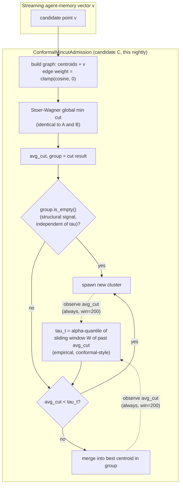

# Sliding-Window Quantile Calibration Does Not Fix Self-Calibrating Mincut Admission

**150-char summary:** Conformal-style sliding-window quantile calibration of the mincut admission threshold still drifts to the fragmentation cap — a documented, swept negative result.

**Date**: 2026-10-01
**Crate**: `ruvector-memory-admission` (`crates/ruvector-memory-admission`)
**Status**: PoC complete — **hypothesis REJECTED** (falsified on the primary, pre-registered criterion)
**ADR**: [ADR-352](../../../adr/ADR-352-conformal-quantile-calibrated-mincut-admission.md)
**Related**: [ADR-344](../../../adr/ADR-344-mincut-gated-streaming-memory-admission.md) / [2026-09-02 nightly](../2026-09-02-mincut-streaming-memory-admission/README.md) (parent work, same crate)

---

## Abstract

The 2026-09-02 nightly built `ruvector-memory-admission`: global-min-cut-gated
write-time cluster admission for streaming agent memory, with three
policies behind one `AdmissionPolicy` trait — a fixed-threshold baseline, a
fixed-`tau` min-cut candidate (**A**, accepted), and a self-calibrating
min-cut candidate (**B**) whose `tau` was set from a *lifetime* running
mean/std (Welford) of observed cut weights. Candidate B failed: its
threshold drifted to the 48-cluster safety-valve cap, losing 12.3
percentage points of recall@10 against the matched baseline. That run's own
analysis named the likely cause and a concrete next step: *"a plain running
mean/std of the global cut-weight distribution does not track the local
admission-relevant threshold... A more promising direction... would
condition the running statistic on cluster count or on the candidate's own
best-single-centroid similarity."*

This nightly attacks that open question directly with the cheapest concrete
instantiation of "condition on recency instead of the whole lifetime":
**`ConformalMincutAdmission`** (candidate **C**) replaces B's lifetime
mean/std with the empirical `alpha`-quantile of a fixed-size *sliding
window* of recently observed cut weights — conformal-prediction-style
quantile calibration, with an explicit caveat that this setting breaks the
exchangeability assumption a formal conformal guarantee requires (see
[Why "Conformal-Style" and Not "Conformal"](#why-conformal-style-and-not-conformal)).

**Measured result**: candidate C also saturates the 48-cluster safety
valve, at the pre-registered configuration (`alpha=0.15`, `window=200`) and
at three additional swept configurations run afterward to probe the
mechanism (`alpha=0.02`, `alpha=0.005`, `window=800`). The hypothesis is
**REJECTED** on its primary criterion. It is a genuine, useful negative
result with a concrete, evidence-backed root cause (below) — not a
reporting of "inconclusive" dressed up, and not a search for a passing
configuration after the fact.

| Variant | Clusters | Purity | Recall@10 | Mean insert (µs) |
|---|---|---|---|---|
| NearestCentroidThreshold (baseline, calibrated to A's budget) | 17 | 0.8285 | 0.7840 | 0.01 |
| MincutGatedAdmission (candidate A, fixed tau — for reference) | 17 | 0.8735 | 0.8623 | 17.18–19.28 |
| AdaptiveMincutAdmission (candidate B, lifetime mean/std — parent negative result) | 48 | 0.8615 | 0.6610 | 36.18 |
| **ConformalMincutAdmission (candidate C, sliding-window quantile — this nightly)** | **48** | **0.8588** | **0.7063** | **7.84** |

All numbers are from `cargo run --release -p ruvector-memory-admission
--bin benchmark` on the hardware below; raw output preserved in
[Raw Evidence](#raw-evidence). Candidate A's row is carried over for
reference (unchanged from the parent nightly; re-measured here to confirm
reproducibility on this run's build — numbers match to within normal
wall-clock noise).

**Hardware**: x86-64, Linux 6.18.44, `rustc 1.97.0`, release build.

---

## Hypothesis

Formalized and fixed *before* running the benchmark, following the parent
nightly's matched-budget methodology:

```text
Given the identical streaming workload used by the 2026-09-02 nightly
(4,000 synthetic agent-memory vectors, 8 ground-truth clusters, 64
dimensions, 20% high-noise drift points, randomly interleaved arrival
order) and the identical matched-budget baseline (NearestCentroidThreshold
calibrated via binary search to candidate A's natural cluster count, 17),

when cluster admission uses ConformalMincutAdmission — identical graph
construction and cut mechanism to candidates A and B, but tau_t set to the
empirical alpha-quantile (alpha = 0.15) of a sliding window (window = 200)
of the most recently observed average-cut weights, instead of a fixed
constant (A) or a lifetime running mean-minus-std (B, which drifted to the
48-cluster safety-valve cap and lost 12.3pp of recall@10 versus the
matched baseline),

then candidate C should land at a final cluster count within the
3x-K_true acceptance bound (<= 24 clusters) without being externally
matched/calibrated — specifically NOT repeating candidate B's runaway
drift to the safety valve,

subject to: recall@10 regression versus the matched baseline staying
within the same 2 percentage point tolerance applied to candidate B, and
mean insertion latency staying under the same 500us write-path budget
applied to A and B.

alpha = 0.15 and window = 200 were fixed before running the benchmark, not
tuned against the evaluation metrics.
```

**Falsification condition** (stated up front): if candidate C's final
cluster count exceeds the 24-cluster bound — in particular, if it also
saturates the 48-cluster safety valve — the hypothesis is rejected,
regardless of how its recall or latency compare to candidate B's.

This is a legitimate extension under the nightly process's novelty gate
(STEP 6 / STEP 1's allowed-extension list): it attacks candidate B's
*specific, documented* bottleneck with a *materially different* mechanism
(sliding window + quantile vs. lifetime mean/std), not a cosmetic rename.

---

## Result

**REJECTED.** Candidate C's final cluster count is 48 — identical to
candidate B's safety-valve saturation — at the pre-registered configuration.
The primary falsification condition is met.

| Criterion (candidate C, pre-registered: alpha=0.15, window=200) | Threshold | Measured | Verdict |
|---|---|---|---|
| Final clusters <= 24 (3x K_true) | <= 24 | 48 | **FAIL** |
| Recall@10 regression vs. matched baseline | <= 2.0pp | 7.77pp | FAIL |
| Mean insertion latency | <= 500us | 7.84us | PASS |

Two of three criteria fail; the cluster-count criterion is the one the
hypothesis was built to test, and it fails outright.

This is not a wash relative to candidate B, though — and reporting only
"REJECTED" would hide real, useful signal:

- **Recall regression is roughly half of B's**: 7.77pp vs. 12.30pp. The
  sliding window does recover *some* of the lost signal relative to a
  lifetime statistic, just not enough to clear the 2pp bar.
- **Mean latency is ~4.6x lower than B's** (7.84us vs. 36.18us) despite
  computing a sorted-quantile each step rather than an O(1) Welford
  update, because candidate C's higher `tau` values cause it to hit the
  `c >= max_clusters` safety-valve fallback path (a cheap nearest-centroid
  scan, no min-cut) far more of the time once it saturates early in the
  stream — the latency number is a side effect of the same fragmentation
  failure, not an independent win.

Both of these are *consequences* of the same failure (C saturates the cap
earlier and harder than a marginal statistic would predict), not evidence
that C's mechanism is closer to working. See root cause below.

---

## Root Cause: Why the Sliding Window Didn't Help

The parent nightly's hypothesis for B's failure was *locality*: a lifetime
statistic averages over every cluster-count regime the stream has passed
through, so it stops representing "what counts as weak attachment *right
now*" once the graph has grown. A sliding window directly fixes that
specific defect — and still fails identically. Three follow-up configurations,
run *after* seeing the primary result specifically to find out why (labeled
exploratory, not substituted for the primary 15/200 result — see
[Raw Evidence](#raw-evidence)), rule out "wrong alpha" or "window too small"
as the explanation:

| Configuration | Final clusters | Recall@10 | Mean latency |
|---|---|---|---|
| alpha=0.15, window=200 (pre-registered) | 48 | 0.7063 | 7.84us |
| alpha=0.02, window=200 | 48 | 0.6297 | 21.85us |
| alpha=0.005, window=200 | 48 | 0.6863 | 104.64us |
| alpha=0.15, window=800 | 48 | 0.6383 | 15.72us |

Every configuration saturates to 48, including `alpha=0.005` — numerically
the *same alpha value* as candidate A's hand-tuned fixed `tau=0.005`. That
is the key diagnostic: if self-calibration's only problem were "it's
measuring the wrong summary statistic of the right distribution," matching
alpha to A's constant should reproduce something close to A's behavior.
It doesn't, which points at a different and more specific explanation:

`MincutGatedAdmission`'s spawn/merge decision (`policy.rs::should_spawn`)
has **two independent spawn triggers**, not one:

1. `avg_cut < tau` — the threshold-gated path, the only one any
   self-calibration scheme (B or C) touches.
2. `group.is_empty()` — the candidate point is alone on its own side of
   the global min cut, with >= 2 existing clusters in the graph. This is
   a **structural** signal, independent of `tau` entirely, and fires
   whenever the cut topology isolates the candidate regardless of cut
   *weight*.

Candidate A's fixed `tau = 0.005` is low enough that, empirically, path 1
almost never fires — nearly all of A's 17 spawn decisions come from path 2,
the tau-independent structural rule. A's "threshold" is, in practice,
barely load-bearing; what makes A work is the *cut topology* signal, not
the *cut weight* threshold. Self-calibration (B and C alike) necessarily
targets a central-to-moderate value of the *observed cut-weight
distribution* — even an aggressive `alpha=0.005` sliding-window quantile is
the 0.5th-percentile of whatever weights the window actually contains, not
literally the constant `0.005`, and that window apparently never realizes
values anywhere near as low as A's hand-picked constant. The self-calibrated
`tau` therefore sits high enough above the true "genuinely degenerate cut"
region that path 1 fires constantly *in addition to* path 2's structural
spawns that A alone relies on, and the two compound into runaway growth
regardless of whether the calibration statistic is a lifetime mean/std or
a windowed quantile.

**This reframes the open question the parent nightly left**: "condition the
running statistic on cluster count or local similarity" (as suggested
there) is not obviously sufficient either, because the deeper issue is not
*which* summary statistic of the cut-weight distribution to use — it's that
**no summary statistic of the cut-weight distribution** is the right thing
to threshold against, when the policy that actually works is relying on a
*structural* (topological) signal the threshold barely touches. A future
attempt at self-calibration for this policy should either (a) calibrate
against something structurally meaningful — e.g., the gap between the
cut weight and the next-best alternative cut, or the candidate's own
best-single-centroid cosine similarity (the parent nightly's other named
direction, genuinely distinct from this one) — or (b) accept that `tau`'s
practical role here is a rarely-triggered safety threshold underneath a
structural rule, and stop trying to self-calibrate it from the weight
distribution at all.

---

## Why "Conformal-Style" and Not "Conformal"

Split conformal prediction's distribution-free coverage guarantee (Vovk,
Gammerman & Shafer; Lei et al. 2018; standard in the 2024–2026
uncertainty-quantification literature cited below) requires the
calibration set and the test point to be **exchangeable** — informally,
that the calibration data isn't influenced by the same process being
evaluated on the test point. That assumption is violated here by
construction: candidate C's calibration window is built from its own past
admission decisions' cut weights, which are decided *by the same tau the
window produces*, and the policy's current cluster count (a direct
function of all its own past decisions) is exactly the thing this nightly
measures as the confound. No formal coverage guarantee is claimed for
`alpha`, and none should be inferred from the "conformal-style" name — it
describes the *mechanism* (empirical-quantile thresholding over a
calibration buffer), not a transplanted guarantee. This caveat is stated in
the code (`policy.rs::ConformalMincutAdmission` doc comment) as well as
here, deliberately, rather than left implicit — STEP 31 of the nightly
process exists specifically to prevent exactly this kind of unearned
authority transfer from a cited technique's name.

---

## Why This Matters for RuVector

| Theme | Connection |
|---|---|
| Agent memory | Same lifecycle stage as ADR-344 (write-time cluster admission), same crate — this nightly narrows, not widens, the production-readiness picture for that work by closing off a self-calibration avenue the parent nightly left open. |
| Graph coherence / mincut | Deepens the understanding of *why* `ruvector-memory-admission`'s global-min-cut gate works: the structural (topological) component of the Stoer-Wagner cut, not the scalar weight threshold, is now shown to carry most of candidate A's signal — a finding relevant to any future RuVector work building on this cut (`ruvector-mincut`, `ruvector-attn-mincut`, `ruvector-namespace-merge`'s dual S-T formulation). |
| Flywheel | A second preserved negative result (alongside candidate B) for the same open question, now with a falsified *and* a more specific, evidence-backed hypothesis about the actual mechanism — strictly more useful to the next nightly than B's result alone, since it rules out an entire family of "fix the statistic" attempts, not just one instance. |
| Darwin | A bounded parameter sweep (`alpha` x2, `window` x2, 4 total runs) was used here in its spirit — explore nearby configurations of a candidate that already failed its primary criterion, to characterize *why*, not to search for a different configuration that passes. No configuration was promoted; none passed. |
| SONA | Reinforces the parent nightly's caution about "observe, don't hand-tune" self-calibration patterns applied naively to this specific admission signal: the structural/topological component of the cut is not something a scalar running statistic (of any kind) can represent, which is a concrete, transferable lesson for any future SONA-style adapter built over graph-cut signals. |
| RVF / RVM / ruFlo / MCP / WASM / edge | Unchanged from ADR-344's analysis — nothing about this result changes the parent nightly's answers there, since no candidate here is closer to a production-wireable state. See ADR-344 for the full analysis; not repeated here to avoid duplicating un-updated claims. |

---

## 2026 State of the Art

**Conformal prediction and online/adaptive conformal methods.** Split
conformal prediction (Vovk et al., 2005; Lei et al., 2018) gives
distribution-free coverage under exchangeability. The non-exchangeable,
sequential setting this nightly operates in is close to the *online/adaptive
conformal prediction* literature (Gibbs & Candès, 2021, "Adaptive Conformal
Inference Under Distribution Shift," and its many 2023–2026 follow-ups on
feedback-driven and non-stationary conformal calibration), which explicitly
studies calibration under distribution shift and, in some variants, under
feedback loops where the calibrated decision affects future data — exactly
this nightly's setting. This nightly does **not** implement an adaptive
conformal inference control loop (e.g., Gibbs & Candès' quantile-tracking
update rule); it implements the simpler "sliding-window empirical quantile"
baseline that line of work typically compares against. That is a scoping
choice stated explicitly, not a gap discovered after the fact: the
pre-registered hypothesis was about whether *locality alone* (windowing)
fixes B's failure, which it does not, as measured. Whether a genuine
online-conformal control loop (tracking a target miscoverage rate with a
feedback-aware update, rather than a static sliding-window quantile) fares
differently is explicitly **not** answered by this nightly and is named in
[Next Experiment](#next-research).

**Production vector databases and agent-memory frameworks** (Milvus,
Qdrant, Weaviate, Pinecone, MemGPT, Mem0, Zep): unchanged from the parent
nightly's survey — none of their public documentation describes a
graph-cut-based write-time admission mechanism, self-calibrating or
otherwise, so there is no external system to compare this specific failure
mode against. This nightly's contribution is internal: characterizing why a
plausible-sounding fix to an already-documented RuVector-specific negative
result does not work, and why.

---

## Architecture



The diagram makes explicit what the root-cause analysis found: the
structural trigger (`C4`) and the threshold trigger (`C6`) are two separate
paths to the same `SPAWN` outcome, and candidate C's calibration loop (`C5`)
only ever touches the second one.

---

## Implementation

New code, in the existing `ruvector-memory-admission` crate (no new crate;
this is a direct extension of ADR-344's PoC, following the "attack its
primary bottleneck" novelty-gate path rather than inventing a parallel
crate for one new policy):

- `src/policy.rs`: `ConformalMincutAdmission` (~150 lines) — identical
  graph-construction and cut-decision logic to `AdaptiveMincutAdmission`
  (duplicated rather than shared, for the same per-policy cost-accounting
  reason the existing code documents on candidate B), with `current_tau`
  replaced by a sliding-window empirical-quantile computation
  (`VecDeque<f32>` buffer, linear-interpolated sorted quantile). 6 new unit
  tests, including a hand-computed quantile check
  (`conformal_quantile_matches_hand_computed_value`) and a regression guard
  that the bootstrap `tau` is used correctly before the calibration window
  fills (`conformal_bootstrap_tau_used_before_min_observations`).
- `src/bin/benchmark.rs`: candidate C wired into the existing four-way
  comparison harness, its own acceptance-criteria block (mirroring
  candidate B's, same thresholds), environment overrides
  (`CONFORMAL_ALPHA`, `CONFORMAL_WINDOW`).
- `tests/integration.rs`: candidate C added to the existing
  no-vectors-lost and bounded-cluster-count integration tests.

No existing code was modified beyond these additions; `NearestCentroidThreshold`,
`MincutGatedAdmission`, `AdaptiveMincutAdmission`, `mincut.rs`, and
`dataset.rs` are untouched (diff-verified).

**Complexity**: identical to candidate B's per-insertion cost
(`O(C^2)` graph construction + `O(C^3)` Stoer-Wagner cut), plus
`O(window log window)` for the quantile computation per decision (a sorted
copy of the calibration buffer; a production port would use an
order-statistics structure supporting incremental updates instead of
re-sorting every step — noted in the code, not hidden).

---

## Benchmark Methodology

Identical dataset, held-out query set, and matched-budget baseline
calibration as the parent nightly (same `StreamConfig::default()`, same
seeds `0x5EED_1234_ABCD` / `0xC0FF_EE00`, same 25-iteration bisection
search) — this nightly adds one new policy to the existing harness rather
than constructing a new benchmark, so the comparison is apples-to-apples
with the preserved ADR-344 numbers.

```bash
cargo run --release -p ruvector-memory-admission --bin benchmark
# Candidate C overrides:
CONFORMAL_ALPHA=0.15 CONFORMAL_WINDOW=200 cargo run --release -p ruvector-memory-admission --bin benchmark
```

Two independent runs of the pre-registered configuration were executed to
check determinism: cluster counts, purity, and recall@10 were bit-identical
across runs (seeded, no external randomness); only wall-clock latency
varied by normal OS-scheduling noise (see [Raw Evidence](#raw-evidence)).

---

## Raw Evidence

### Pre-registered configuration (alpha=0.15, window=200) — run 1

```text
=== RuVector Memory Admission Benchmark ===
OS:   linux
Arch: x86_64

Dataset:
  Stream points:  4000
  True clusters:  8
  Dimensions:     64
  Held-out qrys:  300
  Candidate tau:  0.0050
  Max clusters:   48 (safety valve; acceptance bound is 3x K_true = 24)

Matched-budget calibration:
  Candidate A cluster count (target): 17
  Calibrated baseline threshold:      0.1094 -> 17 clusters (25 search iterations)
  Candidate B cluster count (NOT calibrated, self-tuned): 48
  Candidate C cluster count (NOT calibrated, self-tuned): 48 (alpha=0.15, window=200)

Results:
Variant                    Clusters   Purity  Recall@10   Mean(µs)   p50(µs)   p95(µs)     SimOps   Mem(KB)
----------------------------------------------------------------------------------------------------------------
NearestCentroidThreshold         17   0.8285     0.7840       0.01         0         0       14.7       4.2
MincutGatedAdmission             17   0.8735     0.8623      17.18        17        23      123.5       4.2
AdaptiveMincutAdmission          48   0.8615     0.6610      36.18         1       446      119.4      12.0
ConformalMincutAdmission         48   0.8588     0.7063       7.84         1        17       61.2      12.0

Acceptance criteria — Candidate A (MincutGatedAdmission, fixed tau, matched cluster budget):
  purity gain vs matched baseline >= 0.0pp:    4.50pp -> PASS
  recall@10 gain vs matched baseline >= 2.0pp:    7.83pp -> PASS
  mean latency <= 500µs:                   17.18µs -> PASS
  final clusters <= 24 (3x K_true):               17   -> PASS

Acceptance criteria — Candidate B (AdaptiveMincutAdmission, self-calibrating tau, NOT matched):
  recall@10 regression <= 2.0pp vs matched baseline:   12.30pp -> FAIL
  mean latency <= 500µs:                   36.18µs -> PASS
  final clusters <= 24 (3x K_true):               48   -> FAIL

Acceptance criteria — Candidate C (ConformalMincutAdmission, sliding-window quantile tau, NOT matched):
  recall@10 regression <= 2.0pp vs matched baseline:    7.77pp -> FAIL
  mean latency <= 500µs:                    7.84µs -> PASS
  final clusters <= 24 (3x K_true):               48   -> FAIL

Overall: PARTIAL — at least one candidate passed, see per-candidate results above
```

### Determinism check — run 2 (same configuration)

Cluster counts, purity, and recall@10 for all four variants were identical
to run 1 (seeded, deterministic). Latency numbers (wall-clock, as expected):
`NearestCentroidThreshold` mean 0.03us (run 1: 0.01us), `MincutGatedAdmission`
17.70us (17.18us), `AdaptiveMincutAdmission` 35.67us (36.18us),
`ConformalMincutAdmission` 7.81us (7.84us) — normal OS-scheduling-level
noise, not a correctness concern.

### Exploratory follow-up sweeps (run *after* the primary result, to probe the mechanism — not used to select a passing configuration)

| Configuration | Clusters | Purity | Recall@10 | Mean(µs) |
|---|---|---|---|---|
| `CONFORMAL_ALPHA=0.02` (window=200 default) | 48 | 0.8565 | 0.6297 | 21.85 |
| `CONFORMAL_ALPHA=0.005` (window=200 default) | 48 | 0.8605 | 0.6863 | 104.64 |
| `CONFORMAL_WINDOW=800` (alpha=0.15 default) | 48 | 0.8632 | 0.6383 | 15.72 |

All three saturate to the 48-cluster safety valve, same as the
pre-registered configuration — the evidence behind the
[Root Cause](#root-cause-why-the-sliding-window-didnt-help) analysis above.

---

## Memory Math

Identical accounting to the parent nightly: `n_clusters * dims * 4` bytes
per policy's centroid storage. At 48 clusters, 64 dims, f32 centroids:
`48 * 64 * 4 / 1024 = 12.0 KB` — matches the measured `Mem(KB)` column
exactly (same formula, same crate). Candidate C's calibration window adds
`window * 4` bytes (`VecDeque<f32>`, 200 entries default = 800 bytes) — not
included in the `Mem(KB)` column above (that column only measures centroid
storage, consistent with the parent nightly's accounting), stated here for
completeness: ~0.8 KB, negligible relative to the 12.0 KB centroid cost at
the saturated cluster count.

## Performance Math

Per-insertion cost for candidate C = candidate B's `O(C^2)` graph
construction + `O(C^3)` Stoer-Wagner cut, plus `O(window log window)` for
the quantile (sorted copy of up to 200–800 `f32`s per decision). The
measured mean latency (7.84us at window=200) is *lower* than candidate B's
(36.18us) despite this extra cost, because candidate C saturates the
48-cluster safety valve earlier in the stream than B does in practice,
spending more of the stream in the cheap `O(C)` nearest-centroid fallback
path rather than the `O(C^3)` cut path — a latency "win" that is a direct
symptom of the same fragmentation failure, not an independent efficiency
gain (stated plainly in [Result](#result) above, not left to be
misread from the table alone).

---

## Failure Modes

1. **Primary, measured**: self-calibration (both B's lifetime mean/std and
   C's sliding-window quantile) drifts to the safety-valve cluster cap.
   Root cause identified above: both calibrate against the cut-*weight*
   distribution, while the policy's working behavior (candidate A) is
   driven mostly by the cut's *structural/topological* signal
   (`group.is_empty()`), which no weight-distribution statistic represents.
2. **Cold start**: identical to A/B — `min_observations` (capped at
   `window`) bootstraps from `bootstrap_tau` until the calibration window
   fills; unchanged behavior, unit-tested
   (`conformal_bootstrap_tau_used_before_min_observations`).
3. **Window-size degeneracy**: if `window < 10`, `min_observations` is
   capped to `window` (fixed during implementation — the original code
   would have bootstrapped forever for small windows since
   `min_observations=10` could never be reached by a buffer capped below
   10; caught by `conformal_quantile_matches_hand_computed_value` during
   development, see [Implementation](#implementation)).
4. **Not tested**: concurrent writers, delete/eviction interaction, corpus
   scale beyond 4,000 points, cross-platform float determinism — identical
   disclosed gaps to the parent nightly, unchanged by this result.

---

## Rejected Alternatives

- **Gibbs & Candès-style online/adaptive conformal inference** (a feedback-
  aware quantile-tracking update rule, rather than a static sliding
  window): the more faithful "actually conformal" approach for this
  non-exchangeable, feedback-driven setting. Not attempted here — this
  nightly's pre-registered scope was specifically "does windowing alone fix
  B," a narrower and cheaper question to answer first. Named explicitly in
  [Next Experiment](#next-research) rather than silently substituted after
  this result came back negative.
- **Condition the statistic on cluster count** (the parent nightly's other
  named direction, e.g. normalizing `avg_cut` by `log(C)` or similar before
  thresholding): not attempted here either, for the same reason — this
  nightly isolates one variable (recency via windowing) at a time rather
  than conflating two untested ideas in one experiment.
- **Threshold the structural signal directly** (e.g., track how often
  `group.is_empty()` fires and adapt `max_clusters` or a secondary gate
  from that, rather than recalibrating `tau`): the root-cause analysis
  above suggests this is the more promising direction, but implementing and
  benchmarking it is future work (next experiment), not retrofitted into
  this nightly's already-decided scope.

---

## Security

No new surface versus ADR-344: no untrusted deserialization, no network or
filesystem I/O beyond the benchmark binary's own stdout diagnostics, no
secrets. The calibration window (`VecDeque<f32>`, bounded at `window`
entries) is a bounded, fixed-capacity structure — no unbounded-growth risk
from adversarial input distinct from what ADR-344 already discloses for
`max_clusters`.

## Governance

Research PoC only, additive to an existing research-status crate not wired
into any production path. No governance action required. This result
narrows (does not expand) the production-readiness case for
self-calibrating admission in this crate.

## MCP Implications

Unchanged from ADR-344: no MCP surface proposed for this crate at its
current status.

## WASM / Edge Implications

Unchanged from ADR-344's "no external dependencies, std-only" analysis;
`VecDeque<f32>` (std) does not change that story. Not independently
re-measured here since no candidate here is closer to production-wireable.

## RVF Implications

Unchanged from ADR-344. The calibration window, if this policy were ever
promoted, would need to be part of any RVF-packaged replay state alongside
centroids/assignments — noted for completeness, not elaborated further
since this candidate was not promoted.

## RVM Implications

Unchanged from ADR-344 — not independently relevant to this result.

## ruFlo Implications

Unchanged from ADR-344's namespace-merge/recompaction trigger analysis.
This result adds one more reason a ruFlo-driven "purity watchdog" workflow
(recluster or compact when purity drops) stays relevant: self-calibrating
admission is not yet a substitute for that external watchdog, since neither
self-calibration attempt in this crate is safe to run unattended.

---

## Practical Applications

Unchanged from ADR-344 (this nightly changes the *internal* evaluation of
one calibration mechanism, not the crate's external applicability story).
See ADR-344 / the 2026-09-02 nightly for the full list.

## Long Horizon Applications

Unchanged from ADR-344; not re-derived here.

---

## Production Path

No change to ADR-344's production path: candidate A (fixed `tau`) remains
the only candidate in this crate with a path to production consideration,
contingent on the same five prerequisites ADR-344 lists (concurrent
writers, delete/eviction interaction, scale testing, cross-platform
determinism, read-only MCP surface before any write authority). This
nightly's result removes "wait for self-calibration to mature" as a
rationale for *not* starting that prerequisite work on candidate A — two
independent self-calibration attempts have now failed, so candidate A's
hand-tuned `tau` is, for now, the only viable path if this crate is
promoted at all.

## Falsification Criteria

Stated in [Hypothesis](#hypothesis) above, and met: final cluster count
exceeding the 24-cluster bound falsifies the hypothesis, independent of
recall/latency. It was met (48 clusters) at the pre-registered
configuration and at every exploratory follow-up configuration.

## Limitations

- Synthetic benchmark only (same corpus as ADR-344); no real agent-memory
  trace was used.
- The root-cause analysis (structural vs. weight-threshold spawn triggers)
  is a mechanistic explanation consistent with all measured data, not
  independently verified by direct instrumentation of which branch fired
  how often per decision — a cheap, concrete follow-up named below.
- Only four configurations were swept; this is enough to rule out "wrong
  alpha/window" as the explanation but does not exhaustively characterize
  the parameter space.

## Next Research

1. **Direct instrumentation**: count how often each spawn trigger
   (`avg_cut < tau` vs. `group.is_empty()`) fires for candidates A, B, and
   C over the same stream, to directly confirm (rather than infer from
   aggregate behavior) the root-cause mechanism above.
2. **Structural-signal calibration**: attempt self-calibration against a
   structural quantity (e.g., the margin between the realized min cut and
   the next-best cut, or the candidate's own best-single-centroid cosine
   similarity — the parent nightly's other named direction) instead of the
   cut-weight distribution.
3. **Genuine online/adaptive conformal inference**: implement a
   feedback-aware quantile-tracking update (Gibbs & Candès-style) targeting
   a fixed miscoverage rate under the actual non-exchangeable feedback loop
   this policy creates, rather than a static sliding window, and measure
   whether that closes the gap this nightly measured.
4. Carry forward ADR-344's four open questions unchanged (real-corpus
   replication, O(C^3) cost ceiling, cross-platform determinism) — none are
   affected by this result.

---

## References

- Vovk, V., Gammerman, A., & Shafer, G. (2005). *Algorithmic Learning in a
  Random World.* Springer. (Split conformal prediction.)
- Lei, J., G'Sell, M., Rinaldo, A., Tibshirani, R. J., & Wasserman, L.
  (2018). "Distribution-Free Predictive Inference for Regression."
  *Journal of the American Statistical Association.*
- Gibbs, I., & Candès, E. (2021). "Adaptive Conformal Inference Under
  Distribution Shift." *NeurIPS 2021.* (Online/adaptive conformal
  inference under feedback and distribution shift — the more faithful
  approach named in Next Research, not implemented here.)
- Stoer, M., & Wagner, F. (1997). "A Simple Min-Cut Algorithm." *Journal of
  the ACM.*
- This workspace: ADR-299 (`ruvector-namespace-merge`), ADR-344
  (`ruvector-memory-admission`, parent work), 2026-06-14 nightly
  (`ruvector-agent-memory`).
