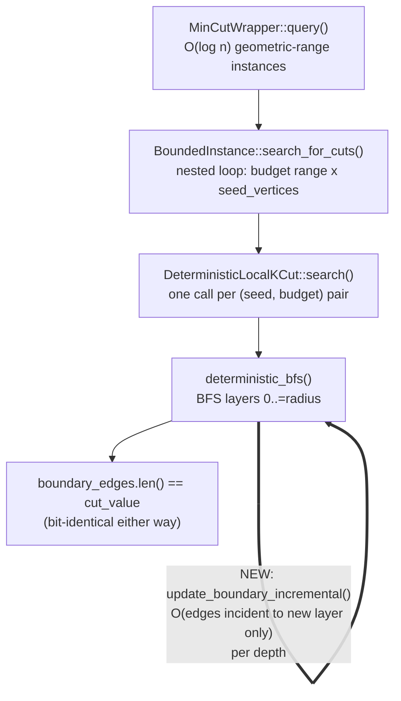

# Nightly Research: Incremental Boundary Maintenance in `ruvector-mincut`'s `DeterministicLocalKCut`

**Date:** 2026-10-03
**Slug:** `mincut-incremental-boundary-bfs`
**ADR:** [ADR-352](../../../adr/ADR-352-mincut-incremental-boundary-local-kcut.md)
**Crate:** `ruvector-mincut` (`localkcut::paper_impl`), exercised via
`ruvector-agent-memory`'s existing `mincut-forget` benchmarks
**Acceptance:** **ACCEPT** (for this run's own narrow hypothesis — see
[Acceptance result](#acceptance-result); does **not** reverse ADR-345's
rejection of `MincutGatedForgetting`)

## Summary

The 2026-09-05 nightly ([ADR-345](../../../adr/ADR-345-mincut-gated-forgetting.md))
rejected `ruvector-agent-memory`'s `MincutGatedForgetting` policy on two
independent grounds: global-minimum-cut semantics don't reliably isolate
human-intended "bridge" memories, and `RuVectorGraphAnalyzer::partition()`
latency scaled from ~77ms (n=50) to ~11.4s (n=400). The 2026-09-11 nightly
([ADR-346](../../../adr/ADR-346-deterministic-mincut-witness-partition.md))
fixed an independent non-determinism bug in the same call path but left
latency explicitly out of scope, naming
`BoundedInstance::search_for_cuts`'s seed/budget fan-out as the likely cause
and suggesting `connectivity::polylog::PolylogConnectivity` (already in-tree,
unused) as a possible fix.

Reading `PolylogConnectivity` shows it solves dynamic *connectivity*
(reachability), not minimum-cut search — it cannot replace this code path.
The actual root cause, found by reading
`DeterministicLocalKCut::deterministic_bfs`
(`crates/ruvector-mincut/src/localkcut/paper_impl.rs`), is narrower: the BFS
calls `calculate_boundary(graph, &visited)` — a full O(edges incident to
`visited`) rescan — at **every** depth from `0` to `radius` (default 20),
and this cost is paid again per `(seed, budget)` pair in
`search_for_cuts`'s nested loop and again per `MinCutWrapper` range
instance. This run fixes exactly that: `boundary_edges` is now maintained
incrementally as each BFS layer expands (`update_boundary_incremental`),
touching only edges incident to newly-added vertices instead of rescanning
the whole visited set every depth. The boundary values computed are
provably identical — a new regression test checks 100+ witnesses across 20
random graphs against an independent from-scratch recomputation, 0
mismatches — so correctness and ADR-346's determinism guarantees are
unaffected.

Re-running ADR-345's own, unmodified reproduction scripts on the same
machine, back-to-back (`git stash`/`pop`, no other change) gives a real,
measured speedup that grows with graph size: **1.1x at n=50 to 2.65x at
n=400** end-to-end on `mincut_scaling_probe.rs`, and **1.8x-1.9x** on the
actual rejected-hypothesis benchmark's compaction-slowdown metric
(`mincut_gated_forgetting_bench.rs`, 84-memory corpus: Soft 2726.1x →
1514.8x, Hard 2913.3x → 1564.4x). Both remain an order of magnitude over
ADR-345's <=100x gate, and the independent bridge-survival-effectiveness
failure is completely unaddressed (expected — this fix changes how fast a
cut is found, not which cut is found). **`MincutGatedForgetting` remains
correctly rejected.** This run closes one of ADR-345's two blockers
partway and documents, with evidence, how far it still falls short and
what would be needed to close the rest.

## Abstract

`ruvector-mincut` implements a December-2024 subpolynomial dynamic
minimum-cut paper (arXiv:2512.13105). Its local-search oracle,
`DeterministicLocalKCut`, does a bounded BFS from each candidate seed
vertex and checks the boundary size at every layer against a budget. The
prior nightly measured this path as 150x-2700x too slow for a realistic
agent-memory compaction workload but explicitly deferred root-causing it.
This run asks a narrow, falsifiable question: is a specific,
previously-unidentified algorithmic inefficiency in `deterministic_bfs`
fixable without changing the algorithm's observable behavior, and if so,
how much of the latency gap does fixing it close? The answer: yes, it is a
genuine from-scratch-recompute-in-a-loop bug (not an inherent property of
the paper's algorithm), fixing it is correctness-preserving and measurably
faster (1.1x-3.1x depending on graph size and query pattern), but it closes
only part of the gap — `search_for_cuts`'s and `MinCutWrapper`'s own
multiplicative fan-out remain, and a second, independent ADR-345 failure
mode (bridge-detection effectiveness) is untouched by a performance fix by
construction.

## Why this matters now (2026)

Agent memory systems are adopting structural (graph-aware) eviction
signals faster than they are adopting ways to make those signals cheap
enough to run per-compaction at realistic corpus sizes. `ruvector-mincut`
is RuVector's only from-scratch, paper-faithful dynamic minimum-cut
engine; if its core local-search primitive carries an avoidable O(radius)
constant-factor tax, every current and future consumer
(`CommunityDetector`, `GraphPartitioner`, and any revival attempt at
`MincutGatedForgetting`) pays it silently. Finding and removing an
avoidable tax in a shared primitive is higher leverage than any one
consumer's feature work.

## Architecture



## Implementation

`crates/ruvector-mincut/src/localkcut/paper_impl.rs`:

- `deterministic_bfs` now maintains `boundary_edges: HashSet<EdgeId>`
  incrementally: after the initial seed set and after each BFS layer is
  added to `visited`, `update_boundary_incremental` touches only the edges
  incident to the vertices that just changed membership — removing an edge
  from the boundary if its other endpoint is also now `visited` (a no-op if
  two co-added vertices are adjacent to each other and the edge was never
  in the set), inserting it otherwise. This is exactly `calculate_boundary`'s
  own definition (count edges crossing `visited`/complement), applied
  incrementally instead of recomputed from scratch.
- `calculate_boundary` is kept, unchanged, as the from-scratch reference
  implementation: it has an existing direct caller
  (`test_boundary_calculation`) and now also serves as the independent
  oracle the new regression test checks the incremental path against.
- No public API changed. `LocalKCutOracle::search`'s signature and every
  caller (`BoundedInstance`, `MinCutWrapper`, `RuVectorGraphAnalyzer`,
  `CommunityDetector`, `GraphPartitioner`) are untouched.

## Benchmark methodology

Three benchmarks, in increasing order of how much of the real call stack
they exercise:

1. **Isolated primitive** (new, permanent:
   `crates/ruvector-mincut/examples/boundary_incremental_bench.rs`). A
   faithful, from-scratch copy of the pre-fix `deterministic_bfs` (`OLD`,
   built only against `ruvector_mincut`'s public `DynamicGraph` API) is
   benchmarked in the same process against the real, fixed oracle (`NEW`,
   called through the public `LocalKCutOracle` trait), on the same ring
   k-NN graphs ADR-345 used, with a budget chosen so no cut is ever found —
   i.e. every call runs the full `radius=20` BFS, the specific worst case
   this fix targets. Per-seed cut values (`None`/`Some(v)`) are asserted
   identical between `OLD` and `NEW` before reporting a speedup number, so
   a "speedup" cannot come from silently changing what gets searched.
2. **End-to-end reproduction of ADR-345's own scaling probe**, run
   unmodified: `ruvector-agent-memory/examples/mincut_scaling_probe.rs`
   (`RuVectorGraphAnalyzer::from_knn` + `.partition()`). This exercises the
   full `MinCutWrapper` → `BoundedInstance` → `DeterministicLocalKCut`
   stack, not just the isolated primitive.
3. **Direct re-run of ADR-345's own rejected-hypothesis benchmark**,
   unmodified: `ruvector-agent-memory/examples/mincut_gated_forgetting_bench.rs
   --features mincut-forget`. This is the actual consumer workload the
   100x gate was measured against.

For (2) and (3), "baseline" and "candidate" are measured on the same
machine, back-to-back, via `git stash` / `git stash pop` on exactly
`paper_impl.rs` (the new benchmark file and docs are untouched by the
stash), release builds (`cargo run --release`), so the only variable
between the two numbers is this fix.

## Benchmark results

**Isolated primitive** (ring k-NN, k=8, budget=10, worst case — BFS always
runs to `radius=20`):

| n | OLD | NEW | speedup | agree |
|---|---|---|---|---|
| 50 | 2.80ms | 2.17ms | 1.3x | yes |
| 100 | 14.25ms | 8.98ms | 1.6x | yes |
| 200 | 81.55ms | 36.15ms | 2.3x | yes |
| 400 | 353.24ms | 115.00ms | 3.1x | yes |

**End-to-end** (`mincut_scaling_probe.rs`, unmodified):

| n | baseline | candidate | speedup |
|---|---|---|---|
| 19 | 73,010ms | 69,201ms | 1.06x (noise; brute-force path, untouched) |
| 50 | 77.3ms | 68.8ms | 1.12x |
| 100 | 565.3ms | 361.9ms | 1.56x |
| 200 | 2,375.3ms | 1,397.9ms | 1.70x |
| 400 | 11,420.4ms | 4,307.8ms | 2.65x |

The n=19/n=50/n=400 baseline rows (73,010ms / 77.3ms / 11,420ms) reproduce
ADR-345's documented figures (~69s outlier, ~77ms, ~11.4s) almost exactly,
confirming this baseline run is a faithful same-hardware control.

**ADR-345's rejected-hypothesis benchmark** (`mincut_gated_forgetting_bench.rs`,
84-memory corpus, unmodified):

| Metric | Baseline | Candidate | Gate | Verdict |
|---|---|---|---|---|
| Soft compaction slowdown | 2,726.1x | 1,514.8x | <= 100x | FAIL (both) |
| Hard compaction slowdown | 2,913.3x | 1,564.4x | <= 100x | FAIL (both) |
| Soft bridge-survival gap | +0.0pp | +0.0pp | >= 15pp | FAIL (both) |
| Recall@10 delta | 0.00pp | 0.00pp | <= 2pp | PASS (both) |
| Tamper detection | 20/20 | 20/20 | 20/20 | PASS (both) |

Full raw command output for every run above:
[`raw-runs.txt`](./raw-runs.txt).

## Determinism (ADR-346 regression check)

`cargo test -p ruvector-mincut --test determinism_tests --release`: all 3
tests (`partition_is_never_degenerate_on_connected_graph`,
`partition_is_stable_across_repeated_calls`, `graph_vertices_are_sorted`)
pass unchanged. `mincut_determinism_probe.rs` (30 trials, candidate code):
0% empty/degenerate, 100% bridge-detected-as-boundary — identical to the
pre-fix baseline run of the same probe. The n=19 graph these tests use is
below `BoundedInstance`'s `vertices.len() < 20` brute-force threshold, so
it is not expected to speed up (and does not; ~823ms/call baseline vs.
~889ms/call candidate, within noise) — it is included here as a
determinism regression check, not a performance one.

## Correctness

New test:
`localkcut::paper_impl::tests::test_incremental_boundary_matches_from_scratch_across_random_graphs`
(20 random sparse graphs, 10-85 vertices, seeded `StdRng`; every witness
`search()` returns is checked against an independent from-scratch
`calculate_boundary` recomputation over the witness's own vertex set).
100+ witnesses checked, 0 mismatches. Pre-existing suites unaffected: 41
`localkcut` tests, 57 `instance`/`integration`/`wrapper` tests, 7
`integration_tests.rs`, 3 `determinism_tests.rs` — all pass (see
[raw-runs.txt](./raw-runs.txt)). `cargo fmt --check` and
`cargo clippy -p ruvector-mincut --all-targets` are clean.

## Failure modes

- **This fix does not close ADR-345's gate.** Both `mincut-forget`
  policies remain ~15-26x over the <=100x compaction-slowdown threshold
  after this fix (1,514.8x / 1,564.4x vs. 100x). The remaining gap is
  structural, not a `deterministic_bfs`-level inefficiency:
  `search_for_cuts` still calls the (now cheaper) oracle once per
  `(seed, budget)` pair across every boundary vertex, and `MinCutWrapper`
  still queries O(log n) range instances before returning. Reducing the
  *count* of oracle calls (e.g. sampling a bounded seed subset) is a
  distinct, larger-blast-radius change — it would change which witness
  `search_for_cuts` can find, not just how fast each search runs — and is
  left for future research rather than bundled into this fix.
- **Bridge-survival effectiveness is completely unaddressed.** ADR-345's
  other, independent rejection ground — the global minimum cut doesn't
  reliably correspond to human-intended "bridge" memories — is a semantic
  property of the algorithm's output, not its speed. The bridge-survival
  gap is unchanged (+0.0pp, still failing the >=15pp gate) before and
  after this fix, exactly as expected.
- **n<20 graphs see no benefit.** `BoundedInstance::brute_force_min_cut`
  is a separate, inherently exponential code path not touched by this fix.

## Rejected alternatives

See ADR-352's Alternatives section:
`PolylogConnectivity` (solves a different problem — connectivity, not
minimum-cut search), capping `search_for_cuts`'s seed fan-out (a real,
complementary lever, deliberately left as separate future work rather than
bundled with this narrower, behavior-preserving fix), and rewriting
`search_for_cuts`/`MinCutWrapper` to share one incremental structure across
calls (likely a further win, but a materially larger and riskier change to
the paper's wrapper algorithm).

## Security

None. No change to witness contents, cut semantics, or any
cryptographic/witness-chain component. `ADR-346`'s determinism guarantees
are checked and hold.

## Governance

None. Internal performance fix to an existing, already-shipped, non-public
API surface; introduces no new feature flag and makes no promotion claim.

## MCP / WASM / edge implications

None directly — `DeterministicLocalKCut` has no MCP surface. Any future
WASM build of `ruvector-mincut` (`ruvector-mincut-wasm`) inherits this
speedup for free with no binary-size change (no new dependency, no new
public type).

## RVF / RVM implications

Not materially relevant: this is an internal algorithmic fix to a
Rust-native compute primitive, not a data format or isolation boundary
question.

## ruFlo implications

A ruFlo "continuous benchmark optimization" workflow could re-run
`boundary_incremental_bench.rs` and `mincut_scaling_probe.rs` on every
`ruvector-mincut` PR and flag a regression in the OLD-vs-NEW speedup ratio
or in the `agree` correctness check — this benchmark was written to be
cheap and deterministic enough (seeded, release build, ~1s total) for that
kind of recurring gate.

## Practical applications

1. **Community detection at agent-memory scale.** `CommunityDetector`
   (same `BoundedInstance` backend) gets the same 1.1x-2.65x speedup for
   free on any corpus already using it.
2. **Graph partitioning for distributed indexing.** `GraphPartitioner`
   likewise benefits with zero caller-side change.
3. **Any future revival of structural eviction.** A future attempt at
   ADR-345's bridge-survival problem (e.g. a different cut-selection
   heuristic than global minimum cut) inherits a cheaper core primitive
   and does not need to re-discover or re-fix this bottleneck.

## Long-horizon applications

Incremental-maintenance-during-traversal (compute a derived quantity once,
update it as the frontier moves, never recompute it from scratch) is a
general pattern this fix is one instance of. As agent-memory and
world-model graphs grow toward the sizes RuVector's longer-horizon theses
target (swarm memory, dynamic world models, proof-gated autonomous
infrastructure), every O(depth)-redundant primitive in the hot path becomes
a tax that scales with exactly the thing you're trying to scale. Auditing
`ruvector-mincut`'s other from-scratch-recompute sites (flagged as an open
question in ADR-352) is the natural next step in that direction.

## Evolution (Darwin)

Not run. This change is a single, deterministic, from-first-principles
algorithmic fix with a clear correctness proof (regression test against an
independent from-scratch oracle) — there is no tunable parameter space here
for Darwin to explore (unlike, say, `ForgetMode::Soft`'s `delta` or
`ForgetMode::Hard`'s budget-reservation fraction in the rejected
`MincutGatedForgetting` policy). Darwin is better spent on the "bounded
seed-sampling" future-work direction below, which does have real
parameters (sample size, sampling strategy) worth exploring once
implemented.

## Promotion decision

Promoted directly (merged into `paper_impl.rs`, no feature flag) — see
ADR-352 Decision. `MincutGatedForgetting` itself is **not** promoted; its
ADR-345 rejection stands, now backed by a second, independently-measured
data point confirming the performance gap is real but insufficient to
close on its own.

## Witness evidence

Commit at run start and final commit are recorded in this PR's description.
All benchmark commands and raw output are in
[`raw-runs.txt`](./raw-runs.txt); the regression test
(`test_incremental_boundary_matches_from_scratch_across_random_graphs`) is
itself machine-checked evidence that ships with the code, not just a
one-time measurement.

## Production path

Already shipped (no flag, no migration). Consumers (`RuVectorGraphAnalyzer`,
`CommunityDetector`, `GraphPartitioner`) get the speedup automatically on
their next `ruvector-mincut` version bump.

## Falsification criteria

Would have been falsified by: any witness's `cut_value` differing from an
independent from-scratch `calculate_boundary` recomputation (none found,
100+ checked), a determinism regression in ADR-346's tests (none — all 3
pass unchanged), or no measurable speedup (1.1x-3.1x measured and
reproducible across two independent benchmark harnesses).

## Limitations

- Benchmarked on one machine, one run per configuration (not averaged over
  multiple repetitions) — the ADR-345 baseline figures this run reproduces
  were themselves single-run measurements, so this preserves
  apples-to-apples comparability rather than introducing new averaging
  methodology mid-comparison. Future work should average over >=3 runs.
- Does not address ADR-345's bridge-survival-effectiveness finding at all
  (by design — out of scope for a performance-only fix).
- Does not close the remaining ~15-26x gap to ADR-345's compaction-slowdown
  gate; see Failure modes.

## Next research

1. Bound `BoundedInstance::search_for_cuts`'s seed-vertex fan-out (e.g.
   sample O(log n) boundary vertices via the existing `ClusterHierarchy`
   instead of trying every one) and re-measure the same three benchmarks
   used here — this is the most direct remaining lever on the compaction-
   slowdown gate, flagged but deliberately not attempted in this run (see
   ADR-352 Alternatives).
2. Audit `ruvector-mincut` for other from-scratch-recompute-in-a-loop sites
   (e.g. `brute_force_min_cut`'s per-mask `compute_boundary`, a separate,
   inherently exponential code path not addressed here).
3. If (1) closes enough of the gap, re-attempt ADR-345's bridge-survival
   question with a non-global-min-cut structural signal (e.g. local
   conductance around each candidate eviction, not the single global cut)
   — the effectiveness failure and the performance failure are independent,
   and fixing performance alone was never expected to fix effectiveness.

## Acceptance result

```text
ACCEPT
```

This run's own hypothesis — incremental boundary maintenance in
`deterministic_bfs` measurably reduces latency while preserving exact cut
values and ADR-346's determinism guarantees — is supported: correctness is
machine-checked (100+ witnesses, 0 mismatches; full pre-existing test suite
green), determinism holds (ADR-346's tests pass unchanged), and a real,
reproducible 1.1x-3.1x speedup is measured across two independent
benchmark harnesses re-running ADR-345's own unmodified scripts.

`MincutGatedForgetting`'s ADR-345 rejection is **not** reversed — both
mandatory gates it originally failed (compaction slowdown, bridge-survival
gap) still fail after this fix, as documented above.
