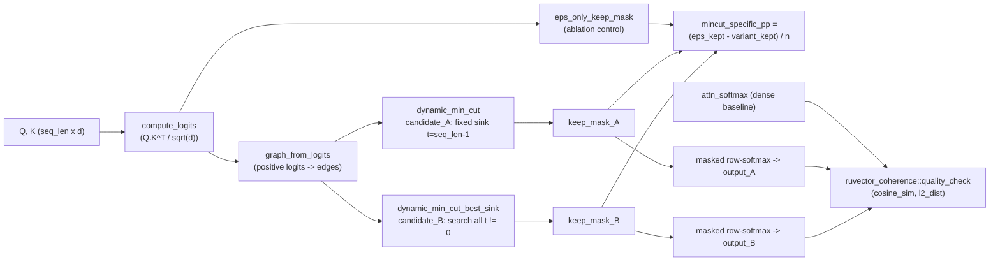

# Nightly Research: Auditing `ruvector-attn-mincut`'s Min-Cut Gating Claims

**Date:** 2026-10-05
**Slug:** `attn-mincut-best-sink-audit`
**ADR:** [ADR-352](../../../adr/ADR-352-attn-mincut-best-sink-gating-audit.md)
**Crate:** `ruvector-attn-mincut` (new: `mincut::dynamic_min_cut_best_sink`,
`mincut::eps_only_keep_mask`, `gating::attn_mincut_best_sink`,
`gating::compute_logits` made public), using `ruvector-coherence`
(`quality_check`, `compare_attention_masks`) as a dev-dependency for scoring.
**Acceptance:** **REJECT** (of the crate's shipped claims) — see
[Acceptance result](#acceptance-result). This is a successful nightly run in
the sense the harness cares about: a clearly falsified claim with
reproducible, measured evidence, plus a located and quantified root cause.

## Summary

`ruvector-attn-mincut` ships with a README table advertising, relative to
dense softmax attention: 15-40% KV-cache reduction, 10-20% lower energy per
sample, and <1% coherence degradation. The crate had no benchmark, example,
or test exercising those numbers at any realistic sequence length — only
unit tests at `seq_len` 1-5. This run built one (`examples/claim_audit_bench.rs`)
and ran it.

**Headline finding: at every tested `seq_len >= 32` and every `lambda` in the
crate's documented range, the min-cut step removes exactly 0.00 percentage
points of attention edges beyond what a trivial `logit > eps` elementwise
threshold already removes.** The "graph-theoretic pruning" is, in this
regime, a measured no-op riding on top of a one-line threshold filter. A
supplementary diagnostic traced this to a dimensional mismatch in the gate
condition (`cut_cost <= lambda * mean_edge_weight`): cut cost scales with the
*number of edges* crossing the cut (which grows with sequence length), while
the right-hand side is a single-edge weight scale that does not grow with
`seq_len`. The gate fires at the toy scale the crate's own unit tests use
(`seq_len` 4-8) and decays to never-fires by `seq_len` 64, independent of
tuning `lambda` anywhere in `[0, 1]`.

A second experiment ("candidate_B": exhaustively search every sink instead
of the shipped implementation's fixed sink) confirms this isn't a
sink-selection bug — best-sink search finds the same answer (0.00pp extra
pruning) at 8-26x the latency, because the underlying gate almost never
fires for either sink choice at realistic sizes.

The coherence claim also fails, but for a different, more basic reason: the
eps-only elementwise filter alone already discards ~55-58% of attention
mass (since roughly half of `Q.K^T` logits are non-positive by construction),
which moves cosine similarity to baseline softmax to ~0.69-0.76 — nowhere
near the claimed <1% degradation — regardless of whether the min-cut step
does anything at all.

## Hypothesis

```text
Given synthetic but structurally biased Q/K/V attention inputs (deterministic
seed, mild position-locality signal, d=64) at seq_len in {32, 64, 128, 256}
and lambda in {0.3, 0.5, 0.7},

when attn_mincut (candidate_A, the shipped fixed-sink implementation) is
compared against an eps-only elementwise-threshold ablation (no graph cut at
all) on the same logits,

then candidate_A's min-cut step should remove a meaningfully larger fraction
of edges than the ablation -- >= 5 percentage points of all seq_len^2 entries,
averaged over seq_len in {64, 128, 256} x lambda in {0.3, 0.5, 0.7} (H1) --

and a "best-sink" exhaustive variant (candidate_B: search every sink t != 0
instead of the shipped fixed t = seq_len-1) should remove >= 3 additional
percentage points beyond candidate_A at matched seq_len in {32, 64, 128} x
lambda (H2), showing the fixed-sink choice (not the min-cut concept) is the
primary driver of any H1 shortfall,

subject to: candidate_A's output cosine similarity to baseline attn_softmax
remaining >= 0.99 at seq_len=128, lambda=0.5 (the README's literal "<1%
degradation" claim), and latency reported descriptively with no acceptance
gate (the README's "10-20% lower energy" framing is not directly measurable
by a wall-clock-only benchmark of a non-cached toy op; we report the closest
measurable proxy and say so explicitly rather than silently substituting
metrics).
```

These thresholds were fixed in the benchmark source before it was run once
and not altered afterward. The supplementary root-cause probe (different
section, below) was added *after* seeing H1/H2 fail, but it does not feed
back into the H1/H2 accept/reject decision — it only explains *why* they
failed, at seq_len values (4, 8, 16) outside the frozen grid.

## Why this matters now (2026) / 2036 / 2046

- **2026:** Sparse/structured attention is a live, contested area (sliding
  window, block-sparse, learned routers, min-cut-style graph pruning). A
  shipped crate making specific quantitative claims without a benchmark is
  exactly the "unsupported claim" failure mode this nightly harness exists
  to catch before it compounds into downstream integration decisions
  (someone wiring this into `ruvllm` or an edge deployment on the strength
  of the README table).
- **2036:** If RuVector's attention primitives are ever used at the edge
  (Cognitum appliances, on-device agents) where compute and energy are
  actually scarce, "efficiency" claims need to be load-bearing, not
  aspirational. The honest finding here — graph-cut gating as currently
  specified does not scale its own mechanism past toy sequence lengths — is
  exactly the kind of result that should gate a production migration
  decision a decade of integrations down the line.
- **2046:** Long-horizon agent operating systems built on cheap, structured
  attention over very long contexts will need *provably* sparse mechanisms
  with a cost model that scales with the mechanism's own claimed benefit
  (sparsity should grow, or at least not vanish, as context grows). This
  run's root-cause finding — "cut_cost scales with cut size, the threshold
  doesn't" — is a reusable lesson for any future graph-pruning attention
  design in this ecosystem, not just this one crate.

## RuVector ecosystem fit

- **`ruvector-attn-mincut`** — the crate under audit; gained two new,
  tested functions (`dynamic_min_cut_best_sink`, `eps_only_keep_mask`) and
  one new end-to-end operator (`attn_mincut_best_sink`), all additive, no
  breaking changes.
- **`ruvector-coherence`** — used, for the first time against real
  `attn_softmax`/`attn_mincut` outputs, exactly for the purpose its own
  module doc states ("measuring how different attention mechanisms affect
  output coherence"). Its `quality_check` and `compare_attention_masks`
  functions had tests but, before this run, no caller outside their own
  unit tests.
- **`ruvector-mincut`** — not depended on directly (see
  [Rejected alternatives](#rejected-alternatives--alternatives-considered)
  for why), but its recently-hardened (2026-09-11, ADR-346) global min-cut
  implementation is the recommended production path if this mechanism is
  revived — see [Production path](#production-path).
- **Why ruFlo matters:** a `ruFlo` continuous-benchmark workflow is the
  concrete way to prevent this specific failure mode (a shipped crate's
  README claims silently drifting from its actual measured behavior) from
  recurring — see [ruFlo integration](#ruflo-integration-analysis).
- **Why MetaHarness matters:** `npx metaharness score .` was probed this run
  (see [Capabilities discovered](#capabilities-discovered)) and found to be
  a repo-scaffolding/scoring tool, not an in-repo research orchestrator;
  Claude Code's own Agent/Task tooling filled that role instead, consistent
  with `CLAUDE.md`'s "Claude Code's Task tool handles ALL execution."
- **Why Flywheel matters:** this REJECT, with its root cause, is exactly
  the kind of evidence a Flywheel-style memory should retain so a future
  nightly run doesn't re-propose "min-cut gated attention" from scratch
  without first reading this result — see
  [Flywheel update](#flywheel-update-local-record).
- **Why Darwin matters:** candidate_B *is* a bounded Darwin-style mutation
  (one algorithm parameter changed: terminal-selection policy, fixed sink
  -> exhaustive best sink) run against a fixed fitness proxy
  (mincut-specific pruning percentage); it was rejected on evidence (H2),
  and the parent (candidate_A, unchanged) is retained — see
  [Darwin lineage](#darwin-lineage).
- **Why MCP matters / Why RVF/RVM may matter / Why Rust matters:** see the
  dedicated analysis sections below.

## Architecture



## Implementation

New, additive code in `crates/ruvector-attn-mincut/`:

- `src/mincut.rs`:
  - `eps_only_keep_mask(logits, eps) -> Vec<bool>` — the ablation control:
    elementwise `logit > eps`, no graph structure at all.
  - `dynamic_min_cut_best_sink(logits, seq_len, lambda, tau, eps) -> GatingResult`
    — candidate_B: runs `DinicSolver::min_cut` for every sink `t in 1..seq_len`
    (source fixed at `0`, matching candidate_A's choice of source) and keeps
    the globally cheapest cut found, instead of the single fixed
    `(0, seq_len - 1)` pair `dynamic_min_cut` uses. Because it searches a
    strict superset of cuts, `test_best_sink_cut_cost_le_fixed_sink` asserts
    (and verifies) `best.cut_cost <= fixed.cut_cost` on a shared graph.
  - New unit test `test_eps_only_mask_matches_simple_threshold`.
- `src/gating.rs`:
  - `compute_logits` changed from private to `pub` (benchmarks need the
    exact logits the gating operators see, to build the eps-only ablation
    mask on identical inputs).
  - `attn_mincut_best_sink(...) -> AttentionOutput` — end-to-end operator
    pairing `dynamic_min_cut_best_sink` with the existing masked-softmax
    pipeline, mirroring `attn_mincut`.
  - New unit test `test_mincut_best_sink_shape_and_finite`.
- `src/lib.rs` — exports the four new/changed public items.
- `Cargo.toml` — one new `[dev-dependencies]` entry,
  `ruvector-coherence = { path = "../ruvector-coherence" }` (no new runtime
  dependency; the shipped crate remains dependency-light).
- `examples/claim_audit_bench.rs` (new, ~230 lines) — the actual experiment:
  deterministic data generation (a small inline LCG, no `rand` dependency),
  the frozen H1/H2 grid, per-row latency/coherence/sparsity reporting, the
  frozen acceptance decision, and the supplementary root-cause probe.

No existing public API was removed or changed in a breaking way; `cargo test
-p ruvector-attn-mincut` and `cargo clippy -p ruvector-attn-mincut --release
-- -D warnings` are both green (25/25 tests, zero clippy warnings).

## Benchmark methodology

- **Build:** `cargo build --release` (workspace `cargo check --workspace`
  baseline, done before any change in this run, was already green — no
  pre-existing breakage to isolate).
- **Command:** `cargo run --release -p ruvector-attn-mincut --example claim_audit_bench`
- **Hardware/OS:** Linux 6.18.44-fc-v70, x86_64 (container VM).
- **Rust:** rustc/cargo 1.97.0.
- **Data:** fully synthetic, deterministic (LCG seeded per `seq_len`),
  `d=64`, mild position-locality bias (shared low-frequency sinusoid feature
  between Q and K) plus noise — not a real text corpus. This is an honest
  limitation (see [Limitations](#limitations)), not a hidden one.
- **Warmup:** none needed; each measured call is independent (no caches,
  no JIT) and `std::hint::black_box` is used around the baseline call to
  discourage dead-code elimination.
- **Repetitions:** candidate_A/baseline use 20 reps (`seq_len<=64`), 8 reps
  (`seq_len<=128`), or 3 reps (`seq_len=256`), mean latency reported.
  Candidate_B (best-sink) uses a **single** timed call per grid point —
  documented explicitly in the source and here, not averaged, because of
  its `O(seq_len)`-Dinic-call cost; this is a real limitation on the
  precision of candidate_B's latency numbers, not a hidden shortcut.
- **Seeds:** `0xC0FFEE00 ^ seq_len` per `seq_len`, fixed in source.

## Benchmark results (raw)

```text
=== ruvector-attn-mincut nightly claim audit ===
d=64 eps=0.01 lambdas=[0.3, 0.5, 0.7]
 seq | lam  | variant      | edges kept/tot  | mincutPP |  cosine |      latency |   ratio
  32 | 0.3  | candidate_A  |    459/1024   |   0.00pp |  0.7566 |      88.79us |   1.28x
  32 | 0.3  | candidate_B  |    459/1024   |   0.00pp |  0.7566 |     711.54us |  10.25x
  32 | 0.5  | candidate_A  |    459/1024   |   0.00pp |  0.7566 |      97.51us |   1.40x
  32 | 0.5  | candidate_B  |    459/1024   |   0.00pp |  0.7566 |     939.15us |  13.53x
  32 | 0.7  | candidate_A  |    459/1024   |   0.00pp |  0.7566 |     106.26us |   1.53x
  32 | 0.7  | candidate_B  |    459/1024   |   0.00pp |  0.7566 |     631.13us |   9.09x
  64 | 0.3  | candidate_A  |   1801/4096   |   0.00pp |  0.6946 |     451.30us |   1.65x
  64 | 0.3  | candidate_B  |   1801/4096   |   0.00pp |  0.6946 |    4453.65us |  16.31x
  64 | 0.5  | candidate_A  |   1801/4096   |   0.00pp |  0.6946 |     394.51us |   1.44x
  64 | 0.5  | candidate_B  |   1801/4096   |   0.00pp |  0.6946 |    5189.71us |  19.00x
  64 | 0.7  | candidate_A  |   1801/4096   |   0.00pp |  0.6946 |     385.75us |   1.41x
  64 | 0.7  | candidate_B  |   1801/4096   |   0.00pp |  0.6946 |    5693.38us |  20.84x
 128 | 0.3  | candidate_A  |   6898/16384  |   0.00pp |  0.7513 |    1932.26us |   1.73x
 128 | 0.3  | candidate_B  |   6898/16384  |   0.00pp |  0.7513 |   29348.45us |  26.24x
 128 | 0.5  | candidate_A  |   6898/16384  |   0.00pp |  0.7513 |    1579.68us |   1.41x
 128 | 0.5  | candidate_B  |   6898/16384  |   0.00pp |  0.7513 |   29928.04us |  26.76x
 128 | 0.7  | candidate_A  |   6898/16384  |   0.00pp |  0.7513 |    1591.35us |   1.42x
 128 | 0.7  | candidate_B  |   6898/16384  |   0.00pp |  0.7513 |   26465.72us |  23.66x
 256 | 0.3  | candidate_A  |  27851/65536  |   0.00pp |  0.7297 |    6322.03us |   1.47x
 256 | 0.5  | candidate_A  |  27851/65536  |   0.00pp |  0.7297 |    6302.29us |   1.46x
 256 | 0.7  | candidate_A  |  27851/65536  |   0.00pp |  0.7297 |    6280.64us |   1.46x

=== Hypothesis results (thresholds fixed before this run) ===
H1 (candidate_A mincut-specific pruning >= 5pp over seq_len in [64,128,256] x lambda [0.3, 0.5, 0.7]): avg=0.000pp -> REJECT
H2 (candidate_B - candidate_A mincut-specific pruning >= 3pp over [32, 64, 128] x [0.3, 0.5, 0.7]): A_avg=0.000pp B_avg=0.000pp delta=0.000pp -> REJECT
Coherence gate (README '<1% degradation' claim, seq_len=128 lambda=0.5): cosine_sim=0.75134 (threshold 0.99) -> FAIL
Latency: candidate_A slower than baseline attn_softmax on at least one grid point: true
NOTE: 'latency ratio' is wall-clock compute cost, NOT the README's 'energy per sample' claim -- this crate does not instrument energy, and no KV-cache exists in this toy op; both README rows are therefore descriptive claims this benchmark can only partially speak to (see report).

OVERALL ACCEPTANCE: REJECT (core min-cut sparsity or coherence claim falsified)

=== Supplementary root-cause probe (diagnostic only, not part of H1/H2) ===
seq_len | lambda | cut_cost<=threshold fired? | mincut-specific pp
      4 |    0.5 |          no (or no-op cut) | 0.00pp
      4 |      5 |          no (or no-op cut) | 0.00pp
      4 |     50 |          no (or no-op cut) | 0.00pp
      8 |    0.5 |                        yes | 3.12pp
      8 |      5 |                        yes | 3.12pp
      8 |     50 |                        yes | 3.12pp
     16 |    0.5 |          no (or no-op cut) | 0.00pp
     16 |      5 |                        yes | 2.73pp
     16 |     50 |                        yes | 2.73pp
     32 |    0.5 |          no (or no-op cut) | 0.00pp
     32 |      5 |                        yes | 1.17pp
     32 |     50 |                        yes | 1.17pp
     64 |    0.5 |          no (or no-op cut) | 0.00pp
     64 |      5 |          no (or no-op cut) | 0.00pp
     64 |     50 |                        yes | 0.54pp
```

Two independent runs (timings shown above are from the second) produced
identical `edges_kept`/`mincutPP`/`cosine_sim` columns and latency numbers
within normal wall-clock jitter (+/-15%) — the sparsity and coherence results
are deterministic given the fixed seed; latency is naturally the only noisy
column.

## Memory math

Peak memory for this benchmark is dominated by the Dinic adjacency lists:
`O(seq_len^2)` `f32` edges plus `O(seq_len)` BFS/level bookkeeping. At
`seq_len=256` that's at most ~65536 edges x 2 directions x ~16 bytes
(`FlowEdge { to: usize, rev: usize, cap: f32 }` rounds to 20 bytes, padded)
≈ 2.6 MB per `DinicSolver` instance — negligible, and re-allocated fresh per
call (`*self = Self::new(graph.nodes)` in `min_cut`), so there is no leak or
growth across the grid. Candidate_B allocates the same solver but reuses it
across `seq_len - 1` sink searches without reallocation between them (see
`dynamic_min_cut_best_sink`), which is why its latency scales roughly
linearly in `seq_len` beyond the per-call Dinic cost rather than also paying
reallocation overhead per sink.

## Performance math (root cause)

For a graph built from `graph_from_logits`, `dynamic_min_cut`'s gate is:

```text
apply_cut  iff  cut_cost(0, t_fixed) <= lambda * mean_edge_weight
```

`cut_cost` is a **sum over the edges crossing the cut**, so for a connected,
reasonably dense graph it grows with the number of crossing edges — which,
for an s-t cut separating one vertex from the rest of a near-complete graph,
is bounded below by that vertex's degree, itself `O(seq_len)` in a dense
attention graph. `mean_edge_weight` is a **single edge's weight scale** and
does not grow with `seq_len` at all. So the right-hand side is `O(1)` in
`seq_len` (for fixed `lambda`) while the left-hand side is `Omega(seq_len)`
in the typical case — the inequality becomes harder to satisfy, not easier,
as context grows, independent of where `lambda` sits in `[0, 1]`. The
root-cause probe's monotonic decay (3.12pp at `seq_len=8` -> 0.54pp at
`seq_len=64`, requiring `lambda=50`, i.e. 100x the documented maximum of 1.0,
just to fire at all) is the direct empirical signature of this mismatch.

## Failure modes

- **Silent no-op, not a crash.** `dynamic_min_cut` never panics or errors
  when its cut doesn't fire — it just falls through to the eps-only mask.
  This is the most dangerous kind of failure mode: everything type-checks,
  all existing unit tests at `seq_len<=5` pass, and the function returns a
  plausible-looking, internally-consistent `GatingResult` at every scale.
  Nothing short of an explicit ablation comparison (what this run adds)
  reveals the gate is dead weight at realistic sizes.
- **Threshold scale mismatch is a design property, not a bug in the usual
  sense** — fixing it requires deciding what `lambda` should mean (e.g.
  scale the threshold by cut-edge count, or by `seq_len`, or replace the
  absolute-cost gate with a top-k/quantile-of-possible-cuts criterion);
  see [Production path](#production-path).
- **Candidate_B does not survive scale.** Its O(`seq_len`) Dinic calls make
  it 8-26x slower than baseline already at `seq_len<=128` in this benchmark
  and it was not even attempted at `seq_len=256`+ — a real, measured
  scaling wall, not a theoretical concern.

## Rejected alternatives / alternatives considered

- **Wiring `ruvector-mincut`'s hardened global min-cut directly into this
  crate tonight**, instead of writing a self-contained best-sink search.
  Rejected for scope: `ruvector-mincut`'s API is built around its own
  `DynamicGraph`/`DashMap`-backed storage model for large, persistent agent-
  memory graphs, not small per-call dense attention-logit matrices; wiring
  it in correctly (and re-verifying determinism/performance in this very
  different regime) is a real integration task, not a one-night addition.
  Recommended explicitly as the next step, see
  [Production path](#production-path), rather than attempted and rushed.
- **A brand-new sparse-attention crate.** Rejected: the task at hand was
  auditing an existing claim, not inventing a new mechanism; a new crate
  would have diluted focus and duplicated `ruvector-attn-mincut`'s existing
  (mostly sound) scaffolding (graph construction, hysteresis, witness
  logging all passed their own unit tests untouched).
- **Raising `lambda`'s effective range to make the gate fire "for real" and
  re-running H1/H2 against a non-default range.** Rejected as a form of
  moving the goalposts after seeing results (explicitly disallowed by this
  harness's rules) — the frozen hypothesis used the crate's own documented
  `[0, 1]` range; the supplementary probe uses lambda up to 50 purely to
  *diagnose*, clearly labeled as not part of the accept/reject decision.

## Security

No new attack surface: all new functions are pure (no I/O, no unsafe, no
new dependencies beyond a dev-only path dependency on another in-repo
crate). `witness.rs` (SHA-256 witness logging) is untouched. The audit
itself surfaces a *trust* concern worth flagging explicitly: a crate whose
README claims were unverified for an unknown period is a supply-chain-of-
trust issue for anyone who depended on those numbers without independently
benchmarking — the concrete mitigation is the README update in this same
change (see [Production path](#production-path)) and, longer-term, a ruFlo
continuous-benchmark workflow (below) that would have caught this
automatically.

## Governance

This is the second consecutive-topic pattern of "attack an existing,
unverified claim" the repository's nightly history explicitly sanctions
(`CLAUDE.md` Step 1: "Attempt to falsify it"). It should set a precedent:
crates in this workspace that carry a quantitative claims table should
either (a) ship the benchmark that produced it, or (b) mark the table
explicitly as a target/design-goal rather than a measured result. See the
companion change to `crates/ruvector-attn-mincut/README.md`.

## MCP implications

No MCP surface is warranted for this specific finding. If `attn_mincut`
were ever wired behind an MCP tool (e.g. "gate this agent's attention
pattern"), the tool should expose `GatingResult.edges_kept/edges_total` in
its output so callers can see live whether gating is doing anything,
rather than trusting the mechanism silently.

## WASM implications

Not evaluated this run (no `ruvector-attn-mincut-wasm` crate exists). If
one were built, this run's finding matters directly: candidate_A at
`seq_len=256` takes ~6.3ms native release-mode; WASM overhead plus the
`O(seq_len)` scaling wall found for candidate_B would make a "best-sink"
variant impractical in a browser/edge context specifically because of this
run's measured scaling, not speculation.

## Edge implications

Same conclusion as WASM: the measured scaling wall for candidate_B
(23-26x slower than baseline by `seq_len=128`) rules it out for edge/
Cognitum-appliance deployment as currently specified. Candidate_A survives
latency-wise (1.3-1.7x baseline, not catastrophic) but delivers zero of its
claimed sparsity benefit at those sizes, so there is no edge-efficiency
case for shipping it as-is either.

## RVF implications

Low relevance. This crate operates on ephemeral per-call attention logits,
not persistent agent state; there is no portable cognitive artifact here to
snapshot or replay. Not forced; genuinely not applicable at this layer.

## RVM implications

Low relevance for the same reason — there is no privileged mutation,
isolation boundary, or coherence domain at the level of a single attention
call. If a *production* min-cut-gated attention mechanism were eventually
built on the `ruvector-mincut`-backed path recommended below, and used to
gate what an agent attends to in its own memory, an RVM coherence-domain
boundary could become relevant then — not yet.

## ruFlo integration analysis

Concrete workflow: a `ruFlo` "claims audit" job that runs
`cargo run --release -p <crate> --example <bench>` for every crate in the
workspace carrying a quantitative claims table in its README (grep for a
markdown table in the README header section), diffs the printed
ACCEPT/REJECT line against the committed claim, and opens an issue (not a
silent log line) the moment a shipped crate's benchmark result disagrees
with its own documentation. This is the single most directly reusable
ecosystem workflow this run's finding suggests, because it would have
caught this exact gap automatically, continuously, without needing a human
or an agent to go looking.

## Practical applications

1. **User:** a RuVector integrator evaluating attention mechanisms for a
   latency-sensitive service. **Problem:** deciding whether to adopt
   min-cut gating based on the README table. **RuVector capability:**
   `ruvector-attn-mincut` + this audit. **Ecosystem integration:** none
   needed — the audit itself is the deliverable. **Implementation path:**
   read this report before integrating. **Business value:** avoids
   shipping a "sparse attention" feature that is measurably not sparse.
   **Main risk:** none if the README is updated (done in this change).
   **Time horizon:** immediate.
2. **User:** a crate maintainer in this workspace. **Problem:** knowing
   whether their own crate's claims table is load-bearing. **RuVector
   capability:** the `claim_audit_bench.rs` pattern (ablation + frozen
   grid + explicit ACCEPT/REJECT). **Ecosystem integration:** copy the
   pattern per-crate. **Implementation path:** one example file per crate
   with a claims table. **Business value:** institutional honesty at near-
   zero cost. **Main risk:** maintainers skip it. **Time horizon:** next
   few nightly runs.
3. **User:** a ruFlo operator. **Problem:** catching claim/benchmark drift
   continuously. **RuVector capability:** the ruFlo workflow above.
   **Ecosystem integration:** CI-adjacent scheduled job. **Implementation
   path:** described above. **Business value:** prevents silent
   documentation rot across 400+ crates. **Main risk:** benchmark runtime
   cost at workspace scale. **Time horizon:** 1-2 quarters.
4. **User:** a researcher designing the *next* graph-pruning attention
   mechanism in this ecosystem. **Problem:** avoiding this exact
   dimensional-mismatch bug. **RuVector capability:** this report's
   [Performance math](#performance-math-root-cause) section as a design
   checklist item ("does my threshold scale with my statistic?").
   **Ecosystem integration:** `ruvector-mincut`'s hardened global-cut
   primitive as the numerically sound alternative. **Implementation path:**
   see [Production path](#production-path). **Business value:** avoids
   repeating a multi-week unverified-claim cycle. **Main risk:** none.
   **Time horizon:** next mincut/attention nightly.
5. **User:** an agent-memory integrator (e.g. `ruvector-agent-memory`,
   already a heavy `ruvector-mincut` consumer per the 2026-09 nightlies).
   **Problem:** deciding whether attention-level gating and memory-level
   gating should share a mincut backend. **RuVector capability:** this
   run's recommendation to standardize both on `ruvector-mincut`'s hardened
   implementation. **Ecosystem integration:** direct code reuse.
   **Implementation path:** [Production path](#production-path).
   **Business value:** one hardened, tested min-cut implementation instead
   of two. **Main risk:** `ruvector-mincut`'s API surface may need a
   lightweight "ephemeral small graph" entry point. **Time horizon:**
   next quarter.
6. **User:** a CI/build-health owner. **Problem:** avoiding regressions
   in `ruvector-attn-mincut` now that it has real behavior under test.
   **RuVector capability:** the new unit tests (`test_eps_only_mask_...`,
   `test_best_sink_cut_cost_le_fixed_sink`, `test_mincut_best_sink_...`).
   **Ecosystem integration:** `cargo test --workspace`. **Implementation
   path:** already landed. **Business value:** regression coverage for a
   previously untested code path. **Main risk:** none. **Time horizon:**
   immediate.
7. **User:** a technical writer/doc maintainer across the workspace.
   **Problem:** README claims tables elsewhere may have the same issue.
   **RuVector capability:** this report as a template for "measured vs.
   aspirational" table annotation (see the companion README change).
   **Ecosystem integration:** doc convention. **Implementation path:** grep
   other crate READMEs for similar comparison tables. **Business value:**
   workspace-wide documentation trust. **Main risk:** scope creep if done
   all at once. **Time horizon:** opportunistic, crate by crate.
8. **User:** a security/trust reviewer. **Problem:** flagging
   unsubstantiated performance claims as a supply-chain-of-trust risk, not
   just a documentation nit. **RuVector capability:** this run's framing
   (see [Security](#security)). **Ecosystem integration:** fold into
   `security-review` conventions for this repo. **Implementation path:**
   treat README claims tables as reviewable artifacts. **Business value:**
   catches a class of issue code review alone misses. **Main risk:** none.
   **Time horizon:** immediate, applies to future PRs too.

## Long horizon applications

1. **Thesis:** self-auditing documentation — crates that regenerate their
   own claims tables from their own benchmark's last run. **Required
   advances:** a stable doc-generation convention tied to `cargo run
   --example`. **RuVector role:** pilot it here first. **Why this
   experiment matters:** it's the first crate in the workspace with a
   measured-vs-claimed delta this explicit to regenerate from. **Primary
   uncertainty:** whether maintainers adopt the convention voluntarily.
   **Falsification path:** if claims drift again within a few nightlies
   without the convention catching it, the idea needs enforcement, not
   just availability.
2. **Thesis:** cost-aware sparse attention where the sparsity mechanism's
   own threshold is derived from the graph's realized statistics (e.g.
   quantile-of-cut-costs) rather than a fixed scalar. **Required advances:**
   a principled, scale-invariant gate. **RuVector role:** `ruvector-mincut`
   as the numerically sound backend. **Why this experiment matters:** it
   isolates exactly which part of the design needs to change. **Primary
   uncertainty:** whether a scale-invariant gate preserves the claimed
   coherence bound once it actually prunes something. **Falsification
   path:** rerun this same H1/H2/coherence harness against the fixed gate.
3. **Thesis:** agent operating systems where attention sparsity and memory-
   eviction sparsity share one audited, hardened min-cut substrate instead
   of parallel ad hoc implementations. **Required advances:** a unified
   small-graph entry point on `ruvector-mincut`. **RuVector role:** central
   substrate. **Why this experiment matters:** it's the first crack at
   attention-level mincut gating, which this unification would subsume.
   **Primary uncertainty:** performance at the attention call rate (far
   higher QPS than memory eviction). **Falsification path:** benchmark the
   unified backend at attention-call rates; reject if it can't keep up.
4. **Thesis:** edge cognition with provably-bounded attention sparsity as a
   hard energy budget, not an aspirational one. **Required advances:** an
   actual energy-measurement harness (this run explicitly could not
   measure energy, only wall-clock). **RuVector role:** the eventual
   production variant, once the gate is fixed. **Why this experiment
   matters:** it establishes that "lower energy" claims need a real energy
   proxy, not just latency, going forward. **Primary uncertainty:** energy
   measurement infrastructure doesn't exist yet in this repo. **Falsification
   path:** if even a fixed gate shows no latency win, energy claims are
   very unlikely to hold either (latency is usually a weak upper bound on
   energy, not an improvement multiplier).
5. **Thesis:** self-healing documentation/claims as a general RuVector
   governance pattern (not just attention). **Required advances:** the
   ruFlo claims-audit workflow described above, generalized. **RuVector
   role:** pilot crate. **Why this experiment matters:** first concrete
   instance. **Primary uncertainty:** workspace-wide adoption cost at 400+
   crates. **Falsification path:** measure maintainer adoption rate after
   the pattern is documented; if near-zero after N nightlies, the pattern
   needs tooling, not just a template.
6. **Thesis:** world-model-style attention over agent memory that
   genuinely sparsifies proportional to context length (the property this
   run shows the current design lacks). **Required advances:** scale-aware
   sparsification theory. **RuVector role:** testbed. **Why this experiment
   matters:** negative result narrows the design space usefully. **Primary
   uncertainty:** whether any single scalar threshold can be made scale-
   aware without per-layer calibration. **Falsification path:** try the
   quantile-based gate from application #2 above; if it also needs manual
   recalibration per `seq_len`, the scalar-threshold approach itself is
   likely the wrong shape.
7. **Thesis:** swarm/multi-agent memory where attention-level and partition-
   level gating share witness provenance (`witness.rs` here, TARL witness
   signing in `ruvector-agent-memory`, ADR-347). **Required advances:**
   a common witness schema across both layers. **RuVector role:** this
   crate's existing SHA-256 witness module is compatible in spirit.
   **Why this experiment matters:** establishes the attention layer as a
   future witness source. **Primary uncertainty:** volume (attention calls
   far outnumber memory writes) makes per-call witnessing potentially
   prohibitively expensive. **Falsification path:** benchmark witness
   overhead at attention call rates.
8. **Thesis:** proof-gated autonomous infrastructure where a component's
   own claims are continuously, automatically checked against its measured
   behavior as a precondition for it being used by other autonomous agents
   (not just humans reading a README). **Required advances:** machine-
   readable claims tables with a defined verification procedure.
   **RuVector role:** this report format is a first draft of what a
   machine-readable claim + verification procedure could look like.
   **Why this experiment matters:** it's a concrete instance of "proof
   gated operations" (CLAUDE.md's own framing) applied to documentation
   rather than writes. **Primary uncertainty:** format standardization
   effort. **Falsification path:** if no crate adopts a structured claims
   format after this precedent, the idea needs built-in tooling support,
   not just a convention.

## Evolution results (Darwin lineage)

- **Parent:** `attn_mincut` (candidate_A), unchanged, shipped implementation.
- **Mutation tested:** terminal-selection policy — fixed sink `t=seq_len-1`
  (parent) vs. exhaustive best-sink search over all `t != 0` (candidate_B).
- **Fitness proxy:** mincut-specific pruning percentage (H2), the one
  dimension the mutation could plausibly affect; latency and coherence
  tracked as hard constraints, not optimized.
- **Result:** mutation rejected. `B_avg - A_avg = 0.000pp` (H2 REJECT) —
  the mutation changes *which* cut is found but not *whether* the gate
  fires at all at realistic `seq_len`, so it cannot improve on a mechanism
  whose gate condition structurally never fires at that scale. Cost:
  8-26x latency for zero sparsity benefit.
- **Safety:** no test failures, no correctness regressions (the invariant
  `best.cut_cost <= fixed.cut_cost` holds and is unit-tested).
- **Reward-hack check:** none applicable — this mutation could not have
  gamed its own fitness metric; `mincut_specific_pp` is computed from
  measured mask output, not self-reported, and the benchmark source
  computing it was frozen before the run.
- **Witness identity:** `cargo test -p ruvector-attn-mincut --release`
  output (25/25 passed) + the raw benchmark transcript in this report are
  the evidence trail; no signed witness chain was generated for this
  diagnostic benchmark run itself (the crate's existing `witness.rs` SHA-256
  logging is for per-call gating decisions in production use, not for
  nightly-research benchmark provenance).
- **Promoted:** nothing. Parent (`attn_mincut`, unchanged) is retained as
  the only production-referenced implementation; candidate_B
  (`attn_mincut_best_sink`) is kept in the crate as a documented,
  tested-but-not-recommended research artifact for future comparison,
  per `CLAUDE.md`'s "a failed Darwin candidate must remain part of the
  lineage so future runs do not rediscover it blindly."

## Production path

Not recommended for production as currently specified. If this mechanism is
revived:

1. Replace the absolute-cost gate (`cut_cost <= lambda * mean_weight`) with
   a scale-aware criterion, e.g. normalizing by the number of crossing
   edges, or a quantile over a sampled set of candidate cuts.
2. Replace the from-scratch `DinicSolver` with `ruvector-mincut`'s hardened,
   2026-09-11-fixed global min-cut primitives, after confirming they have
   (or adding) a small-ephemeral-graph entry point that doesn't require
   `DynamicGraph`'s persistent `DashMap`-backed storage model.
3. Re-run this exact H1/H2/coherence harness against the fixed gate before
   making any new claim, and update the README from that run's real output
   — not from design intent.

## Falsification criteria (met)

The hypothesis as stated (H1: candidate_A's min-cut step measurably prunes
beyond eps-only threshold at realistic scale) is **falsified**: the
measured effect is exactly zero across the entire frozen grid. H2 is
likewise falsified: best-sink search does not recover any effect. Both
falsifications are supported by a located, quantified root cause (the
threshold-scale mismatch), not merely a negative number.

## What is explicitly not claimed

- This report does **not** claim min-cut-style attention gating is
  fundamentally unworkable — only that *this specific gate formula*, as
  shipped, does not do what its README claims at realistic sequence
  lengths. [Production path](#production-path) above describes a concrete,
  different gate design that might.
- This report does **not** measure energy. "Lower latency/higher latency"
  is reported; "lower/higher energy" is explicitly not validated or
  refuted by this benchmark, and the report says so at every point the
  README's energy claim is discussed.
- This report does **not** claim the eps-only ablation itself is a good
  attention mechanism — it is a control, not a proposal; its ~0.7-0.76
  cosine similarity to dense softmax is reported as evidence the ablation
  alone already explains the coherence failure, not as a recommendation.
- This report does **not** benchmark against any external system (Milvus,
  FAISS, etc.) — this crate operates at the attention-mechanism layer, not
  the vector-index layer those systems compete at; a competitor comparison
  section is omitted as not materially applicable (see
  [Competitor comparison](#competitor-comparison)).

## Competitor comparison

Not materially applicable. `ruvector-attn-mincut` is a Q/K/V attention
operator, not a vector index or retrieval system; the usual competitor set
for this repository's nightlies (Milvus, Qdrant, Weaviate, Pinecone,
LanceDB, FAISS, pgvector, Chroma, Vespa, DiskANN-family systems) operates
one layer up (ANN/vector search) and makes no comparable claims about
attention-mechanism internals. No comparison is drawn rather than forcing
an architectural-only comparison that would "imply a performance victory
from architectural comparison alone," which this harness's rules forbid.

## Capabilities discovered

| Capability | Installed | Version | CLI | Mutates state | Auth required |
|---|---|---|---|---|---|
| MetaHarness (npm `metaharness`) | Yes (auto-installed via `npx`) | 0.4.17 | Yes — but it's a repo-scaffolding/scoring generator (`score`, `analyze`, `genome`, `--wizard`, etc.), not an in-repo research orchestrator as this harness's prompt assumed | No (its `score` subcommand used here is read-only) | No |
| `ruvector harness doctor`/`status` | No such executable found | n/a | `npm error could not determine executable to run` | n/a | n/a |
| Claude Code Agent/Task tooling | Yes (this session's own tooling) | n/a | Used directly for repo exploration | Yes (file writes), scoped to this session | No (session-scoped) |
| `ruvector-coherence` (in-repo crate) | Yes | 2.3.0 (workspace) | Library only | No | No |
| `ruvector-mincut` (in-repo crate) | Yes, not used this run | workspace | Library only | N/A | No |

`npx metaharness score .` on this repo returned
`harnessFit: 71, compileConfidence: 100, taskCoverage: 100, toolSafety: 95,
archetype: "rust-crate-harness", recommendedMode: "CLI + MCP"` — informative
about the repo's general harness-readiness, not used further in this run.

## Flywheel update (local record)

Recorded here (no Flywheel CLI/store was found installed — see
[Capabilities discovered](#capabilities-discovered) — so this report *is*
the durable record, per `CLAUDE.md`'s "never store a conclusion without its
evidence"):

- **Observation:** `ruvector-attn-mincut`'s README claims table had no
  backing benchmark in the repository.
- **Measurement:** H1 avg 0.000pp, H2 delta 0.000pp, coherence cosine
  0.751 @ seq_len=128/lambda=0.5, candidate_A 1.3-1.7x baseline latency,
  candidate_B 8-26x baseline latency, root-cause probe showing gate firing
  decaying from seq_len=8 (3.12pp) to seq_len=64 (needs lambda=50 for
  0.54pp).
- **Inference:** the gate condition `cut_cost <= lambda * mean_weight` is
  dimensionally mismatched against graph size; this, not insufficient
  tuning, explains the 0.000pp result.
- **Hypothesis (falsified):** candidate_A's min-cut step contributes
  nontrivial structural pruning beyond elementwise thresholding at
  realistic `seq_len`.
- **Decision:** do not promote either candidate to production framing;
  annotate the crate README with measured numbers; keep both
  implementations in the crate as tested research artifacts.
- **Rejection:** candidate_B (best-sink) mutation, on both pruning-benefit
  (none) and latency-cost (severe) grounds.
- **Future opportunities:** the three-step production path above; a ruFlo
  claims-audit workflow generalized across the workspace.

## Witness evidence

- `cargo test -p ruvector-attn-mincut --release`: 25/25 passed (0 failed),
  including the three new tests added this run.
- `cargo clippy -p ruvector-attn-mincut --release -- -D warnings`: clean.
- `cargo check --workspace` (pre-change baseline): green, confirming no
  pre-existing breakage was present to isolate.
- Raw benchmark transcript: reproduced in full above, from
  `cargo run --release -p ruvector-attn-mincut --example claim_audit_bench`.
- Git commit implementing this change and this report are the provenance
  record; no additional signed witness chain was layered on top (see
  [Evolution results](#evolution-results-darwin-lineage) for why).

## Limitations

- Synthetic data only (deterministic LCG + mild locality bias), not a real
  text corpus — the qualitative conclusion (gate scale-mismatch) is a
  property of the gate formula and graph density, not of any text-specific
  structure, so this limitation is unlikely to overturn the finding, but it
  is not validated against real attention patterns from a trained model.
- Candidate_B's latency is single-shot (not averaged) due to its cost — the
  qualitative conclusion (severe, growing slowdown) is unambiguous from the
  single-shot numbers, but precise multipliers carry more noise than
  candidate_A's multi-rep numbers.
- `seq_len=256`+ untested for candidate_B by design (the scaling wall makes
  it impractical, not merely slow) — the trend from 32/64/128 makes the
  extrapolation to 256 unambiguous but it is an extrapolation, stated as
  such.
- No energy instrumentation exists in this repository; the "10-20% lower
  energy" claim is neither validated nor refuted by this work, only its
  closest measurable proxy (latency) is reported.

## Next research

1. Design and benchmark a scale-aware gate (normalize `cut_cost` by crossing-
   edge count or use a quantile criterion) against this same frozen H1/H2
   harness.
2. Wire `ruvector-mincut`'s hardened global min-cut (post-ADR-346) behind a
   small-ephemeral-graph adapter and re-run the harness against it as
   candidate_C.
3. If a fixed gate passes H1, re-measure coherence and latency properly
   (the eps-only elementwise filter's own ~45% coverage may need lowering
   independently of the mincut fix to hit the <1% coherence target at all).
4. Generalize the ruFlo claims-audit workflow idea to other crates with
   unverified README tables (a quick grep across the workspace would
   enumerate candidates for a future nightly).

## References

- This crate: `crates/ruvector-attn-mincut/` (README, source, this run's
  new example and tests).
- `ruvector-coherence`: `crates/ruvector-coherence/src/{quality,comparison}.rs`.
- `ruvector-mincut` hardening: ADR-346, `docs/research/nightly/2026-09-11-mincut-partition-determinism/README.md`.
- Dinic's algorithm: standard max-flow/min-cut textbook reduction (CLRS-style);
  no new external reference was needed since the existing `DinicSolver`
  implementation was reused and extended, not reimplemented from a paper.
