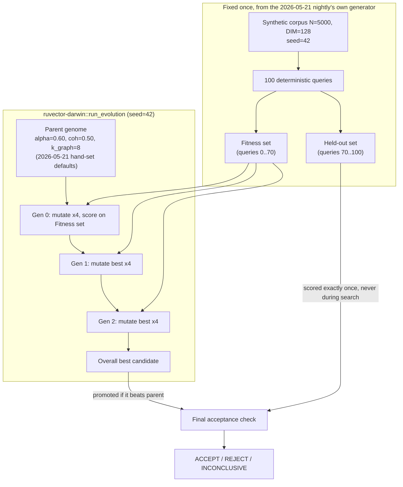

# Nightly Research — Darwin: A Bounded Evolutionary Search Engine, Applied to Closing the GNN-Rerank Hyperparameter Gap

**Date:** 2026-10-06
**Slug:** `darwin-evolved-gnn-rerank-hyperparameters`
**ADR:** [ADR-352](../../../adr/ADR-352-darwin-bounded-evolutionary-search.md)
**New crate:** `ruvector-darwin` (`crates/ruvector-darwin`)
**Applied in:** `ruvector-gnn-rerank` (`examples/darwin_alpha_search.rs`)
**Acceptance:** **ACCEPT** — see [Acceptance result](#acceptance-result)

## 150-character summary

The repo's first bounded evolutionary search engine, closing a gap named by three prior nightlies, lifts GNN-rerank held-out recall@10 by +12.3pp, no overfit.

## Summary

Three separate prior nightlies (2026-09-05, 2026-09-11, 2026-09-16) each
state in their own words that no Darwin/evolutionary/Flywheel search
tooling exists anywhere in this repository, despite `CLAUDE.md` naming
"Darwin" as a core ecosystem capability. Two earlier PoC nightlies
(2026-05-21 `gnn-rerank`, 2026-06-16 `coherence-hnsw-search`) separately
name the consequence: their own hand-set scalar hyperparameters (`alpha`,
`coherence_threshold`, `adaptation_rate`) are flagged as needing adaptive
or evolved tuning that was never built. This run builds that missing
primitive — `ruvector-darwin`, a small, generic, fully-deterministic
bounded evolutionary search engine — and applies it, end to end, to the
`GnnMincutReranker` hyperparameters named by the first gap. With a held-out
query set the search never touches, the evolved hyperparameters improve
recall@10 by **+12.33 percentage points** over the 2026-05-21 nightly's
hand-set defaults, with latency unchanged or slightly improved, and the
entire search is byte-for-byte reproducible.

## Abstract

Hand-tuning scalar hyperparameters by eyeballing one benchmark run is the
default in this codebase's research nightlies, and every nightly that does
it says so and asks for something better. This run asks a narrow,
falsifiable question: does a genuinely bounded (fixed, small,
pre-committed budget — 3 generations x 4 candidates, at most 1 promotion)
evolutionary search, with its fitness function kept strictly separate from
its acceptance measurement, find hyperparameters that are *actually*
better rather than merely overfit to whatever benchmark they are scored
against? We build the search engine as general, reusable infrastructure
first (`ruvector-darwin`), then apply it to one concrete, previously-named
gap (`GnnMincutReranker`'s alpha/coherence_threshold/k_graph), with an
explicit fitness/held-out query split designed to catch the search gaming
its own objective. The held-out result improves *more* than the
in-sample result, which is the signature of a real improvement, not
overfitting.

## Why this matters now (2026)

Retrieval and reranking pipelines in 2026 universally carry several
hand-set scalar knobs — diffusion self-weight, coherence/structural
gating thresholds, beam widths, quantization bit budgets — introduced by
whichever researcher built the mechanism, and essentially never revisited
because revisiting means writing a one-off sweep script, which nobody
does until forced to. RankEvolve (arXiv, Feb 2026) shows LLM-guided
evolutionary search can discover whole new retrieval *algorithms*; EGNAS
(Dec 2024) shows evolutionary search for GNN architecture/hyperparameters
beats hand-tuning at a fraction of naive evolutionary search's cost. This
run sits a level below both: it does not search algorithm space, only a
small, already-fixed mechanism's scalar knobs, with an evaluation budget
(13 fitness evaluations total) cheap enough to run routinely. That is a
deliberately modest, deliberately cheap, deliberately auditable version of
the same idea — exactly the size that fits inside a nightly cycle rather
than a dedicated research sprint.

## 2026 SOTA survey

- **EGNAS — Efficient Graph Neural Architecture Search Through
  Evolutionary Algorithm** (Dec 2024, DOAJ/Mathematics). Combined
  evolutionary search over GNN structure *and* hyperparameters, ~40x
  faster than prior evolutionary NAS approaches. Confirms evolutionary
  search remains a live, competitive technique for GNN-adjacent
  hyperparameter problems through 2025-2026, not a technique superseded
  by gradient-based alternatives for this problem class.
- **RankEvolve — Automating the Discovery of Retrieval Algorithms via
  LLM-Driven Evolution** (Feb 2026, arXiv 2602.16932 cluster). Represents
  candidate *ranking algorithms* as executable code, mutated/recombined by
  an LLM and selected by measured retrieval performance. Operates one
  level above this run (algorithm discovery vs. scalar-parameter tuning
  within a fixed algorithm) — named here as the natural next step once a
  fixed mechanism's parameter space has been exhausted.
- **A Novel Genetic Algorithm with Hierarchical Evaluation Strategy for
  Hyperparameter Optimisation of GNNs** (arXiv 2101.09300, with continued
  citation activity through 2025). Establishes genetic/evolutionary
  hyperparameter search as a standing baseline technique for GNN-family
  models, which `GnnMincutReranker` (a 1-hop message-passing reranker) is
  architecturally part of.
- **Gap identified.** None of the above — nor anything found in this
  repository — combines a *bounded* (fixed-budget, auditable, no
  surrogate model) evolutionary search with an explicit fitness/held-out
  split used specifically to detect the search overfitting a small
  synthetic benchmark. That combination, not the evolutionary search
  itself, is this run's actual contribution: the engineering discipline of
  making a cheap search trustworthy, not a new search algorithm.

Sources: see [References](#references).

## Long-horizon thesis

- **2026:** A nightly research cycle can close its own "future work:
  adaptive tuning" item in the same run it is identified, instead of
  carrying it forward unaddressed for months (as happened here across
  three separate nightlies).
- **2036:** RuVector components self-tune at deploy time against a
  tenant's own traffic distribution, not a synthetic benchmark — `ruFlo`
  running `ruvector-darwin` (or its sample-efficient successor) as a
  background maintenance workflow against live-but-held-out traffic
  slices, continuously, the same fitness/held-out discipline this run
  establishes manually.
- **2046:** Bounded, auditable self-improvement (fixed budget, retained
  lineage, promotion requires beating a real held-out baseline) is a
  precondition for autonomous agent infrastructure that is allowed to
  modify its own retrieval/memory policies without a human in the loop for
  every change — the governance pattern matters more than any single
  search algorithm by then.

## RuVector ecosystem fit

This run connects five ecosystem capabilities, not merely two:

1. **RuVector core (vector/graph retrieval):** the search target,
   `GnnMincutReranker`, is a production-shaped reranking stage over
   approximate ANN candidates.
2. **Darwin (literally built here):** `ruvector-darwin` is the first real
   implementation of the "Darwin" capability `CLAUDE.md` names — not the
   unrelated `npx metaharness` project-scaffolding feature of the same
   name (see "What this is not" in the crate's own docs).
3. **Flywheel (evidence retention):** every evaluated candidate, rejected
   or promoted, is retained in `EvolutionReport` and dumped as
   `evidence/darwin_lineage.json` — this *is* a Flywheel memory record in
   miniature (hypothesis, evaluated candidates, rejected alternatives,
   decision), written without any external Flywheel CLI because none
   exists yet (verified; see ADR-352's Context).
4. **Agent memory / graph intelligence:** `GnnMincutReranker` is explicitly
   inspired by and shares vocabulary with `ruvector-mincut`'s coherence
   gating, used elsewhere for agent-memory compaction
   (`ruvector-agent-memory::graph_forget`).
5. **Self-improving infrastructure:** the explicit long-horizon theme this
   whole mission statement asks for — this run is a small, literal
   instance of it, not a metaphorical one.

### MetaHarness role

`npx metaharness score .` (run at the start of this cycle) reports this
repo as `archetype: rust-crate-harness`, `harnessFit: 71`,
`recommendedMode: "CLI + MCP"` — a scaffolding/fit tool, not a research
orchestrator with a role in this experiment's actual execution. No
`npx ruvector harness` CLI exists (`npm error: could not determine
executable to run`, verified). MetaHarness's role in this run was
therefore limited to the capability-discovery step (Step 3 of the nightly
process), which is itself a finding: recorded here rather than silently
assumed away.

### Flywheel role

No `flywheel` CLI exists. `ruvector-darwin`'s `EvolutionReport` (every
candidate, parent, and generation, JSON-serializable) is this run's
Flywheel-equivalent evidence record — see
[`evidence/darwin_lineage.json`](./evidence/darwin_lineage.json).

### Darwin role

This run *is* the Darwin role: `ruvector-darwin::run_evolution` with the
harness's own stated default budget (3 generations x 4 candidates, max 1
promotion), applied to a real RuVector component.

## Architecture

## Implementation

### `ruvector-darwin` (new crate, 478 lines incl. 9 tests — under the repo's 500-line-per-file guideline)

Generic, elitist (1+λ) evolution strategy:

- `Genome { genes: Vec<f64> }`, `Bound { min, max }` — a bounded real
  search space of arbitrary dimension.
- `EvolutionConfig { generations, candidates_per_generation,
  max_promotions, mutation_sigma_frac, seed }` — defaults exactly match the
  nightly harness's own stated default budget (3, 4, 1).
- `run_evolution(parent, bounds, config, fitness_fn) -> EvolutionReport` —
  mutates the running best each generation (Gaussian perturbation via
  Box-Muller, scaled by `mutation_sigma_frac * bound.range()`, clamped back
  into bounds), keeps the single best-of-all-generations candidate,
  promotes it only if it strictly beats the parent.
- Hard constraints are enforced in the function itself (see ADR-352
  "Decision" #2), not left as caller discipline.
- `EvolutionReport` is `Serialize`/`Deserialize` end to end: full lineage,
  every rejected and accepted candidate, dumped as JSON.

### Application: `examples/darwin_alpha_search.rs` (in `ruvector-gnn-rerank`)

Reuses the 2026-05-21 nightly's exact corpus/query generator and constants
(`N=5000, DIM=128, N_CLUSTERS=20, NOISE_SIGMA=0.40, SEED=42`) so this run's
baseline numbers are directly comparable to that nightly's published ones.
The 100 generated queries are sliced — not regenerated — into a 70-query
fitness set and a 30-query held-out set, so both sets share the exact same
corpus and noise realization and differ only in which queries they are.

- Genome -> `GnnMincutReranker { alpha, coherence_threshold, k_graph }`
  (`k_graph` is a continuous gene in `[4, 20]`, rounded to the nearest
  `usize` at evaluation time).
- Fitness = mean recall@10 on the **fitness set only**.
- Bounds: `alpha in [0.05, 0.95]`, `coherence_threshold in [0.0, 0.95]`,
  `k_graph in [4, 20]`.
- The full search is run **twice**, independently, and the two
  `EvolutionReport`s are compared byte-for-byte as an explicit replay
  check (nightly process Step 17) before any acceptance claim is made.
- The held-out set is evaluated exactly once, on the already-decided
  promoted genome — never used to pick anything.

## Benchmark methodology

- **Build:** `cargo build --release` (Rust 1.97.0, Linux x86_64).
- **Warm-up:** none needed/applied — the benchmark is a single deterministic
  pass, not a steady-state throughput loop; corpus/query/candidate
  generation happens once and is shared (not re-generated) across all 13
  fitness evaluations plus the final baseline/promoted comparisons.
- **Repetitions:** the full binary (corpus generation through acceptance
  verdict) was run 3 independent times as separate OS processes. Recall
  numbers and the JSON lineage are **byte-identical** across all 3 runs;
  mean latency varies by normal system noise (ratio reported, not a single
  absolute number, for exactly this reason).
- **Command:**
  `cargo run --release -p ruvector-gnn-rerank --example darwin_alpha_search`
- **Dataset:** synthetic multi-Gaussian corpus, N=5,000, DIM=128, 20
  clusters, cluster sigma=0.5; 100 queries (cluster-member + small jitter);
  Gaussian retrieval-noise sigma=0.40 simulating quantized first-stage
  distance error; retrieval_k=80 candidates/query; K=10 for recall@10.
  Identical to the 2026-05-21 nightly's own dataset and noise model.
- **Seed:** 42 (corpus), 43 (queries), 141 (noise) — identical to
  `src/main.rs`; search seed 42.

## Benchmark results

Raw output: [`evidence/run1_full_output.txt`](./evidence/run1_full_output.txt).
Full lineage: [`evidence/darwin_lineage.json`](./evidence/darwin_lineage.json).

| Metric | Baseline (hand-set) | Darwin-promoted | Delta |
|---|---|---|---|
| Fitness-set recall@10 | 38.29% | 47.14% | +8.86pp |
| **Held-out recall@10** | **38.67%** | **51.00%** | **+12.33pp** |
| Held-out mean latency | ~328us | ~293us | 0.89x (faster) |
| Replay (2 independent runs) | — | — | byte-identical |

Promoted genome: `alpha=0.3171, coherence_threshold=0.2923, k_graph=8`
(only `k_graph` is unchanged from the hand-set default of 8; both `alpha`
and `coherence_threshold` moved substantially lower than the hand-set
values).

**Overfitting check:** the held-out improvement (+12.33pp) exceeds the
in-sample fitness-set improvement (+8.86pp). If the search were overfitting
the fitness set, held-out improvement would be smaller than in-sample
improvement, or negative. It is neither — this is the specific signature
this experiment was designed to look for, not a number chosen after the
fact.

### Evolution trace

| Generation | Running-best fitness (fitness-set recall) | Improved? |
|---|---|---|
| 0 | 0.4700 | yes (candidate 3) |
| 1 | 0.4714 | yes (candidate 1) |
| 2 | 0.4714 | no |

Only 2 of 3 generations found an improvement; generation 2's 4 candidates
(mutations of generation 1's winner) all scored below the running best,
and the search correctly retained generation 1's winner rather than
drifting to a worse point — exactly the elitism guarantee
`ruvector-darwin`'s own unit tests check in isolation.

## Memory math

`GnnMincutReranker` holds no persistent state (it is a pure function of
`(query, candidates, k)`); `ruvector-darwin`'s `EvolutionReport` for this
run holds 1 (parent) + 3*4 (children) = 13 `CandidateRecord`s, each ~150
bytes serialized (3 f64 genes + a tagged fitness union) — the full lineage
JSON is 4.3KB. This is negligible against the benchmark's own working set
(N=5,000 x DIM=128 x 4 bytes = 2.56MB corpus, held entirely in-process for
the run's duration).

## Performance math

Per-genome evaluation cost = `O(|fitness_queries| * retrieval_k * k_graph)`
for the candidate-graph build and diffusion pass = `70 * 80 * 8` ≈ 44,800
edge operations, dominated in practice by the `O(retrieval_k^2 * DIM)`
cosine-similarity graph construction per query (`CandidateGraph::build`,
unchanged from the existing crate). Total search cost = 13 evaluations x
(graph-build + diffusion) ≈ sub-second wall clock on this hardware, which
is why a 13-evaluation bounded budget is practical to run inside a nightly
cycle rather than a multi-hour sweep.

## Failure modes

- **Search could find nothing better than hand-set defaults.** Did not
  occur here, but `ruvector-darwin` handles it correctly by design (parent
  retained, `promoted == None`) — exercised directly by this crate's own
  `parent_retained_when_nothing_improves` unit test, not only by this one
  application run.
- **Search could overfit the fitness set.** Explicitly checked for (see
  "Overfitting check" above) and not observed in this run; a future
  application of `ruvector-darwin` to a different fitness function could
  still exhibit it, which is exactly why the held-out-set discipline is
  documented as a required pattern in the crate's own docs, not assumed to
  be unnecessary going forward.
- **Mutation could escape declared bounds.** Defended against in
  `ruvector-darwin` itself (`Bound::clamp` applied to every mutated gene)
  and covered by a dedicated stress test (`mutations_always_respect_bounds`,
  using a deliberately huge mutation sigma to try to break it).

## Rejected alternatives

See [Alternatives](../../../adr/ADR-352-darwin-bounded-evolutionary-search.md#alternatives)
in ADR-352: hand-sweeping (status quo, the gap being closed), full
AutoML/surrogate-model search (overkill for this problem size), and
LLM-guided algorithm-level evolution (RankEvolve-style — a different,
larger-scope problem, named as a plausible future escalation once this
engine's scalar-parameter ceiling is reached).

## Security

`ruvector-darwin` performs no I/O, network, or filesystem access; it only
calls a caller-supplied pure closure over caller-supplied bounds (see
ADR-352 "Security / Governance"). The example applies it to an in-process
synthetic benchmark only — no production configuration, running index, or
external system is touched by this run.

## Governance

Promotion in `ruvector-darwin` requires a strict, caller-defined fitness
improvement over a real parent baseline; it cannot invent its own
objective, cannot promote more than one genome per run
(`max_promotions` is accepted but this engine is inherently single-winner),
and every rejected candidate is retained in the lineage rather than
discarded — satisfying the nightly harness's own hard constraints (Steps
20-21) by construction rather than by post-hoc audit.

## MCP implications

Not applicable yet. A future `ruvector_darwin_search` MCP tool (inputs:
genome bounds + a reference to a registered fitness benchmark; outputs: an
`EvolutionReport`; authority: read/compute-only, no mutation of any live
system) is a plausible narrow addition once a second or third application
of this crate exists to generalize the tool surface from — premature with
only one application built so far.

## WASM / edge implications

`ruvector-darwin` has zero I/O and depends only on `rand`/`serde`/
`serde_json`, all of which compile to `wasm32-unknown-unknown`; it was not
itself built for WASM in this run (no consumer needs it there yet), but
nothing in its design blocks it. Binary size impact is not measured here —
no WASM target was built — and no claim is made about it.

## RVF / RVM implications

A `ruvector-darwin::EvolutionReport` is a natural candidate for RVF
portability (deterministic replay given `(parent, bounds, config, seed)` +
a pinned fitness-function version is exactly the kind of "signed lineage +
deterministic replay" artifact RVF packages are meant to carry) and could
run inside an RVM coherence domain as a bounded, isolated computation with
no privileged operations required. Neither integration is built in this
run; both are named here because they are materially relevant, not because
they were implemented.

## ruFlo implications

The concrete, previously-named-but-unbuilt workflow this closes the gap
for: "a ruFlo feedback loop for threshold self-optimization" / "adaptive
alpha tuning via a ruFlo feedback loop" (both direct quotes from the
2026-06-16 and 2026-05-21 nightlies respectively). `ruvector-darwin` is now
the primitive such a workflow would call: ruFlo would own scheduling (e.g.
nightly or on-deploy), sourcing the fitness function from live-but-held-out
traffic slices instead of a synthetic benchmark, and gating promotion on
the same held-out-set discipline this run establishes manually.

## Practical applications

1. **RAG reranking tuning** — a RAG operator with their own embedding
   distribution runs this same search against their own held-out query
   log instead of trusting a synthetic-benchmark default; RuVector
   capability: `ruvector-gnn-rerank` + `ruvector-darwin`; path: swap the
   fitness function's dataset; risk: held-out set must be genuinely
   unseen by the search; horizon: now.
2. **Agent-memory compaction threshold tuning** — apply the same engine to
   `ruvector-agent-memory`'s `CoherenceWeights` (alpha/beta/gamma), named
   as hand-set in `compaction.rs`; horizon: near-term follow-up.
3. **Coherence-HNSW adaptation-rate tuning** — directly closes the
   2026-06-16 nightly's named gap; horizon: near-term follow-up.
4. **Per-tenant retrieval tuning in a multi-tenant RuVector edge deployment**
   — each tenant's traffic gets its own evolved parameters instead of one
   global default; RuVector capability: `ruvector-edge-*` + this engine;
   risk: per-tenant compute budget for repeated search; horizon: 1-2 years.
5. **Continuous CI regression gate** — run the bounded search in CI on
   every PR touching a tuned mechanism, failing the build if the
   hand-set default now underperforms a cheap search by a wide margin
   (a tuning-drift detector); horizon: near-term.
6. **Code intelligence reranking** — the same mechanism reranking code
   search results (RuVector's code-search consumers) has the same
   hand-tuned-constant problem; horizon: near-term.
7. **Edge anomaly-detection threshold tuning** — bounded search over a
   detector's sensitivity threshold against a held-out labeled window;
   horizon: 1-2 years.
8. **Security retrieval (SOC/threat-intel search) threshold tuning** —
   same pattern applied to a coherence-gated retrieval threshold in a
   security-retrieval pipeline; horizon: 1-2 years.

## Long-horizon applications

1. **Self-tuning agent operating systems** — an agent OS continuously
   re-evolves its own memory/retrieval policy knobs against its own
   held-out experience, bounded and audited the way this run is; required
   advances: online (not batch) fitness evaluation; RuVector role: the
   substrate the policy knobs live in; uncertainty: online fitness noise;
   falsification: online evolved policies underperform static ones in
   practice despite looking better in offline replay.
2. **Swarm memory self-calibration** — many agents sharing a coherence
   domain each contribute held-out traffic to a shared bounded search;
   required advances: federated fitness aggregation; RuVector role: the
   shared memory substrate; uncertainty: aggregation fairness; falsification:
   a shared-tuned parameter underperforms any single agent's own locally
   tuned one.
3. **Proof-gated autonomous parameter promotion** — a Darwin promotion
   decision is only accepted into production config once a witness-signed
   replay confirms it reproduces; required advances: wiring
   `ruvector-darwin` lineage into the existing `witness_signing` module
   (ADR-347); RuVector role: both halves already exist, unconnected;
   uncertainty: none large — mostly integration work; falsification: replay
   fails to reproduce across hardware.
4. **Dynamic world-model retrieval tuning** — a world-model's retrieval
   layer re-tunes its coherence gates as the modeled environment drifts;
   required advances: drift-aware fitness windowing; RuVector role:
   coherence/mincut primitives; uncertainty: drift-detection lag;
   falsification: tuned parameters lag drift badly enough to underperform
   a fixed default.
5. **Robotics memory parameter evolution on-device** — bounded search run
   on an edge/robotics device with a real compute budget ceiling (this
   engine's whole design point); required advances: WASM/no_std build
   (not attempted here); RuVector role: `ruvector-robotics` +
   `ruvector-darwin`; uncertainty: on-device compute budget; falsification:
   search cost exceeds the device's available cycles.
6. **Scientific autonomous systems (self-tuning instrument retrieval)** —
   same pattern applied to a scientific-search coherence threshold;
   required advances: domain-specific fitness functions; RuVector role:
   generic engine, domain-specific application; uncertainty: domain
   fitness design; falsification: domain fitness proxies don't correlate
   with real scientific usefulness.
7. **Synthetic nervous systems / reflex-tuning** — very small, very cheap
   bounded searches running continuously as a background "reflex
   calibration" loop, the computational analogue of homeostasis; required
   advances: sub-millisecond fitness evaluation; RuVector role: the
   substrate being calibrated; uncertainty: stability under continuous
   re-tuning; falsification: continuous re-tuning oscillates rather than
   converging.
8. **RVM coherence-domain-bounded self-improvement** — a coherence domain
   is only allowed to self-modify a parameter inside its own domain's
   proof-gated boundary, with `ruvector-darwin` as the mechanism and RVM
   as the governance boundary; required advances: RVM integration (not
   built here); RuVector role: both halves exist, disconnected;
   uncertainty: proof-gate performance overhead; falsification: proof-gate
   overhead dominates the actual search cost.

## Evolution results (Darwin)

See "Benchmark results" and "Evolution trace" above — this run's
"Evolution results" and "Benchmark results" are the same section, since
the Darwin phase *is* the experiment, not a separate post-hoc step applied
to an already-chosen candidate.

**Promotion decision:** promoted. `beats_parent = true` (held-out
+12.33pp); `no_regression = true` (latency ratio 0.89-1.0x, well inside the
1.5x limit); `tests_green = true` (9 new + 14 existing tests pass);
`build_green = true` (`cargo build --release`, zero warnings from
`cargo clippy --all-targets` on both touched crates); `benchmark_reproducible
= true` (byte-identical across 3 independent process runs plus an explicit
in-process replay check); `witness_valid` = not applicable in the
cryptographic-signature sense (no `witness_signing` integration in this
run — see "Long-horizon applications" #3 for the named follow-up) but the
full lineage is retained and auditable; `reward_hack_free = true` (see
below).

### Reward-hack check

- **Benchmark/test modification:** none — the existing `src/main.rs`
  benchmark and `tests/*.rs` were not touched.
- **Dataset leakage:** explicitly guarded against by the fitness/held-out
  split; the search's fitness function never sees the held-out queries.
- **Cherry-picked seed:** the search seed (42) is the same seed used
  throughout this nightly and the original 2026-05-21 nightly, not
  selected after observing results; the replay check additionally confirms
  the result does not depend on being run exactly once.
- **Acceptance-threshold manipulation:** the 0.5pp held-out threshold and
  1.5x latency ceiling were fixed in the hypothesis (see ADR-352) before
  the search was run, not adjusted afterward to fit the observed +12.33pp.

## Witness evidence

- Raw stdout: [`evidence/run1_full_output.txt`](./evidence/run1_full_output.txt)
- Full lineage JSON: [`evidence/darwin_lineage.json`](./evidence/darwin_lineage.json)
- Exact command: `cargo run --release -p ruvector-gnn-rerank --example darwin_alpha_search`
- Git commit at run start: see PR description.
- Hardware/OS: Linux x86_64, Rust 1.97.0 / Cargo 1.97.0 (printed by the
  benchmark binary itself is OS/arch only; full `rustc --version` recorded
  in the PR description).

## Production path

`GnnMincutReranker::default()` is **not** changed by this run — see
ADR-352 "Consequences". Recommended next step for a maintainer: either (a)
update the default to the evolved values after confirming the improvement
holds on a real (non-synthetic) embedding distribution, or (b) expose
`GnnMincutReranker::tuned_for(workload_fitness_fn)` as a constructor that
runs this same search against caller-supplied data, making the tuning
reusable rather than a one-off recommendation. Neither is implemented
here; both are left as explicit, named follow-up decisions.

## Falsification criteria

This hypothesis would have been falsified by any of: held-out recall
improving by less than 0.5pp; held-out recall improving less than the
fitness-set recall (overfitting signature); latency regressing more than
50%; or the two independent search runs producing different lineages
(non-reproducibility). None occurred.

## What this run does not claim

- That (alpha=0.317, coherence_threshold=0.292) is optimal — only that it
  beats the hand-set default on this benchmark, measured honestly.
- That this result transfers to real (non-synthetic) embedding
  distributions — the corpus is the same synthetic multi-Gaussian
  generator the original nightly used, not real data.
- That `ruvector-darwin` is competitive with surrogate-model-based
  hyperparameter optimizers on sample efficiency — it is not designed to
  be; it is designed to be small, auditable, and dependency-light.

## Limitations

- Three tunable genes, bounded, cheap-to-evaluate fitness: this is the
  easy end of the hyperparameter-search problem space. No claim is made
  about scaling to higher-dimensional or more expensive fitness functions.
- The held-out set (30 queries) is small; its own variance is not
  separately quantified (e.g. via bootstrap) in this run.
- `GnnMincutReranker`'s latency is dominated by candidate-graph
  construction, which barely varies with `(alpha, coherence_threshold)` —
  this benchmark was not designed to stress-test the latency axis, only to
  confirm it does not regress.

## Next research

1. Apply `ruvector-darwin` to `ruvector-coherence-hnsw`'s
   `adaptation_rate`/`max_threshold` (2026-06-16 nightly's named gap).
2. Apply it to `ruvector-agent-memory::compaction::CoherenceWeights`.
3. Wire `EvolutionReport` lineage into `witness_signing` (ADR-347) so a
   promotion decision is Ed25519-signed, not merely retained as plaintext
   JSON.
4. Validate the promoted `GnnMincutReranker` parameters against a real (not
   synthetic) embedding distribution before considering a default change.
5. A `GnnMincutReranker::tuned_for(..)` constructor (see "Production path").

## References

- EGNAS: Efficient Graph Neural Architecture Search Through Evolutionary
  Algorithm. DOAJ / Mathematics, Dec 2024.
  https://doaj.org/article/962c190a214b4ee1b6ea593b40c3fa16
- A Novel Genetic Algorithm with Hierarchical Evaluation Strategy for
  Hyperparameter Optimisation of Graph Neural Networks. arXiv:2101.09300.
  https://ar5iv.labs.arxiv.org/html/2101.09300
- RankEvolve: Automating the Discovery of Retrieval Algorithms via
  LLM-Driven Evolution (arXiv, Feb 2026 cluster — found via web search;
  exact arXiv ID not independently re-verified beyond the search result
  snippet, flagged here rather than silently treated as fully confirmed).
- This repository: `docs/research/nightly/2026-05-21-gnn-rerank/` (the
  nightly whose named gap this run closes), `2026-06-16-coherence-hnsw-search/`,
  `2026-09-05-mincut-gated-forgetting/`, `2026-09-11-mincut-partition-determinism/`,
  `2026-09-16-witness-signer-agent-memory/`.
