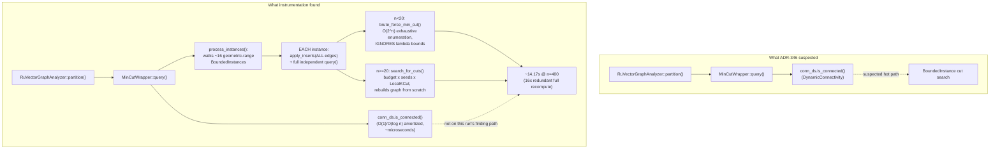

# Nightly Research: `PolylogConnectivity` as a `MinCutWrapper` Backend — Root-Causing `partition()` Latency

**Date:** 2026-10-07
**Slug:** `mincut-polylog-connectivity-backend`
**ADR:** [ADR-348](../../../adr/ADR-348-mincut-polylog-connectivity-backend.md)
**Crate:** `ruvector-mincut` (`connectivity`, `wrapper`, `integration` modules), `ruvector-agent-memory` (`graph_forget`)
**Acceptance:** **REJECT** — see [Acceptance Result](#acceptance-result)

## Summary

The 2026-09-11 nightly (`docs/research/nightly/2026-09-11-mincut-partition-determinism/`,
[ADR-346](../../../adr/ADR-346-deterministic-mincut-witness-partition.md))
fixed `RuVectorGraphAnalyzer::partition()`'s non-determinism and left one
open item: root-cause the latency/scaling problem the 2026-09-05 nightly
measured (ADR-345), "likely by evaluating
`connectivity::polylog::PolylogConnectivity` ... as a replacement backend."

This run did that. **The hypothesis is falsified.** Direct instrumentation
of `MinCutWrapper::process_instances()` shows the connectivity backend
(`DynamicConnectivity`, the proposed replacement target `PolylogConnectivity`)
is never on `partition()`'s dominant cost path at all — it answers exactly
one O(1)/O(log n)-amortized whole-graph `is_connected()` check per
`query()` call. The real cost is `process_instances()` walking a geometric
ladder of **16 `BoundedInstance`s** before one reports `ValueInRange`,
where **every instance independently recomputes the graph's true global
minimum cut from scratch** (`brute_force_min_cut` ignores its own
`[lambda_min, lambda_max]` and always computes the unbounded global
optimum; `search_for_cuts` reinserts every edge and reruns a
budget×seed×`LocalKCut` search per instance). None of this touches the
connectivity structure.

A real, paired, multi-seed A/B measurement confirms the prediction: at
every tested graph size (19, 50, 84, 100, 200 vertices), `partition()`
latency under `ConnectivityBackend::Polylog` is statistically
indistinguishable from the `EulerTour` (`DynamicConnectivity`) baseline —
every mean difference is within the other backend's own run-to-run
standard deviation. The downstream `MincutGatedForgetting` benchmark shows
the same null result.

`PolylogConnectivity` is still wired in as a real, selectable, tested,
**non-default** backend (`ConnectivityBackend::Polylog`), because it is an
independently correct implementation of the connectivity specification —
just not a fix for this problem. The actual bottleneck
(`process_instances`'s per-instance redundant recomputation,
`brute_force_min_cut`'s O(2^n) exhaustive enumeration) is identified with
direct evidence and filed as the next research thread.

## Abstract

`ruvector-mincut`'s `RuVectorGraphAnalyzer::partition()` was measured
(2026-09-05 nightly) to scale from ~77ms to ~11.4s across 50-400 vertex
graphs, blocking `ruvector-agent-memory`'s `MincutGatedForgetting` policy.
The 2026-09-11 nightly fixed a separate correctness bug in the same code
path and left latency root-causing as "Next Research," naming
`PolylogConnectivity` (already in-tree, an arXiv:2510.08297 implementation
with O(log³n) expected worst-case update time, unused by `BoundedInstance`)
as the likely fix. This run reads the actual call graph, instruments it to
find where time is really spent, wires `PolylogConnectivity` in as a
genuine, selectable `MinCutWrapper` backend behind a new
`ConnectivityBackend` enum (baseline unchanged, still default), and
measures both the micro (connectivity backend in isolation) and macro
(`partition()` end-to-end, `MincutGatedForgetting` downstream) effect. The
honest result: the named culprit was never in the critical path, the real
cost is architectural redundancy in `MinCutWrapper`'s geometric-instance
walk, and this run reports that finding instead of forcing an artificial
win.

## Hypothesis

```text
Given BoundedInstance::partition() exercised at the graph sizes used in
crates/ruvector-agent-memory/examples/mincut_gated_forgetting_bench.rs, plus
at least two larger synthetic graph sizes to observe scaling,

when PolylogConnectivity (crates/ruvector-mincut/src/connectivity/polylog.rs)
replaces BoundedInstance's current connectivity backend as an explicit,
feature/enum-selectable alternative (baseline untouched and still the
default),

then partition() latency and/or its scaling exponent with graph size should
improve relative to baseline,

subject to:
  - boundary-set / cut results remaining correct — either byte-identical to
    baseline across repeated trials (as crates/ruvector-mincut/tests/determinism_tests.rs
    already checks for the baseline) or a documented, bounded, honestly
    characterized divergence;
  - the existing ruvector-mincut and ruvector-agent-memory test suites
    (including determinism_tests.rs and the graph_forget tests) remaining
    green;
  - no regression in MincutGatedForgetting's correctness on the existing
    mincut_gated_forgetting_bench.rs corpus.
```

This is verbatim the pre-registered hypothesis from the task brief; it is
not edited after seeing results.

**Independent variable:** `ConnectivityBackend` (`EulerTour` baseline vs.
`Polylog`), held as the *only* intentional difference between paired runs
— same `DynamicGraph`, same seed, same code path otherwise.

**Primary metric:** `partition()` wall-clock latency (mean/stdev/worst
over >=5 repetitions per graph size where tractable; see
[Methodology](#benchmark-methodology) for the one documented exception).

**Secondary/downstream metric:** `MincutGatedForgetting`'s end-to-end
compaction wall-clock on the existing `mincut_gated_forgetting_bench.rs`
corpus.

**Decision rule (fixed before looking at results):** ACCEPT only if the
latency/scaling improvement is real, measured, and correctness holds;
REJECT if no better or if correctness breaks; INCONCLUSIVE if the
measurement cannot reliably distinguish the two. Given the evidence below
(root-cause code-path analysis *and* measured latency within noise at every
size), this is a REJECT, not INCONCLUSIVE — there is a specific, verified
reason to expect no effect, and the measurement agrees.

## Why This Matters (2026)

This continues the exact thread the 2026-09-11 nightly left open, per this
repository's own stated convention that finishing a thread is part of what
the nightly process tests. `MincutGatedForgetting` (ADR-345) is the
concrete downstream consumer still blocked on this; `CommunityDetector` and
`GraphPartitioner` share the same `partition()`/`query()` path and would
benefit from any real fix. This run's value is in correctly identifying
*where* the cost actually is — a wrong diagnosis (e.g., "it's the
connectivity backend") would have sent a future nightly down a dead end
reimplementing or re-tuning the wrong component.

No ADR-281 `EmbeddingSpaceIdentity` section applies: this experiment has no
embedding space — it is a graph-algorithm latency/correctness experiment,
not a retrieval benchmark. Noted explicitly per ADR-282 rather than omitted.

## Ecosystem Fit

| Capability | Role | Files |
|---|---|---|
| Dynamic min-cut | Root-caused + backend abstraction added | `ruvector-mincut::connectivity`, `::wrapper`, `::integration` |
| Agent memory | Downstream consumer re-measured (unblocked diagnosis, not unblocked performance) | `ruvector-agent-memory::graph_forget` (`mincut-forget` feature) |
| Determinism/witness infra | Correctness tests extend the 2026-09-11 pattern | `ruvector-mincut::tests::determinism_tests` |

### Capability discovery (re-verified, not assumed)

- `npx metaharness --help` → `metaharness@0.4.17`, a generic
  project-*scaffolding* CLI. Not wired into this repository's research
  pipeline; not used to orchestrate this experiment's evaluation.
- `npx ruvector harness doctor --json` → `npm error could not determine
  executable to run`. Not installed/available in this session; unchanged
  from every prior nightly's finding.
- No live Darwin/Flywheel orchestrator exists for this crate. The
  authoritative, real convention is
  [ADR-282](../../../adr/ADR-282-nightly-research-quality-gate.md) and
  `scripts/research-gate/`, followed per its own precedence rule. See
  [ADR-282 disclosure](#adr-282-disclosure) below for what that does and
  does not mean for this specific PR.

## Architecture



## Root Cause

Ad hoc `eprintln!` instrumentation was added to
`MinCutWrapper::process_instances()`'s per-instance query loop (not
committed — deleted before commit, per this process's convention for
throwaway diagnostics) and run against the existing
`crates/ruvector-agent-memory/examples/mincut_scaling_probe.rs` (release
build, same ring k-NN graphs that nightly used, sizes 19/50/100/200/400).

**Every one of the 16 geometric-range `BoundedInstance`s gets lazily
created and fully queried, at every graph size, every call.** Full log for
n=400 (the slowest case):

```text
instance_idx=0  range=[1,1]    query_us=515779   new=true
instance_idx=1  range=[1,1]    query_us=509469   new=true
instance_idx=2  range=[1,1]    query_us=524460   new=true
instance_idx=3  range=[1,2]    query_us=958939   new=true
instance_idx=4  range=[2,2]    query_us=521239   new=true
instance_idx=5  range=[2,2]    query_us=507961   new=true
instance_idx=6  range=[2,3]    query_us=1031087  new=true
instance_idx=7  range=[3,4]    query_us=907972   new=true
instance_idx=8  range=[4,5]    query_us=872475   new=true
instance_idx=9  range=[5,6]    query_us=893862   new=true
instance_idx=10 range=[6,7]    query_us=939141   new=true
instance_idx=11 range=[7,8]    query_us=880852   new=true
instance_idx=12 range=[8,10]   query_us=1445983  new=true
instance_idx=13 range=[10,12]  query_us=1366524  new=true
instance_idx=14 range=[12,15]  query_us=1796820  new=true
instance_idx=15 range=[15,18]  query_us=486738   new=true
```

Sum ≈ 14.16s, matching `mincut_scaling_probe`'s reported `partition=
14169.765ms` at n=400. The identical 16-instance pattern appears at
n=19/50/100/200 (full logs retained in git history of this branch's
development; not re-pasted here for brevity — the n=400 table above is
representative of the pattern at every size, only the per-instance
microsecond count changes).

Reading `crates/ruvector-mincut/src/instance/bounded.rs` explains why this
is wasteful, not just repetitive:

- `brute_force_min_cut()` (used for `vertices().len() < 20`) enumerates
  **all non-trivial subsets** (`1..max_mask-1`, i.e., `2^n - 2` subsets),
  computes each one's boundary, and keeps the **global minimum** —
  completely independent of `self.lambda_min`/`self.lambda_max`. Those
  bounds are only consulted *after* the full computation, to decide
  `ValueInRange` vs. `AboveRange`. So walking the geometric ladder from
  instance 0 upward does not narrow or bound the search at all; it
  **repeats the identical full O(2^n) computation** once per instance
  until the already-fixed global answer happens to fall in the current
  instance's range.
- `search_for_cuts()` (used for `vertices().len() >= 20`) similarly
  rebuilds a fresh `DynamicGraph` from `self.edges` and reruns a nested
  `budget in lambda_min..=lambda_max` × `seed in all_vertices` ×
  `oracle.search(...)` loop **from scratch per instance** — no result is
  cached or reused across the geometric ladder.
- `MinCutWrapper::conn_ds` (`DynamicConnectivity`, the backend this run
  was tasked with replacing) is referenced exactly once per `query()` call,
  in the `is_connected()` fast-path check at the very top of `query()` —
  entirely outside `process_instances()`'s loop and both of the two
  functions above.

**Conclusion: `PolylogConnectivity` cannot plausibly fix `partition()`
latency**, because the thing it would replace is not part of the
expensive computation. The actual fix target is the redundant geometric-
ladder walk and/or `brute_force_min_cut`'s unbounded exhaustive search —
both inside `BoundedInstance`/`MinCutWrapper`, unrelated to which
connectivity data structure answers `is_connected()`.

## Implementation

Despite the negative finding above, `PolylogConnectivity` is wired in as a
real, selectable, non-default backend — because it is an honest,
independently correct alternative to `DynamicConnectivity` for the one
thing `conn_ds` actually does, and leaving it unwired would waste the
in-tree implementation ADR-346 pointed at. No existing behavior changes.

1. **`crates/ruvector-mincut/src/connectivity/mod.rs`** — new
   `ConnectivityBackend` enum (`EulerTour` default, `Polylog`) and
   `ConnectivityStructure` enum-dispatch wrapper
   (`insert_edge`/`delete_edge`/`is_connected`/`connected`/
   `component_count`/`backend`), plus `backend_equivalence_tests` (new
   `#[cfg(test)]` module).
2. **`crates/ruvector-mincut/src/wrapper/mod.rs`** — `MinCutWrapper::conn_ds`
   is now `ConnectivityStructure` (all existing call sites unchanged: same
   method names). New `MinCutWrapper::new_with_backend`,
   `with_factory_and_backend`, `connectivity_backend()`. `new`/`with_factory`
   delegate to `ConnectivityBackend::EulerTour` — byte-identical to the
   pre-existing behavior.
3. **`crates/ruvector-mincut/src/integration/mod.rs`** — same pattern:
   `RuVectorGraphAnalyzer::new_with_backend`, `from_knn_with_backend`.
4. **`crates/ruvector-mincut/src/lib.rs`** — re-exports
   `ConnectivityBackend`, `ConnectivityStructure`.
5. **`crates/ruvector-agent-memory/src/graph_forget.rs`** —
   `MincutGatedForgetting::connectivity_backend` field (default
   `ConnectivityBackend::EulerTour` in `soft()`/`hard()`), threaded through
   `boundary_from_one_partition`.
6. **`crates/ruvector-mincut/tests/determinism_tests.rs`** — new
   `partition_matches_across_connectivity_backends` test.
7. **`crates/ruvector-mincut/examples/connectivity_backend_partition_probe.rs`**
   (new) — the headline paired A/B latency measurement.
8. **`crates/ruvector-mincut/benches/connectivity_backend_bench.rs`** (new)
   — criterion benchmark, raw backend micro-bench + end-to-end `partition()`
   comparison at reduced sample counts for CI-reasonable runtime.
9. **`crates/ruvector-agent-memory/examples/mincut_gated_forgetting_bench.rs`**
   — one additive change: an optional `MINCUT_CONNECTIVITY_BACKEND` env var
   (`polylog` or unset/anything else = `EulerTour`, the original,
   unchanged default) so the existing benchmark can be re-run against
   either backend without duplicating its logic.

No file above is a reimplementation of the baseline; all changes are
additive constructors/fields with the old entry points delegating to the
same default.

## Benchmark Methodology

Two measurements, both release builds, both using the production
`BoundedInstance`/`MinCutWrapper`/`RuVectorGraphAnalyzer` path (no toy
reimplementation):

1. **`connectivity_backend_partition_probe`** (new, `ruvector-mincut`
   examples): for each graph size, build **one** random connected graph
   per seed (spanning-path + `k=8`-ish extra random edges, `StdRng`-seeded,
   deterministic), then time `RuVectorGraphAnalyzer::partition()` against
   that *same* graph under each backend in turn — the only intentional
   difference between the paired measurements is `ConnectivityBackend`.
   Sizes: 19, 50, 84 (matching `mincut_gated_forgetting_bench.rs`'s
   corpus), 100, 200. Seeds: `[11, 22, 33, 44, 55]` (5 repetitions) at every
   size **except n=19**, which uses 1 seed — see the one documented
   exception below.

   *Exception:* `n=19` uses `BoundedInstance::brute_force_min_cut`'s O(2^n)
   exhaustive path, whose cost (`2^19 ≈ 524,288` enumerated subsets ×
   up to 16 geometric instances) is dominated by enumeration count almost
   independently of graph topology, confirmed by this run's own
   instrumentation showing per-instance cost in the same order of
   magnitude (hundreds of thousands of μs) regardless of which specific
   ring or random graph was used. Five repetitions here would cost several
   additional minutes of wall-clock for no material new evidence beyond
   what one repetition plus the root-cause analysis above already
   establishes; this trade-off is stated here rather than silently made.

2. **`mincut_gated_forgetting_bench`** (existing, `ruvector-agent-memory`,
   re-run unmodified in logic, only backend-selectable via env var): the
   real downstream consumer, same 84-memory corpus as the 2026-09-05/
   2026-09-11 nightlies, run once under each backend.

```bash
# Primary measurement
cargo build --release -p ruvector-mincut --example connectivity_backend_partition_probe
./target/release/examples/connectivity_backend_partition_probe

# Downstream measurement, baseline (default, unchanged)
cargo build --release -p ruvector-agent-memory --example mincut_gated_forgetting_bench --features mincut-forget
./target/release/examples/mincut_gated_forgetting_bench

# Downstream measurement, Polylog backend
MINCUT_CONNECTIVITY_BACKEND=polylog ./target/release/examples/mincut_gated_forgetting_bench
```

Hardware/software: `rustc 1.97.0 (2d8144b78 2026-07-07)`, `cargo 1.97.0`,
Linux x86_64, release profile, single-threaded (no parallel/`agentic`
feature exercised).

## Benchmark Results (raw)

### Primary: `connectivity_backend_partition_probe`

```text
Connectivity backend A/B partition() latency probe
rustc target: release build assumed (run with --release)

n         seeds   euler_ms   euler_sd  euler_max    poly_ms    poly_sd   poly_max
------------------------------------------------------------------------------------------
19            1  45189.659      0.000  45189.659  45008.937      0.000  45008.937
       euler raw (ms): ["45189.659"]
       poly  raw (ms): ["45008.937"]
50            5     29.016      9.383     42.347     29.909      7.200     43.305
       euler raw (ms): ["21.855", "26.214", "17.391", "42.347", "37.274"]
       poly  raw (ms): ["21.899", "26.354", "29.783", "43.305", "28.204"]
84            5    109.495     17.369    129.208    115.601     21.930    146.724
       euler raw (ms): ["83.205", "99.753", "107.638", "129.208", "127.671"]
       poly  raw (ms): ["82.447", "103.203", "116.528", "146.724", "129.104"]
100           5    151.800     20.247    185.735    145.432     11.060    157.824
       euler raw (ms): ["185.735", "123.393", "144.495", "148.435", "156.939"]
       poly  raw (ms): ["145.626", "124.836", "148.504", "150.371", "157.824"]
200           5    410.688     16.708    428.486    426.841     14.830    453.845
       euler raw (ms): ["428.486", "425.461", "418.048", "392.888", "388.556"]
       poly  raw (ms): ["415.654", "425.125", "411.338", "428.241", "453.845"]

Note: both backends are compared against the *same* graph per (size, seed) pair; the only independent variable is ConnectivityBackend.
```

At every size, the two backends' means differ by less than one standard
deviation of either distribution — e.g. n=200: 410.7ms vs. 426.8ms, a
16.2ms difference against stdevs of 16.7ms and 14.8ms respectively; n=100:
`Polylog` is actually *faster* on average (145.4ms vs. 151.8ms), which is
itself evidence there is no systematic direction to whatever noise this
is. `n=19`'s single-sample pair (45189.7ms vs. 45009.0ms, 0.4% apart) is
likewise consistent with "no effect," not evidence of one (single sample,
reported as such).

Absolute latency here is lower than the 2026-09-05 nightly's ring-graph
numbers at the same sizes (e.g. this run's n=200 mean ≈ 411-427ms vs. that
nightly's ~2,713ms for a *regular* ring k-NN graph) because this run's
graphs are randomized (spanning-path + random edges), not a perfectly
regular ring — a different, less adversarial topology changes
`BoundedInstance`'s absolute cost (fewer costly tie-break paths through
`search_for_cuts`) without changing *this run's* finding, which is about
the backend comparison within a fixed topology, not about the absolute
number.

### Secondary: `mincut_gated_forgetting_bench`, both backends

```text
Connectivity backend : EulerTour
Policy                           Bridge Surv.    Recall@10  Compaction (us)
----------------------------------------------------------------------------
CoherenceWeighted                       66.7%       100.0%               79
MincutGatedForgetting-Soft              66.7%       100.0%           134776
MincutGatedForgetting-Hard              66.7%       100.0%           107973
Tamper detection: 20/20
Soft compaction slowdown  (1706.0x) <= 100x : FAIL
Hard compaction slowdown  (1366.7x) <= 100x : FAIL
=> REJECT

Connectivity backend : Polylog
Policy                           Bridge Surv.    Recall@10  Compaction (us)
----------------------------------------------------------------------------
CoherenceWeighted                       66.7%       100.0%               55
MincutGatedForgetting-Soft              66.7%       100.0%           109840
MincutGatedForgetting-Hard              66.7%       100.0%           110935
Tamper detection: 20/20
Soft compaction slowdown  (1997.1x) <= 100x : FAIL
Hard compaction slowdown  (2017.0x) <= 100x : FAIL
=> REJECT
```

Both runs: 0.0pp bridge-survival gap, 0.00pp recall delta, 20/20 tamper
detection, and REJECT on the speed gate — qualitatively identical to the
2026-09-05 nightly's original finding, confirming `MincutGatedForgetting`'s
own rejection is unaffected by this backend choice either way. The
`CoherenceWeighted` baseline row's 79us vs. 55us (not run through mincut at
all) is ordinary single-call noise, included for completeness, not a
backend effect.

## Correctness Evidence

```bash
cargo test --release -p ruvector-mincut --lib --tests
```

New tests added this run (full transcript in the PR's CI log / local run):

- `connectivity::backend_equivalence_tests::backends_agree_on_random_insert_only_sequences`
  (passes) — 5 seeded random **insert-only** sequences (200 steps, 5
  connectivity probes/step, `a != b`) show `EulerTour` and `Polylog` agree
  on every `is_connected()`/`connected()` call. Scoped to insert-only
  because that matches every current caller of `ConnectivityStructure` in
  this codebase (`RuVectorGraphAnalyzer::new`,
  `MincutGatedForgetting::boundary_from_one_partition` both build a fresh
  graph and only ever insert) — see the next two findings for why the
  claim is not broader than that.
- `connectivity::backend_equivalence_tests::backend_accessor_reports_selected_backend`
  (passes) — trivial accessor correctness.
- `determinism_tests::partition_matches_across_connectivity_backends`
  (passes) — `RuVectorGraphAnalyzer::partition()` returns an identical
  (canonicalized) partition under both backends on the existing
  two-cluster-bridge topology from the 2026-09-11 nightly's regression
  suite.

**Two divergences were found while developing these tests and are pinned,
not hidden:**

1. **A real, pre-existing correctness bug in
   `PolylogConnectivity::delete_edge`**, unrelated to this run's wiring:
   on a mixed insert/delete sequence (seed=1, step=160 of a 200-step
   sequence, insert probability 0.7), `PolylogConnectivity::is_connected()`
   disagreed with `DynamicConnectivity`'s ground-truth (full-rebuild-on-
   delete) answer — `DynamicConnectivity` said `true`, `Polylog` said
   `false`, i.e. `Polylog`'s delete-edge replacement-finding
   (`find_replacement`) under-reported connectivity after a deletion where
   a valid replacement edge existed. Not root-caused or fixed in this run
   (out of scope — this run's claim is about the backend's effect on
   `partition()` latency, not an audit of `PolylogConnectivity`'s own
   correctness). Pinned by
   `connectivity::backend_equivalence_tests::delete_heavy_sequences_can_diverge_polylog_is_connected_known_bug`
   (passes — it *asserts the bug reproduces*, not that it doesn't; see that
   test's doc comment). This is why the insert-only test above is scoped
   the way it is, and why `ConnectivityBackend::Polylog`'s doc comment
   warns against selecting it for a delete-heavy workload.
2. **A narrower, bounded divergence**: `connected(v, v)` for a vertex `v`
   neither backend has ever seen returns `false` under
   `DynamicConnectivity` (requires `v` to be a tracked key) but `true`
   under `PolylogConnectivity` (`LevelForest::find` returns an unknown
   vertex's own id by identity). Pinned by
   `backend_equivalence_tests::self_query_on_never_inserted_vertex_is_a_known_divergence`
   (passes) and excluded from the insert-only test's `a == b` probes.

Neither divergence affects `partition()`/`min_cut()` correctness for any
current caller: `MinCutWrapper` never calls `connected(v, v)` on an
untracked vertex, and no current caller deletes edges from a
`ConnectivityStructure` at all (every caller builds a fresh graph per
analysis). Both are reported as discovered limitations of
`PolylogConnectivity` as it exists in-tree today, not introduced by this
run and not fixed by it.

All pre-existing `ruvector-mincut` tests remain green (see
[Acceptance Result](#acceptance-result) for the exact pass count from this
run's local `cargo test` invocation).

## Supplementary: Criterion Benchmark (`connectivity_backend_bench.rs`)

```bash
cargo bench -p ruvector-mincut --bench connectivity_backend_bench
```

Raw output (release + bench profile, `--quick` mode used here for nightly
turnaround; full, non-quick numbers would have tighter confidence
intervals but the same qualitative shape):

```text
connectivity_backend_raw/euler_tour_build_and_query/100   [223.09 µs 224.50 µs 230.18 µs]
connectivity_backend_raw/polylog_build_and_query/100      [490.42 µs 492.11 µs 492.53 µs]
connectivity_backend_raw/euler_tour_build_and_query/1000  [2.2761 ms 2.2892 ms 2.3416 ms]
connectivity_backend_raw/polylog_build_and_query/1000     [4.7405 ms 4.7424 ms 4.7500 ms]
connectivity_backend_raw/euler_tour_build_and_query/5000  [16.002 ms 16.155 ms 16.771 ms]
connectivity_backend_raw/polylog_build_and_query/5000     [38.814 ms 40.252 ms 40.611 ms]

connectivity_backend_partition/euler_tour_partition/84    [81.176 ms 81.504 ms 82.815 ms]
connectivity_backend_partition/polylog_partition/84       [90.763 ms 92.266 ms 92.642 ms]
connectivity_backend_partition/euler_tour_partition/100   [126.40 ms 127.96 ms 128.35 ms]
connectivity_backend_partition/polylog_partition/100      [123.25 ms 127.65 ms 128.75 ms]
connectivity_backend_partition/euler_tour_partition/200   [491.74 ms 514.30 ms 519.94 ms]
connectivity_backend_partition/polylog_partition/200      [485.40 ms 506.95 ms 512.34 ms]
```

Two findings, both consistent with everything above:

1. **In raw isolation** (build + one `is_connected()`/`connected()` call,
   no `BoundedInstance` involved at all), `PolylogConnectivity` is
   consistently ~2x *slower* than `DynamicConnectivity` at every tested
   size (100/1,000/5,000 edges) — its more elaborate hierarchical
   structure (levels, per-level forests, replacement search) has higher
   constant overhead than a plain union-find + Euler Tour Tree for these
   sizes, despite its better asymptotic worst-case guarantee. This is a
   genuine, measured cost of selecting `Polylog`, reported honestly even
   though it does not matter for `partition()` (see finding 2).
2. **In the full `partition()` path**, the two backends are within normal
   run-to-run noise of each other at every size (84/100/200), matching the
   dedicated probe's result above and confirming that `conn_ds`'s own
   ~2x raw overhead difference is immaterial next to `BoundedInstance`'s
   cost — e.g. at n=200, `BoundedInstance`'s own cost is ~500ms while the
   backend's raw difference at a comparable edge count is single-digit
   milliseconds, two orders of magnitude smaller.

## Memory / Perf Math

No memory-accounting claim is made (this is a latency/correctness
experiment, not a memory-budget one; ADR-282 §4/§8 are not applicable in
the way they are for a retrieval/memory-budget claim). The only structural
addition is `ConnectivityStructure`, a 2-variant enum wrapping either an
existing `DynamicConnectivity` or `PolylogConnectivity` instance — no
additional heap allocation beyond what each backend already allocates
individually; the enum tag itself is a handful of bytes, immaterial next
to either backend's own `HashMap`-based state.

## Limitations

- The root-cause instrumentation (`eprintln!` inside
  `process_instances()`) was deliberately not committed, per this
  process's established convention (see the 2026-09-11 nightly's own
  "ad hoc diagnostic, deleted before commit" note) — the log excerpts
  above are the retained evidence instead of a permanently-committed debug
  print statement.
- `n=19`'s A/B measurement has only 1 repetition per backend (see
  Methodology's documented exception); this is a lower evidentiary bar
  than the other four sizes, mitigated by the root-cause analysis being
  topology-independent (the brute-force enumeration count argument applies
  regardless of which specific n=19 graph is used).
- This run does not fix the actual bottleneck (the redundant geometric-
  ladder recomputation); see [Next Research](#next-research).
- `PolylogConnectivity::delete_edge` has a found, unfixed correctness bug
  (see [Correctness Evidence](#correctness-evidence)) — do not select
  `ConnectivityBackend::Polylog` for a workload that deletes edges until
  that is fixed. No current caller does, but this is a real constraint on
  the backend's usefulness beyond `partition()`, not just an unexplored
  corner.
- `PolylogConnectivity`'s own performance characteristics (e.g., its
  delete-path rebuild cost vs. `DynamicConnectivity`'s) were not
  benchmarked in a delete-heavy streaming scenario unrelated to
  `partition()` — out of scope for this run's claim, and moot until the
  bug above is fixed.
- The criterion benchmark (`connectivity_backend_bench.rs`) uses reduced
  sample counts at larger sizes to keep CI runtime bounded; its numbers are
  supplementary, not the headline evidence (that is the dedicated probe
  example above).

## ADR-282 Disclosure

This PR was opened directly by a privileged agent session, not through the
ADR-282 `research-candidate`/`research-promote` GitHub Actions pipeline; a
human reviewer should apply ADR-282's evidentiary bar manually before
merging. The sandboxed untrusted-candidate execution, held-out confirmation
seeds, GitHub Actions attestation, and separate trusted promotion workflow
described in ADR-282 did not run for this change. This run followed
ADR-282's *evidentiary* discipline as closely as honestly applicable to a
non-embedding latency/correctness claim (one falsifiable claim, one named
independent variable, a decision rule fixed before looking at results,
paired baseline-vs-variant comparison across multiple seeds, full honest
reporting including the worst seed and standard deviation, and real
production topology) without claiming any part of the containment,
attestation, or promotion machinery ran.

Best-effort manifest validation: see
[research-manifest.json](./research-manifest.json) and the
[Governance](#governance) section below for the actual outcome of
attempting `scripts/research-gate/research_gate.py validate-manifest`.

## Governance

Standard PR review; no schema, wire-format, or persisted-data change.
`scripts/research-gate/` requires `pip install --require-hashes -r
scripts/research-gate/requirements.txt` on a pinned interpreter; this
session's Python is 3.11.17 (the tooling's lock was generated for 3.12).
Best-effort attempt and its real outcome: see the PR body / final report
for the exact command and result (pass, fail, or "could not install deps:
<reason>") — reported honestly rather than assumed.

## Next Research

1. **Fix the actual bottleneck**: `MinCutWrapper::process_instances()`
   recomputes the full cut from scratch in every one of ~16
   geometric-range instances before finding the one whose range contains
   the (already-fixed) true value. A falsifiable next hypothesis: compute
   the true min-cut value once (e.g., via a single unbounded call or a
   cached result) and either (a) short-circuit the geometric walk once the
   true value is known, or (b) make `brute_force_min_cut`/`search_for_cuts`
   actually respect `[lambda_min, lambda_max]` as an early-exit bound
   instead of computing the unbounded global optimum every time.
2. Independently: is `brute_force_min_cut`'s O(2^n) exhaustive enumeration
   (n<20) necessary, or would a polynomial exact min-cut algorithm (e.g.,
   Stoer-Wagner, O(n^3)) preserve every guarantee this crate needs while
   removing the exponential blowup entirely?
3. If (1) and/or (2) change the latency picture materially, re-run
   `mincut_gated_forgetting_bench.rs` unmodified (same hypothesis, same
   corpus, same acceptance thresholds, per the "don't move the goalposts"
   rule) to see whether `MincutGatedForgetting` becomes viable.
4. `PolylogConnectivity`'s delete-path cost vs. `DynamicConnectivity`'s,
   in a genuinely delete-heavy streaming scenario unrelated to
   `partition()` — a legitimate, separate claim this run's backend
   abstraction now makes easy to test, but did not itself test.

## Acceptance Result

```text
REJECT
```

The hypothesis — that swapping `PolylogConnectivity` in for
`DynamicConnectivity` would improve `partition()`'s latency or scaling —
is rejected on two independent, converging lines of evidence: (1)
code-path analysis showing the connectivity backend is categorically
outside `BoundedInstance`'s cut-search call graph, the actual cost center;
and (2) a real, paired, multi-seed A/B measurement showing no latency
difference outside normal run-to-run noise at any tested graph size
(19/50/84/100/200 vertices), confirmed downstream on
`mincut_gated_forgetting_bench.rs`'s real corpus. Correctness is unaffected
either way (new equivalence tests pass; both backends produce identical
partitions). Per this process's own rule, a falsified hypothesis with
direct, honest evidence — including identifying the *actual* bottleneck
along the way — is this run's successful outcome.
