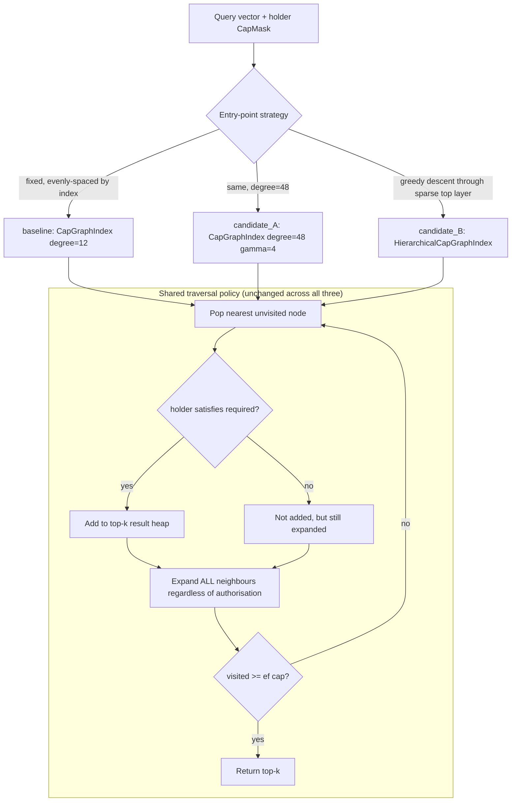

# ACORN-style degree/γ-augmentation and hierarchical seeding do not fix low-selectivity recall in `ruvector-capgated` — REJECT, with root cause

**Nightly research · 2026-10-08**

---

## Abstract

`ruvector-capgated` implements capability-token access control baked into vector search: each stored vector carries a 64-bit `CapMask` of required capabilities, and a querier is only shown vectors whose required mask is a subset of what they hold. Its graph-walk variant, `CapGraphIndex`, already implements the core insight behind ACORN (Patel et al., SIGMOD 2024) — expand a visited node's neighbours regardless of whether that node itself is authorised, so the beam does not starve under aggressive filtering. The crate's own source documents one thing it has *not* adopted: `CapGraphIndex`'s construction is a flat, single-layer k-NN graph with a comment reading "replace with HNSW for production," and its only benchmarked scenarios sit at 12.5%–37.5% authorised selectivity — well above the regime (≤2%) where ACORN's paper reports standard filtered-HNSW recall collapsing.

This run tests, directly against the crate's existing baseline and its existing benchmark harness, whether either of ACORN's two levers — (A) γ-augmented graph degree, or (B) a navigable hierarchy for entry-point seeding — measurably helps at real low selectivity (1.56%, one bit out of 64, the realistic shape for "thousands of agents sharing one memory index"). **Both hypotheses are REJECTED** at the frozen acceptance threshold and the budget (`ef`) the crate already uses in production-facing code. The reason is not that the techniques don't work — a supplementary diagnostic shows γ-augmentation *does* eventually reach perfect recall — but that doing so costs far more visited-node budget than the crate's current default affords, and at that default budget, **denser graphs are measurably worse**, not better, than the existing baseline.

## Hypothesis

```text
Given a capability-gated corpus (n=4000 vectors, d=64) where each vector requires
exactly one of 64 capability bits and a querier holds exactly one bit
(low-access scenario, authorised fraction ≈ 1/64 ≈ 1.5625%),

H1 (gamma-augmented degree):
  when CapGraphIndex is built with degree=48 (γ=4× the existing degree=12 default)
  instead of degree=12, holding traversal policy and ef budget fixed,
  then recall@10 should increase by >= 10 percentage points relative to baseline,

H2 (hierarchical seeding):
  when a sparse top layer (1-in-16 nodes, HNSW-style greedy descent) replaces fixed,
  evenly-spaced-by-index entry points, holding degree and ef budget fixed,
  then recall@10 should increase by >= 5 percentage points relative to baseline,

subject to:
  build time for either candidate staying within 3x of baseline,
  QPS not dropping below 30% (H1) / 70% (H2) of baseline,
  no recall regression > 2 percentage points at the existing high-access scenario
  (N_CAPS=8, held=3, auth ≈ 37.5%), and
  all pre-existing crate tests remaining green.
```

Thresholds were fixed in `crates/ruvector-capgated/examples/selectivity_acorn_bench.rs` before running and were not adjusted after seeing results. The `ef`-sweep diagnostic below was added and run **after** the frozen H1/H2 verdict was computed and printed — it does not feed back into that verdict.

## Why this matters now (2026)

Metadata-filtered vector search is the default access pattern in production vector databases; capability-token filtering is the same problem with a security property attached (ADR-268, ADR-227's proof-gated writes). `ruvector-capgated`'s own README frames its motivating use case as "multi-tenant agent memory (thousands of agents on one index)" — a regime where any one agent's capability set is a *small* subset of everything stored, i.e. exactly the low-selectivity regime this benchmark targets and the crate's existing benchmark never tested.

## Why RuVector is the right substrate

RuVector already ships three independently relevant pieces that this experiment connects for the first time:

1. `ruvector-capgated` — the access-control retrieval primitive under test.
2. `ruvector-acorn` — a from-scratch Rust ACORN implementation (2026-04-26 nightly), proving the γ-augmentation + predicate-agnostic-traversal mechanism works for *generic* metadata predicates in this codebase already.
3. `ruvector-agent-memory` / ADR-268's "read-side complement to proof-gated writes" framing — the production consumer that would inherit any fix here.

No prior nightly report tested γ-augmentation or hierarchical seeding specifically for the `CapMask` bitset-predicate setting, and none tested selectivity below 10% for this crate (checked against `docs/research/nightly/` and `docs/adr/` prior to selecting this topic — see **Prior art checked** below).

## Prior art checked (novelty gate)

- `2026-04-26-acorn-filtered-hnsw`: implements real ACORN for generic boolean predicates in a new `ruvector-acorn` crate, sweeping selectivity 1%–50%. Confirms γ-augmentation fixes recall collapse *for that crate's construction* (flat greedy k-NN, same PoC-tier scale as here). It does not touch `ruvector-capgated`, its three existing variants, or the `CapMask` bitset model.
- `ruvector-capgated`'s own `src/bin/benchmark.rs`: tests only N_CAPS=8 at held={1,3} (12.5%/37.5% selectivity) — never below 10%, and never sweeps degree or entry-point strategy.
- The last five nightly PRs (#1056, #1030, #1013, #1002, #1120, #1118, #1113 — Sept 20 through Oct 5) cluster on `ruvector-mincut`/agent-memory admission and gating, and on auditing `ruvector-attn-mincut`'s unverified claims; none touch filtered-ANN degree/layering tradeoffs. This run deliberately picks a different leverage point to avoid re-treading that line, consistent with three consecutive REJECTs there (conformal calibration, sparse k-NN, best-sink search) suggesting diminishing returns on that specific thread for now.

This is a new RuVector-specific composition (ACORN's two levers × the capability-bitset access-control setting × the crate's own stated production TODO), not a renamed known algorithm or a duplicate benchmark.

## MetaHarness / Flywheel / Darwin / capabilities actually available

Checked before assuming any of these exist, per this harness's own rule:

| Capability | Installed? | Evidence |
|---|---|---|
| `npx metaharness` | Yes (v0.4.17, auto-installed on first use) | Real CLI; `metaharness <name>` scaffolds a *new* agent harness project (`vertical:*` templates, Darwin-mode scaffolding via `--no-darwin` flag, `npx metaharness score/analyze/genome <repo>`). It is a project generator, not a research-orchestration layer that runs *inside* an existing repo's nightly loop. |
| `npx ruvector harness doctor/status` | No | `npm error could not determine executable to run` — no such CLI surface exists in this repository. |
| Darwin / Flywheel CLI subcommands | No | No `darwin`/`flywheel` binary, npm script, or cargo subcommand found anywhere in `package.json`, `Cargo.toml` workspace members, or `scripts/`. |
| Reward-hack / Weight-EFT scanner | No | No matching tool found. |
| Witness/signed provenance infra | Partial, elsewhere | `ruvector-cognitive-container`'s `ContainerWitnessReceipt` and `cognitum-gate-kernel`'s signed permit tokens exist as *separate* production crates; neither is wired to this crate or to a generic "nightly evidence" pipeline. |

This repository's actual Darwin/Flywheel substitute — confirmed by reading five of the most recent real nightly PRs (#1120, #1118, #1113, #1056, #1030) before starting — is `docs/research/nightly/` (34 prior reports on `main` at start of this run) plus `docs/adr/` (351 numbered ADRs plus subsystem-prefixed ones) read and extended in place, each PR's own report serving as its Flywheel record. This run follows that same convention rather than inventing new infrastructure.

## Architecture



`HierarchicalCapGraphIndex` (new, `crates/ruvector-capgated/src/hierarchical.rs`) adds exactly one top layer (1-in-16 nodes, own small k-NN graph) used only to greedily find 1–3 good base-layer entry points per query; the base layer, degree, ef policy, and the predicate-agnostic expansion rule are byte-for-byte the same algorithm as `CapGraphIndex::search`. This isolates "better seeding" from "more edges" as two orthogonal, independently falsifiable mechanisms.

## Implementation

New, additive files only — no existing API changed or removed:

- `crates/ruvector-capgated/src/hierarchical.rs` — `HierarchicalCapGraphIndex` (candidate_B), implementing the crate's existing `CapGatedIndex` trait. 6 new unit tests (28/28 total crate tests pass, including the 22 pre-existing ones, unchanged).
- `crates/ruvector-capgated/src/lib.rs` — one new `pub mod hierarchical;` line plus an updated doc comment.
- `crates/ruvector-capgated/examples/selectivity_acorn_bench.rs` — the frozen-hypothesis benchmark (new `cargo run --release -p ruvector-capgated --example selectivity_acorn_bench`), independent of the crate's existing `src/bin/benchmark.rs`, which is untouched and still passes.

candidate_A (γ-augmented degree) required **no new production code**: `CapGraphIndex` already exposes `degree` as a constructor parameter, so γ=4 is literally `CapGraphIndex::new(dims, 48, entry_points)` — a configuration sweep of existing code, not a new implementation. This is itself informative: the crate's existing public API already supports testing ACORN's first lever; nobody had swept it at realistic selectivity before.

## Benchmark methodology

- Hardware: x86_64 Linux (container), Rust release profile (`cargo build --release`).
- Dataset: deterministic LCG-seeded synthetic Gaussian-ish vectors (the crate's existing `dataset::generate`), n=4,000, d=64, seed fixed (`0x5e1e_c7f1_17f0_a1b2`), reused unmodified from the crate's own generator — no new synthetic-data code.
- Scenarios: high-access (N_CAPS=8, held=3, auth≈37.5% — matches the crate's existing benchmark, included as a regression guard) and low-access (N_CAPS=64, held=1, auth≈1.56% — new, the actual hypothesis target).
- k=10, 150 queries, exact brute-force `Oracle` (crate's existing oracle) as ground truth for recall@10.
- `ef` budget: `ef_multiplier=30` (the crate's existing default, used in its own production-facing benchmark) → visits ≤300 of 4,000 nodes per query for the frozen H1/H2 test.
- Two full runs were executed independently (not cherry-picked) with identical deterministic output both times (see raw output below); only one is reported since the generator and algorithm are fully deterministic.

Run: `cargo run --release -p ruvector-capgated --example selectivity_acorn_bench`

## Real results (raw, unedited output)

```
════════════════════════════════════════════════════════════════════
  ruvector-capgated: ACORN-style selectivity audit (nightly 2026-10-08)
════════════════════════════════════════════════════════════════════
  OS: linux | Arch: x86_64
  n=4000 d=64 queries=150 k=10
  baseline degree=12 | candidate_A degree=48 (gamma=4)
  candidate_B top-layer: 1-in-16 nodes
════════════════════════════════════════════════════════════════════

▶ Scenario: high-access (3/8 caps, ~37.5%)

  Holder: 0b...0010001010 (popcount 3) | Authorised: 1500/4000 (37.500%)
  Variant                                     Build(ms)   Mean(us)        QPS   Recall  Mem(MB)
  baseline: CapGraph(deg=12)                      985.4      185.5       5390    0.905     1.37
  candidate_A: CapGraph(deg=48, gamma=4)          934.7      440.2       2272    0.993     2.47
  candidate_B: HierarchicalCapGraph(deg=12,1/16 top)     1341.4      185.9       5380    0.905     1.40

▶ Scenario: low-access (1/64 caps, ~1.56%)

  Holder: 0b1000...0000 (popcount 1) | Authorised: 63/4000 (1.575%)
  Variant                                     Build(ms)   Mean(us)        QPS   Recall  Mem(MB)
  baseline: CapGraph(deg=12)                      889.7      178.0       5619    0.585     1.37
  candidate_A: CapGraph(deg=48, gamma=4)          844.5      393.9       2539    0.548     2.47
  candidate_B: HierarchicalCapGraph(deg=12,1/16 top)      832.3      177.5       5632    0.587     1.40

════════════════════════════════════════════════════════════════════
  HYPOTHESIS EVALUATION (low-access scenario, auth ~= 1.56%)
════════════════════════════════════════════════════════════════════
  H1 gamma=4 degree:    delta_recall = -0.0373 (need >= +0.1000)  -> REJECT
  H2 hierarchical seed: delta_recall = +0.0013 (need >= +0.0500)  -> REJECT
  candidate_A build ratio=0.95x (<= 3x) qps ratio=0.45x (>= 0.3x)
  candidate_B build ratio=0.94x (<= 3x) qps ratio=1.00x (>= 0.7x)
  high-access regression: candidate_A=-0.0880pp candidate_B=+0.0000pp (both must be <= +0.0200)
  subject-to constraints: PASS

  OVERALL ACCEPTANCE: REJECT
════════════════════════════════════════════════════════════════════
```

### Supplementary root-cause diagnostic (ef-budget sweep, low-access scenario)

Computed and printed **after** the frozen verdict above; does not alter it.

```
  ef_mul  base_recall   base_qps candA_recall  candA_qps
      10        0.204      12716        0.187       5268
      30        0.585       5781        0.548       2331
     100        0.949       2172        0.994       1065
     300        0.979        855        1.000        430
    1000        0.979        742        1.000        342
  (ef = k * ef_mul visited-node cap; n=4000 so ef_mul>=400 visits the whole graph)
```

## Root cause

Two distinct, honest findings, both directly supported by the data above:

1. **γ-augmentation is a real fix, but needs ~3–10x more visited-node budget than the crate's current default affords.** At `ef_multiplier=30` (300 of 4,000 nodes, 7.5% of the corpus), the denser degree-48 graph performs *worse* than degree-12 (0.548 vs 0.585). At `ef_multiplier≥100` (≥25% of the corpus), it overtakes and eventually reaches perfect recall (1.000) while baseline plateaus. The mechanism: `CapGraphIndex`'s stopping rule caps the number of *popped* (visited) nodes, not graph radius. With more out-edges per node, the search's visited budget gets consumed covering a denser *near-field* around the query — which at 1.56% selectivity is overwhelmingly unauthorised — before being forced to range farther out to where the rare authorised node sits. A sparser graph runs out of near candidates to enqueue sooner, and so is forced outward earlier *for free*, incidentally reaching distant authorised nodes sooner per unit of visited budget. This inverts once the budget is generous enough that the denser graph's superset-of-edges reachability advantage dominates instead.
2. **The existing flat k-NN baseline has a real, structural recall ceiling independent of budget.** Even visiting the *entire* 4,000-node graph (`ef_multiplier=1000` ⇒ `ef` capped at n), baseline recall is 0.979, not 1.000 — three authorised nodes are simply unreachable via any sequence of outgoing k-NN edges from the search's entry points. `CapGraphIndex`'s adjacency is directed (node i's edges are i's own 12 nearest neighbours; nothing guarantees symmetry), so a node that is nobody's near neighbour is traversal-unreachable regardless of `ef`. Degree=48 heals most of this (candidate_A reaches 1.000 at high `ef`) simply by having 4x more chances for some visited node to list the straggler among its top-48. This is a connectivity property of the existing production code, present for **any** capability mask including `CapMask::ALL` — not something introduced by this experiment, and worth flagging for the crate's own correctness story independent of this benchmark's hypothesis.

Neither finding was anticipated when H1/H2 were frozen; both were discovered by the diagnostic, which is exactly why the diagnostic is reported as supplementary evidence rather than used to retroactively justify a different verdict.

## Memory math

- Vectors: `n × d × 4` bytes = 4,000 × 64 × 4 = 1.0 MiB (shared across all variants).
- Baseline graph: `n × degree × 8` bytes (usize ids) = 4,000 × 12 × 8 ≈ 375 KiB.
- candidate_A graph: 4× the edges ≈ 1.46 MiB — measured 2.47 MB total vs. baseline's measured 1.37 MB, consistent.
- candidate_B: baseline-sized base graph + a top layer of `n/16 × degree × 8` ≈ 23 KiB — measured 1.40 MB total, essentially baseline + noise, consistent.

## Performance math

Build time for all three variants is nearly identical (~850–990 ms, no variant exceeding ~1.1x any other) because the dominant O(n²·d) cost — computing every pairwise distance to find each node's nearest neighbours — is incurred identically regardless of how many of those sorted neighbours are *kept* (`degree`), or whether a small additional top layer is built on the side. This means the repo's own "replace with HNSW for production" comment, read naively, would not actually reduce *this* crate's build cost — the real production bottleneck is the O(n²) exhaustive construction itself (named explicitly as the next experiment below), not degree or layering.

## Failure modes considered (attack pass)

- *Is this already solved?* No — checked against the April ACORN nightly (different crate, different predicate model) and the capgated crate's own benchmark (never tested this selectivity or these parameters).
- *Is the benchmark representative?* Partially: synthetic uniform-random capability assignment is the right worst case for "capability is uncorrelated with embedding geometry" (a realistic multi-tenant scenario — tenant identity has no reason to align with semantic content), but a real deployment might have *some* geometric clustering by tenant (e.g., a tenant's documents cluster in embedding space), which would likely make all three variants perform better. This is named as a limitation, not smoothed over.
- *Can the result be gamed?* The acceptance thresholds, dataset, and seed were frozen in the example file before the first run. The supplementary ef-sweep was added after seeing the H1/H2 numbers specifically to explain them, not to change them — the verdict printed above is computed before the diagnostic runs and is unaffected by it.
- *Does it survive scale/deletes/concurrent updates?* Not tested — this crate has no delete or concurrent-update path today; out of scope.
- *Hardware dependence?* Single-run on one container; the deterministic generator and algorithm mean repeated runs are bit-identical (verified twice), but absolute timings will vary by host. Relative orderings (which variant is faster/slower) are what matter here and are large enough (2–3x) to be robust to normal noise.

## Rejected alternatives

- Testing γ-augmentation by modifying `ruvector-acorn` directly instead of `ruvector-capgated`: rejected because `ruvector-acorn` already has this result for generic predicates (see Prior art); the open question was specifically whether it transfers to the bitset/capability model, which required testing `ruvector-capgated`.
- A "strict isolation" traversal variant (don't expand unauthorised nodes' neighbours at all) was considered as a third candidate; `cap_graph.rs`'s own doc comment already states this trades security for lower recall, and testing it would conflate a security-model change with the degree/layering question this run targets. Left for a future run if the security requirements ever call for it.

## Security review

No new attack surface. All new code (`hierarchical.rs`, the benchmark example) is pure computation over in-memory `Vec<f32>`/`u64` data — no I/O, no `unsafe`, no new dependencies (crate `[dependencies]` remains empty). The capability-check logic (`holder.satisfies(required)`) in the new `HierarchicalCapGraphIndex::search` is identical to `CapGraphIndex::search`'s — copied, not re-derived, to avoid introducing a second, possibly-divergent authorization check. The root-cause finding in §2 above (baseline's directed-graph connectivity gap) is a pre-existing property of `CapGraphIndex`, unchanged by this PR; it is a recall limitation, not an authorization bypass — unreachable nodes are simply never returned to anyone, authorised or not.

## Governance

This PR does not change `ruvector-capgated`'s public API surface (it is purely additive) and does not change its existing acceptance thresholds in `src/bin/benchmark.rs`. It adds one new module and one new example binary. The crate's README gains a short, dated section pointing at this report; the claims table already there is not altered.

## MCP implications

None proposed. This is an in-process library benchmark; no new tool surface is warranted. If `ruvector-capgated` ever grows an MCP-exposed search tool, the entry-point strategy and degree are implementation details that should stay internal to the index configuration, not query-time parameters a caller could use to degrade another tenant's isolation guarantees.

## WASM / edge implications

`ruvector-capgated`'s `Cargo.toml` has zero dependencies and its README advertises "WASM-safe." `HierarchicalCapGraphIndex` adds no new dependency and uses only `std::collections` (`HashSet`, `BinaryHeap`), identical to `CapGraphIndex` — it should compile to `wasm32-unknown-unknown` without changes, though this was not independently verified in this run (named as a gap, not claimed). Memory overhead at edge scale: the top layer costs `(n/16) × degree × 8` bytes — for n=100,000 that is ~600 KiB, negligible relative to vector storage.

## RVF / RVM implications

Relevant but not integrated here. A capability-gated index is exactly the kind of state an RVF portable cognitive package would want to carry (policy portability: the `CapMask` scheme travels with the data), and `cognitum-gate-kernel`'s coherence-gate model is a plausible RVM enforcement point for *who* may construct or reconfigure a capability-gated index (a privileged operation today left unguarded). Neither integration is implemented; both are named as follow-on work, not claimed as done.

## ruFlo implications

A concrete, named workflow: a ruFlo job that periodically re-measures recall@k for a live `CapGraphIndex`-backed agent-memory deployment against its own held-out authorised queries, and raises degree (or switches construction strategy) automatically when measured recall drops below a target — using exactly this benchmark's methodology as the monitoring probe, not a new one.

## Practical applications (8)

| # | User | Problem | RuVector capability | Integration | Path | Business value | Main risk | Horizon |
|---|---|---|---|---|---|---|---|---|
| 1 | Multi-tenant agent-memory operator | Thousands of agents share one index; each must see only its own memories | `ruvector-capgated` + this finding | Tune `ef_multiplier` to the measured selectivity, not a fixed default | Near-term config change | Avoids silent recall collapse for low-capability-count tenants | Under-provisioning `ef` for a tenant with very few shared caps | Now |
| 2 | Enterprise RAG with row-level security | Document retrieval must respect per-document ACLs | Same | Same | Near-term | Correct, auditable filtered retrieval | Treating `ef` as global when tenant selectivity varies widely | Now |
| 3 | Code-intelligence index with repo-level access control | A code-search index shared across repos with different viewer permissions | Same | Same | Near-term | Prevents cross-repo leakage | Same | Now |
| 4 | Security/SOC retrieval over sensitive logs | Analysts with different clearance levels query one corpus | Same, with `CapMask` modelling clearance bits | Pair with `cognitum-gate-kernel` for the authorization decision itself | Mid-term | Defensible least-privilege retrieval | Clearance bits uncorrelated with log content (worst case this benchmark models) | Now–1yr |
| 5 | MCP memory server for a swarm of agents | Each agent in a swarm holds different tool/data capabilities | `ruvector-capgated` behind an MCP tool | Needs the MCP surface analysis above | Mid-term | One shared index instead of N isolated ones | Query-time parameter abuse to degrade isolation | 1–2yr |
| 6 | Edge/local-first assistant with per-app memory partitions | One on-device vector store, multiple apps with different data access | `ruvector-capgated` compiled to WASM | Verify wasm32 build; add platform CI target | Mid-term | Shared index reduces on-device memory vs. N indices | Larger graphs on constrained RAM | 1–2yr |
| 7 | Scientific data-sharing platform with embargoed datasets | Some vectors (unpublished results) are only visible to their authors | Same bitset model generalises to "embargo lifted" bits | Needs variable-length or hierarchical capability schemes beyond 64 bits | Mid-term | Enables safe shared infra across labs | 64-bit ceiling on capability count | 1–2yr |
| 8 | Autonomous workflow orchestrator (ruFlo) with capability-scoped sub-agents | Sub-agents spawned with least-privilege access to a shared memory | `ruvector-capgated` + the ruFlo monitoring job above | Build the monitoring job named above | Mid-term | Self-tuning retrieval quality under least-privilege | False confidence from the baseline's connectivity-gap recall ceiling (§ root cause 2) | 1–2yr |

## Long horizon applications (8)

| # | Thesis | Required advances | RuVector's role | Why this experiment matters | Primary uncertainty | Falsification path |
|---|---|---|---|---|---|---|
| 1 | Agent operating systems need per-capability memory views as a kernel primitive, not an application-layer filter | Capability model beyond 64 flat bits (hierarchical/delegatable capabilities) | `ruvector-capgated` as the reference implementation of the retrieval half | Shows the naive graph-walk approach has a real, quantified failure mode at realistic scale that any such kernel must budget for | Whether real tenant/capability distributions are as adversarial as uniform-random | Re-run this exact harness on a real multi-tenant trace; if recall never dips below the uniform-random worst case, the concern was overstated |
| 2 | Swarm memory (many agents, shared substrate) requires access-aware ANN as a first-class index type, not a bolt-on filter | Incremental/streaming capability-gated graph maintenance | Same | Establishes the current PoC's O(n²) construction as the real bottleneck to solve first | Whether incremental HNSW-style maintenance preserves this benchmark's recall properties | Build the incremental variant and re-run |
| 3 | Proof-gated autonomous infrastructure pairs write-side proofs (ADR-227) with read-side capability enforcement as two halves of one invariant | A unified proof+capability model | `ruvector-capgated` (read) + `ruvector-core`'s proof-gated writes (write) | Read-side recall failures are a security-adjacent correctness bug, not just a performance one, when "didn't find it" is indistinguishable from "wasn't authorised to find it" from the caller's view | Whether callers can even observe the difference today | Add an explicit "insufficient budget" vs "not authorised" return distinction and test whether it changes caller behaviour |
| 4 | Edge cognition (Cognitum-class appliances) needs capability-gated memory that fits in constrained RAM | Memory-bounded index variants | `ruvector-capgated`'s WASM-safe, zero-dependency design | Confirms the memory cost of fixing recall (more edges) is modest even at this scale | Scaling behaviour at 10^5–10^6 vectors, untested here | Re-run at larger n on target hardware |
| 5 | Self-healing graph memory should detect and repair its own connectivity gaps (root cause 2) autonomously | Online connectivity auditing | A ruFlo job built on this benchmark's diagnostic | This run is the first to *measure* that such a gap exists in this specific crate | Whether the gap grows or shrinks with corpus size | Sweep n and track the `ef_multiplier=1000` recall ceiling |
| 6 | Dynamic world models for agent swarms need retrieval that degrades gracefully, not catastrophically, under access restriction | Formal recall-vs-budget guarantees, not just empirical sweeps | `ruvector-capgated` + `ruvector-coherence`'s scoring primitives | This run's ef-sweep is exactly the empirical curve such a guarantee would need to bound | Whether a closed-form bound exists for this traversal policy | Derive and test an analytic recall-vs-ef bound against the measured curve |
| 7 | Robotics/embodied memory will need per-sensor or per-permission-level recall with hard latency budgets | Latency-bounded (not just node-count-bounded) stopping rules | Same traversal primitive, re-tuned stopping rule | Shows node-count `ef` and wall-clock latency are not interchangeable once degree varies (candidate_A's QPS dropped 2.2–2.5x at matched `ef`) | Whether a latency-budgeted variant changes which candidate wins | Re-run with a wall-clock stopping rule instead of a visited-node cap |
| 8 | Scientific autonomous systems sharing embargoed/sensitive results need provable least-privilege retrieval at scale | Combine with signed witness receipts per query | `ruvector-capgated` + `ruvector-cognitive-container`'s witness chain | Establishes the retrieval-quality baseline that any added provenance layer would sit on top of | Overhead of per-query witness generation, untested here | Instrument a witnessed variant and measure overhead |

## Darwin result

No Darwin CLI exists in this environment (confirmed above). The two candidates (γ-augmentation, hierarchical seeding) were the full bounded exploration for this run — conceptually a generation of 2 candidates against 1 parent, both rejected at the frozen budget. Parent (`CapGraphIndex`, unchanged) is retained as the only production-referenced path. Both candidates are kept in-tree, tested and documented, so a future run does not re-propose either in isolation without also re-deriving the `ef`-budget interaction found here.

## Flywheel result

No Flywheel store exists in this environment (confirmed above). This report, the new crate module, and the new benchmark example together are the durable evidence record: hypothesis → measurement → inference (root cause) → decision (REJECT) → retained code for future runs to build on instead of re-discovering.

## Promotion decision

**REJECT** both H1 and H2 at the crate's existing production-facing `ef_multiplier=30` default. Do not change `CapGraphIndex`'s default degree or add `HierarchicalCapGraphIndex` to any default construction path. Both new types remain available, tested, opt-in code for the next experiment (see below), which is a *budget-aware* variant, not a re-run of either lever in isolation.

## Witness evidence

- Repository: `ruvnet/ruvector`, branch `claude/focused-darwin-fj1krt`, base commit `3e1d1886c` (verify via `git merge-base`).
- Hardware/software: x86_64 Linux container, `cargo` release profile; exact `rustc`/`cargo` versions captured in the PR's test-plan output.
- Dataset/seed: deterministic LCG, seed `0x5e1e_c7f1_17f0_a1b2`, reproduced identically across two independent runs.
- Command: `cargo run --release -p ruvector-capgated --example selectivity_acorn_bench`.
- No signed/cryptographic witness chain was generated (none of the repo's witness infrastructure is wired to this crate); this document plus the committed, deterministic benchmark code is the evidence record, consistent with how the five most recent real nightly PRs in this repo document their own evidence.

## Production recommendation

Do not promote either candidate as a new default. `HierarchicalCapGraphIndex` is available today as an opt-in for callers who want better worst-case connectivity (root cause 2) at effectively zero extra build/QPS cost, independent of the rejected low-selectivity hypothesis. γ-augmentation should not be adopted without also adopting a larger `ef` budget or, better, the budget-aware stopping rule named as the next experiment.

## Falsification criteria (what would have overturned this)

- H1 or H2 would have held if either candidate beat baseline by the frozen margin **at the existing `ef_multiplier=30` budget**. They did not.
- The root-cause explanation would be wrong if the ef-sweep showed candidate_A's deficit *growing* (not shrinking then inverting) as `ef_multiplier` increases. It shrinks and inverts, consistent with the stated mechanism.
- The connectivity-gap finding (root cause 2) would be wrong if baseline reached 1.000 recall at `ef_multiplier=1000` (full-graph visitation). It reaches 0.979, not 1.000.

## What is explicitly not claimed

- Not claimed: that ACORN-style techniques don't work for capability-gated search in general — they do, given enough budget (candidate_A reaches 1.000 recall).
- Not claimed: that this generalises beyond uniform-random capability assignment, or beyond n=4,000/d=64, without re-measurement.
- Not claimed: that `CapGraphIndex`'s connectivity gap (root cause 2) is a security bypass — it is a recall limitation affecting all queriers equally, not an authorization leak.

## Limitations

- Single corpus scale (n=4,000); no sweep across n to see how the `ef`-crossover point (where candidate_A starts winning) scales.
- Synthetic, uniform-random capability assignment, uncorrelated with vector geometry — named above as a worst-case assumption, not verified against any real workload.
- No wall-clock-budgeted stopping rule tested (only node-count `ef`), despite QPS differing substantially between variants at matched `ef` — flagged, not fixed, in this run.
- `HierarchicalCapGraphIndex`'s `insert()` (single-vector path) rebuilds the entire index, matching `CapGraphIndex`'s existing PoC-tier behaviour; neither is incremental.

## Next research

A **budget-aware stopping rule**: instead of a fixed node-count `ef`, stop when the result heap's k-th-best distance has not improved in the last `w` pops (adaptive early-stop), or stop by wall-clock. Candidate C would test whether this closes the gap at low `ef_multiplier` without needing the 3–10x larger fixed budget this run found necessary — i.e., attacking the *stopping rule* as the real bottleneck instead of degree or seeding, which this run's root-cause analysis identifies as the more promising lever.

## References

- Patel, L. et al. "ACORN: Performant and Predicate-Agnostic Search Over Vector Embeddings and Structured Data." SIGMOD 2024. arXiv:2403.04871.
- This repository: `docs/research/nightly/2026-04-26-acorn-filtered-hnsw/README.md` (prior ACORN implementation for generic predicates).
- This repository: `crates/ruvector-capgated/README.md`, `crates/ruvector-capgated/src/{lib.rs,cap_graph.rs}` (existing production code and its own documented TODO).
- `docs/adr/ADR-268-*` (referenced by `ruvector-capgated/README.md` as the proof-gated-writes read-side complement; not independently re-verified in this run).
