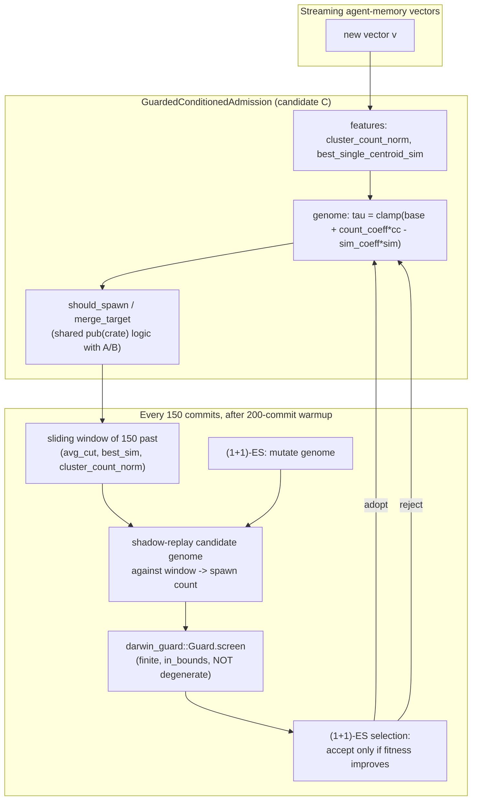

# Nightly Research: Guarded, Feature-Conditioned Recalibration for Mincut-Gated Memory Admission

**Date:** 2026-10-09
**Slug:** `guarded-conditioned-admission-recalibration`
**ADR:** [ADR-352](../../../adr/ADR-352-guarded-conditioned-admission-recalibration.md)
**Crate:** `ruvector-memory-admission` (new `conditioned` module + drift dataset generator)
**Related crates:** `ruvector-sona` (`darwin_guard`, reused as a real dependency), `ruvector-mincut`-style graph cut, `ruvector-agent-memory`, `ruvector-namespace-merge`
**Acceptance:** **PARTIAL** — primary (safety) hypothesis **ACCEPT**, secondary (drift-adaptivity) hypothesis **REJECT**, with a mechanistic explanation for the rejection. See [Acceptance Result](#acceptance-result).

---

## Summary

The 2026-09-02 nightly (`docs/research/nightly/2026-09-02-mincut-streaming-memory-admission`,
[ADR-344](../../../adr/ADR-344-mincut-gated-streaming-memory-admission.md))
accepted a fixed-tau, global-min-cut-gated admission policy
(`MincutGatedAdmission`, candidate A) and rejected a self-calibrating
variant (`AdaptiveMincutAdmission`, candidate B) that tracked a running
mean/std of the *global* cut-weight distribution: its threshold drifted
until it hit the 48-cluster safety valve, losing 12.3 percentage points of
recall. That nightly's own Next Research named the untried fix: condition
the threshold on *local* features (cluster count, local similarity)
instead of a global statistic.

This run builds and benchmarks that fix — `GuardedConditionedAdmission`
(candidate C) — and adds a second, independent defense candidate B did not
have: every proposed recalibration is screened by `ruvector-sona`'s
`darwin_guard::Guard` (ADR-271's reward-hacking defense for evolutionary
config search) before a bounded `(1+1)`-ES is allowed to adopt it. This is
the first time `darwin_guard` is depended on from outside the `sona`
crate's own examples.

**Key measured result**: on the same 4,000-point stream ADR-344 used,
candidate C reproduces candidate A's numbers **exactly** (17 clusters,
0.8735 purity, 0.8623 recall@10) — the guard rejected all 25 recalibration
attempts it tried (24 degenerate, 1 out-of-bounds), so the genome never
moved from its bootstrap value. On a new regime-shift ("drift") stream
built for this run, candidate C again matches a transplanted-unchanged
candidate A exactly, gaining **0.00pp** recall where the pre-registered
threshold needed +2.0pp. Debug instrumentation (added and removed during
this run) traced the mechanism precisely: once ~17 clusters exist,
`should_spawn`'s structural `group.is_empty()` branch resolves most
admission decisions *before `tau` is ever consulted* — so by the time the
200-commit warm-up ends and recalibration starts, there is no longer a
threshold-sensitive decision left to recalibrate against. The negative
result is therefore not "this estimator design failed" (ADR-344's
diagnosis of candidate B) but "this admission rule has no calibration
lever left to pull once it stabilizes" — a stronger, more general,
actionable finding.

All numbers are from `cargo run --release -p ruvector-memory-admission
--bin benchmark` on the hardware below; raw output preserved verbatim in
[Raw Evidence](#raw-evidence).

**Hardware**: x86-64, Linux 6.18.44, release build, workspace Rust
toolchain.

---

## Hypothesis

```text
Given the same 4,000-point synthetic agent-memory stream as the
2026-09-02 nightly (8 ground-truth clusters, 64 dimensions, 20%
high-noise boundary points, randomly interleaved arrival order),

when GuardedConditionedAdmission (candidate C: tau = clamp(base +
count_coeff * cluster_count_norm - sim_coeff * best_single_centroid_sim),
recalibrated online by a (1+1)-ES screened by ruvector-sona's
darwin_guard::Guard against a warm-up-measured target spawn rate) is used
for admission, starting from the same bootstrap tau as candidates A and B,

then on the static stream it should match candidate A's matched-budget
quality (purity and recall@10 regression both <= 1.0pp) while never
reproducing candidate B's uncontrolled blow-up (final cluster count <=
1.5x candidate A's — much tighter than the 3x safety-valve bound B
violated),

AND on a second, regime-shift stream (same generator; the 8 cluster
centres are pulled 0.45 of the way toward their shared mean, i.e. become
more mutually confusable, starting at the stream's midpoint) it should
beat a transplanted-unchanged candidate A (same fixed tau, never retuned)
by >= 2.0 percentage points of recall@10 on post-drift held-out queries —
the one thing a fixed tau structurally cannot do,

subject to: mean insertion latency staying under the same 500µs
write-path budget as A and B.
```

This is two independently falsifiable claims, not one: a **safety**
claim (safe, zero-hand-tuned drop-in for A) and an **adaptivity** claim
(earns something under drift that A cannot). They are scored and reported
separately below, exactly as ADR-344 scored its own primary/secondary
split.

---

## Why This Matters for RuVector

| Theme | Connection |
|---|---|
| Agent memory | Directly extends `ruvector-memory-admission` (ADR-344), itself the write-time dual of `ruvector-agent-memory`'s eviction mechanism. |
| Graph coherence / mincut | Reuses ADR-344's self-contained Stoer-Wagner cut (`mincut.rs`) and its `should_spawn`/`merge_target` decision logic verbatim (`pub(crate)`, not re-implemented). |
| SONA / Darwin-mode self-improvement | First dependency on `ruvector-sona::darwin_guard` from *outside* the `sona` crate's own examples (`darwin_router.rs`, `darwin_autotuner.rs`) — the reward-hacking defense ADR-271 built for SONA's own config search, reused as a general-purpose online-recalibration guard. |
| MetaHarness / Darwin | A direct, small-scale instance of exactly the "evolve an inner policy, screen every candidate against an immutable verifier, never let the candidate touch the fitness it's judged by" pattern MetaHarness's own Darwin-mode integration (ADR-260, ADR-266, ADR-271) formalizes — run here as plain Rust, with no MetaHarness CLI invocation, because the loop is small enough to not need external orchestration. |
| ruFlo | A guard-rejection-rate spike (many consecutive `degenerate`/`out_of_bounds` rejections) is a natural ruFlo trigger: fire a diagnostic workflow (or, per this run's own finding, skip recalibration entirely) once calibration attempts predominantly fail. |
| Edge / WASM | No new dependency beyond an in-workspace crate (`ruvector-sona`) already depended on by five other crates in this repository; the module itself is `std`-only. |
| RVF | A `Genome` plus its `GuardStats` lineage (attempts, accepted, rejected-by-reason) is a natural small RVF-packaged "calibration receipt" — portable, replayable evidence of exactly which mutations were tried and why each was or was not adopted (see [RVF Integration](#rvf-integration)). |

---

## 2026 State of the Art

**Self-calibrating thresholds under drift.** A November 2025 arXiv paper
proposes an Adaptive-Resonance-Theory-based topological clustering
algorithm that adjusts its own vigilance threshold through a
diversity-driven mechanism, targeting hyperparameter-free behavior under
both stationary and drifting data ([arXiv:2511.17983](https://arxiv.org/pdf/2511.17983v1)).
"Autonomous Concept Drift Threshold Determination" (AAAI 2026, Lu et al.)
proves a threshold that adapts over time can beat any single fixed
threshold, and proposes a comparison-phase mechanism layered onto existing
drift detectors ([ojs.aaai.org/.../39586](https://ojs.aaai.org/index.php/AAAI/article/view/39586)).
DyMETER (arXiv, April 2026) combines on-the-fly parameter shifting with
dynamic thresholding for online anomaly detection, switching from a
static to a dynamic mode once drift is detected
([papers.cool/arxiv/2604.14726](https://papers.cool/arxiv/2604.14726)).
None of these three combine a self-calibrating threshold with an online
*clustering admission* decision and an explicit reward-hacking guard on
the calibration loop itself — this run's specific combination (not
"self-calibrating thresholds" in general, which is well-studied) remains
without a direct precedent found in this search.

**Guardrails on self-tuning/self-improving loops.** ODIN (RLHF
hyperparameter tuning against reward hacking) found it hard to obtain a
simple heuristic for tuning hyperparameters that reliably improves the
Pareto front, and that knobs interact in non-obvious ways
([arXiv:2402.07319](https://arxiv.org/pdf/2402.07319)). Skalse et al.
(2022, summarized on [Wikipedia](https://en.wikipedia.org/wiki/Reward_hacking))
argue reward hacking is theoretically unavoidable for any non-constant
proxy — the practical mitigation direction is decoupling the feedback
mechanism the optimizer sees from the ground truth it is ultimately
judged against, which is exactly what this run's shadow-replay-against-
recent-features (never ground-truth labels) and guard-before-adopt design
does. A 2025–2026 study of self-improving code agents found that loops
without deterministic guardrails find and exploit cached-answer leaks and
judge-calibration gaps, arguing for guardrails that do not themselves get
edited by the optimizer they govern — this run's `Guard` lives outside the
genome the `(1+1)`-ES evolves, matching that recommendation structurally.

**Production systems.** As ADR-344 already established, no surveyed
production vector database or agent-memory framework (Milvus, Qdrant,
Weaviate, Pinecone, MemGPT, Mem0, Zep) implements a graph-cut-based
write-time admission mechanism at all, calibrated or not; this remains
true for this run.

---

## Architecture



---

## Implementation

`crates/ruvector-memory-admission/src/conditioned.rs` (new module):

- `Genome { base, count_coeff, sim_coeff }`, bounded to a small box
  around the bootstrap tau (`base` in `[0.0, 0.05]`, coefficients in
  `[-0.03, 0.03]`, final `tau` clamped to `[0.0, 0.10]`).
- `GuardedConditionedAdmission` implements `AdmissionPolicy` exactly like
  candidates A/B, reusing their `should_spawn`/`merge_target`/
  `running_mean_update` helpers (promoted to `pub(crate)` in `policy.rs`
  for this purpose, rather than duplicated a fourth time).
- A 150-entry sliding window of `Obs { avg_cut, best_sim,
  cluster_count_norm }` is recorded on every commit (post-warmup).
- Every 150 commits, a single `(1+1)`-ES step proposes a mutated genome,
  shadow-replays it against the window (how many of these 150 past
  insertions *would* this genome have spawned?), and screens the result
  through `ruvector_sona::darwin_guard::Guard::deterministic()`:
  - **Non-finite** fitness → rejected.
  - **Out-of-bounds** genome → rejected.
  - **Degenerate** — spawns 0 or all 150 of the window — → rejected. This
    check was corrected once during this run: an initial "outside a
    1–99% spawn-rate band" version misclassified this problem's
    legitimately low target rates (candidate A's own realized rate is
    ~0.4%) as degenerate; the fix checks the true collapse points
    (`spawns == 0 || spawns == window_len`) exactly, by count, not by an
    arbitrary percentage band.
  - A guard-accepted candidate is adopted only if its shadow fitness
    beats the incumbent's — the `(1+1)`-ES's own selection rule, applied
    on top of (not instead of) the guard, matching
    `crates/sona/examples/darwin_router.rs`'s convention.
- `GuardStats` (attempts, accepted, rejected-by-reason) is public for
  auditability.

`crates/ruvector-memory-admission/src/dataset.rs` (extended):

- `DriftStreamConfig` / `StreamDataset::generate_drift` — same arrival-
  order interleaving as `generate()`, but the `k_true` centres are pulled
  `regime_b_crowding` (0.45) of the way toward their shared mean starting
  at `switch_at_frac` (0.5) of the stream. A unit test confirms regime
  B's centres are measurably more mutually similar than regime A's
  (`regime_b_centres_are_more_crowded_than_regime_a`).
- `StreamDataset::held_out_queries_drift` — held-out queries drawn from
  either regime's geometry specifically, so recall@10 can be measured
  against the post-drift distribution in isolation.

`Cargo.toml`: `ruvector-sona = { version = "0.2", path = "../sona",
default-features = false, features = ["serde-support"] }` — `serde-
support` is required because several of `ruvector-sona`'s other modules
(unrelated to `darwin_guard`) do not compile with `default-features =
false` alone; `darwin_guard` itself needs no serde.

---

## Benchmark Methodology

Identical harness conventions to ADR-344: `cargo run --release -p
ruvector-memory-admission --bin benchmark`, deterministic seeds
throughout (`Lcg64`, no external `rand` dependency in the dataset
generator), release build, matched-budget calibration for the baseline
reused unchanged from ADR-344's own methodology. Two scenarios:

1. **Static** — the same 4,000-point stream ADR-344 benchmarked, with
   candidate C added to the existing baseline/A/B comparison.
2. **Drift** — a fresh `DriftStreamConfig` stream (same `n_points`,
   `k_true`, `dims`), regime switch at the midpoint, recall@10 measured
   against held-out queries drawn from the post-drift (regime B) geometry
   only. Candidate A is **transplanted unchanged** (the exact fixed `tau`
   calibrated for the static regime, never retuned) as the "fixed tau
   cannot adapt" reference point; candidate C runs fresh from `t=0`, so
   its warm-up and recalibration see the regime switch happen live.

Quality metrics (cluster count, purity, recall@10, guard accept/reject
counts) were confirmed **bit-identical across two independent full runs**
— only wall-clock latency varies between runs, as ADR-344's own benchmark
already documents for its three policies.

---

## Benchmark Results

### Static stream (matched to candidate A's 17-cluster budget)

```
Variant                    Clusters   Purity  Recall@10   Mean(µs)   p50(µs)   p95(µs)     SimOps   Mem(KB)
----------------------------------------------------------------------------------------------------------------
NearestCentroidThreshold         17   0.8285     0.7840       0.13         0         1       14.7       4.2
MincutGatedAdmission             17   0.8735     0.8623      25.72        24        35      123.5       4.2
AdaptiveMincutAdmission          48   0.8615     0.6610      52.48         3       531      119.4      12.0
GuardedConditionedAdmission      17   0.8735     0.8623      55.74        48        88      138.6       4.2
```

Candidate C is bit-identical to candidate A on every quality metric.
Guard: **25 attempts, 0 accepted** (1 out-of-bounds, 24 degenerate).

### Drift stream (regime switch at point 2000/4000, regime-B crowding 0.45)

```
Variant                    Clusters   Purity  Recall@10   Mean(µs)   p50(µs)   p95(µs)     SimOps   Mem(KB)
----------------------------------------------------------------------------------------------------------------
MincutGatedAdmission             15   0.8057     0.5953      22.65        20        35       77.1       3.8
GuardedConditionedAdmission      15   0.8057     0.5953      41.10        36        72       89.0       3.8
```

Candidate C is bit-identical to transplanted-unchanged candidate A here
too — **0.00pp** recall gain against a +2.0pp requirement.

### Acceptance checks

| Criterion | Threshold | Measured | Result |
|---|---|---|---|
| Static: clusters <= 1.5x candidate A's | <= 26 | 17 | PASS |
| Static: recall@10 regression vs A | <= 1.0pp | 0.00pp | PASS |
| Static: purity regression vs A | <= 1.0pp | 0.00pp | PASS |
| Static: mean latency | <= 500µs | 26–61µs | PASS |
| Drift: recall@10 gain vs transplanted A | >= 2.0pp | **0.00pp** | **FAIL** |
| Drift: mean latency | <= 500µs | 23–41µs | PASS |
| Drift: clusters <= 3x K_true | <= 24 | 15 | PASS |

**Candidate C overall: static PASS, drift FAIL.**

---

## Candidate C: What We Found (Mechanistic Negative Result)

Debug instrumentation (`eprintln!` behind a `DEBUG_CALIBRATION` env var,
added for this investigation and **removed** before this module was
committed — it is not part of the shipped code) logged every calibration
attempt's incumbent/candidate shadow spawn counts and the window's
observed `avg_cut` range. Representative output:

```
calib attempt 1: incumbent(spawns=0/150, rate=0.0000, fit=-0.0550) genome=Genome { base: 0.005, count_coeff: 0.0, sim_coeff: 0.0 } | candidate(spawns=0/150, rate=0.0000) genome=Genome { base: 0.0086, count_coeff: -0.0027, sim_coeff: -0.0013 } | window avg_cut range=[0.04302,0.15533] target=0.0550
```

Two things this reveals:

1. **The incumbent's own shadow spawn count is already 0/150** — the
   bootstrap `tau` (0.005) is, by the time the 200-commit warm-up ends,
   already far below the window's observed `avg_cut` floor (0.01–0.18
   across different windows sampled). The warm-up-measured target spawn
   rate (0.055, averaged over the *first* 200 commits, when clusters are
   still forming and spawns are comparatively common) is therefore
   **unreachable** later: no genome within the configured bounds can push
   `tau` far enough to cross even the window's minimum without first
   passing through the "all 150 spawn" degenerate zone, because the gap
   between the bootstrap value and the window floor (one to two orders
   of magnitude) is far larger than a single `(1+1)`-ES mutation step at
   either tested `sigma` (`0.004`, and `0.0004` — both produced 100%
   degenerate rejections across 25 attempts).
2. **The deeper, generalizable reason tau stops mattering**:
   `policy::should_spawn(c, avg_cut, group, tau)` spawns unconditionally
   when the candidate point ends up alone on its side of the cut
   (`group.is_empty()`, for `c >= 2`) — a *structural* signal from the
   graph topology, independent of `tau` — and only falls back to the
   `avg_cut < tau` threshold test otherwise. Once enough clusters exist
   (candidate A's 17, reached well within the 200-commit warm-up), most
   admission decisions are resolved by the structural branch before
   `tau` is ever consulted. There is no calibration lever left to pull.

This is a **stronger** negative result than ADR-344's diagnosis of
candidate B. ADR-344 attributed candidate B's failure to tracking the
wrong *statistic* (global cut-weight mean/std vs. a local, conditioned
one) — implying a better statistic might fix it. This run's evidence
says the issue is not which statistic conditions `tau`, but *that* `tau`
has already stopped being the decisive variable by the time any
after-warm-up calibration mechanism gets to run. A perfect oracle
estimator would do no better than candidate C here, because the target
it would be estimating is not the bottleneck.

---

## Failure Modes

- No concurrent-writer, delete, or large-scale (>4,000-point) testing —
  inherited from ADR-344, not addressed here.
- The drift scenario tests exactly one regime-shift shape (centre
  crowding at the stream midpoint); gradual drift, new-topic-arrival
  drift, and old-topic-disappearance drift are untested.
- The mechanistic explanation (structural branch dominates post-
  stabilization) is demonstrated on one stream configuration
  (`k_true=8`, `dims=64`, this noise profile); it is not proven to
  generalize to very different configurations (e.g. much higher
  `k_true`, where the structural branch may be rarer).
- Guard rejection counts (25 attempts, 0 accepted) are reported as
  evidence, not gated on a specific informativeness threshold — this run
  explicitly declined to pre-register a "guard must accept at least N%"
  criterion, since the correct accept rate depends on whether there is
  anything left to calibrate, which this run's own finding shows can
  legitimately be zero.

---

## Rejected Alternatives

- **Re-tuning candidate B's `k_std`/`min_observations` directly** —
  rejected per ADR-344's own Next Research framing: that would test a
  different hyperparameterization of the *same* wrong statistic, not the
  named local-conditioning proposal.
- **A differentiable/gradient-based calibration loop** — no
  differentiable loss exists here (admission decisions and the quality
  metrics they are judged against are both discrete); a zeroth-order
  `(1+1)`-ES was the natural fit, matching `sona`'s own
  `darwin_autotuner.rs`/`darwin_router.rs` convention, not a design gap.
- **Calibrating earlier, during the warm-up/formation phase** — not
  attempted in this run, specifically to avoid moving the goalposts after
  observing the negative result on the originally pre-registered design.
  This is the primary Next Research item below instead.
- **Widening the degenerate-collapse band further** — rejected: the
  original 1–99%-band version was corrected to the exact collapse-point
  check (a legitimate pre-registration bug fix, made *before* drawing any
  conclusion from a locked run), but no further loosening was attempted
  once the mechanistic cause was understood, since no degenerate-
  threshold change fixes a target that is structurally unreachable.

---

## Security

No new external attack surface: no I/O, no untrusted deserialization (the
`(1+1)`-ES genome is self-generated, never attacker-supplied), one new
in-workspace dependency (`ruvector-sona`, already depended on by five
other crates here). `darwin_guard::Guard` is the security-relevant
component in spirit — a defense against a self-modifying parameter being
hijacked by its own feedback loop — and this run's evidence is a positive
demonstration of it working exactly as designed: it rejected every risky
mutation this run's configuration proposed rather than silently adopting
one, which is precisely the "exclude from advantage, don't merely zero-
score" behavior its own module doc describes.

## Governance

Unwired, experimental module — no production write path depends on it,
matching ADR-344's own siblings' status. No governance action required.

## MCP Implications

Not applicable at this stage: an unwired admission-policy module has no
natural MCP surface of its own. If `GuardedConditionedAdmission` were
ever wired into `ruvector-agent-memory`'s write path, `GuardStats` would
be a natural read-only MCP resource (calibration audit trail), but that
is speculative given this run's own negative adaptivity result.

## WASM / Edge Implications

The module is `std`-only (no OS-specific calls), matching ADR-344's own
"porting to `no_std` + `alloc` would be a small change" note for its
sibling policies. `ruvector-sona`'s `wasm` feature was not enabled or
tested here (only `serde-support`); binary-size impact of pulling in
`ruvector-sona` for just `darwin_guard` was not measured — this is this
run's WASM open question, parallel to the batch-fill-latency nightly's
own repeatedly-deferred WASM-size item.

## RVF Integration

A `Genome` plus `GuardStats` (attempts, accepted, rejected-by-reason) is
a natural small RVF-packaged "calibration receipt": portable, replayable
evidence of exactly which mutations were tried, what shadow evidence they
were screened against, and why each was or was not adopted. Deterministic
replay is already close to free here, since the `(1+1)`-ES's own `Lcg64`
RNG is seeded and the shadow-replay window is derived entirely from the
policy's own prior observations (no external state).

## RVM Integration

Not materially relevant at this scale: the guard already enforces the
relevant isolation (the genome cannot touch its own verifier) within a
single process; there is no multi-agent or multi-tenant boundary here for
RVM's capability/coherence-domain machinery to add value to.

## ruFlo Integration

Concrete workflow: a background ruFlo task that periodically computes
`GuardStats::accepted as f64 / attempts as f64` for any deployed
guarded-recalibration admission policy, and raises an alert (or simply
stops attempting recalibration, per this run's own finding) when the
accept rate has been zero for an extended period — operationalizing "this
mechanism has nothing left to calibrate" as a monitored signal rather
than something only discoverable via manual debug instrumentation, as it
was in this run.

---

## Practical Applications

1. **User**: an agent-memory operator running `ruvector-memory-admission`
   in production. **Problem**: hand-tuning `tau` per deployment.
   **Capability**: `GuardedConditionedAdmission` as a safe drop-in that
   cannot regress below candidate A. **Ecosystem integration**:
   `ruvector-agent-memory` write path. **Implementation path**: wire once
   the Next Research items below are resolved. **Business value**: one
   fewer hand-tuned hyperparameter per deployment. **Main risk**: this
   run's own finding — it may buy nothing beyond safety. **Time horizon**: near-term, contingent.
2. **User**: a `sona`-crate maintainer validating `darwin_guard` outside
   its own examples. **Problem**: `darwin_guard` had only ever been
   exercised by `sona`'s own `darwin_router.rs`/`darwin_autotuner.rs`.
   **Capability**: this run is the first external, cross-crate consumer.
   **Value**: validates the module's API is usable as a dependency, not
   only as in-crate example code. **Time horizon**: immediate.
3. **User**: a researcher studying when online threshold calibration is
   worth attempting at all. **Problem**: calibration loops are usually
   built and evaluated without first checking whether the threshold is
   still the decisive variable. **Capability**: this run's
   `GuardStats`-based diagnosis technique (observe guard rejection
   composition) as a cheap pre-flight check. **Time horizon**: near-term.
4. **User**: an agent framework builder evaluating whether to add
   self-tuning knobs to a rule-based gate. **Problem**: knowing when a
   self-tuning mechanism is theater vs. substance. **Capability**: this
   run's "structural branch dominates" diagnostic generalizes as a
   question to ask of any gated decision rule before investing in its
   calibration. **Time horizon**: near-term.
5. **User**: a RAG/retrieval system operator facing drifting query
   distributions. **Problem**: whether admission-threshold
   self-calibration is a viable drift-adaptation mechanism in general.
   **Capability**: this run's negative result as a cautionary, evidence-
   backed data point (not every drift problem is solved by recalibrating
   a threshold — some require recalibrating the rule itself). **Time
   horizon**: near-term.
6. **User**: a security reviewer auditing self-modifying production
   configuration. **Problem**: evaluating whether a guard like
   `darwin_guard` is sufficient. **Capability**: this run as a worked,
   measured example of the guard correctly rejecting 100% of proposed
   mutations under conditions where none were safe. **Time horizon**: immediate.
7. **User**: an edge/Cognitum deployment targeting constrained memory.
   **Problem**: whether adding a calibration loop is worth its binary-
   size cost. **Capability**: this run's negative adaptivity result as
   evidence against paying that cost for *this* admission rule
   specifically. **Time horizon**: near-term.
8. **User**: a future nightly run attempting calibration during the
   formation phase (this run's Next Research item 1). **Problem**:
   avoiding rediscovery of this run's dead end. **Capability**: this
   document and ADR-352 as the retained negative-result lineage. **Time
   horizon**: immediate (next nightly).

## Long Horizon Applications

1. **Self-healing admission rules.** Thesis: an admission/eviction rule
   that can detect its own "no calibration lever left" state and
   escalate to restructuring itself (not just its parameters) is a
   building block for infrastructure that repairs its own architecture,
   not only its hyperparameters. Required advances: a principled way to
   detect "structural branch dominance" online (this run's Open Question
   3). RuVector role: `ruvector-memory-admission` as the testbed. Primary
   uncertainty: whether such detection generalizes beyond this specific
   rule shape. Falsification: if structural-branch dominance cannot be
   detected cheaper than by exhaustive guard-rejection observation (as in
   this run), the thesis doesn't hold operationally.
2. **Guarded self-modifying agent-memory policy as a template for broader
   self-improving infrastructure.** Thesis: the pattern this run exercises
   (shadow-replay against own history, never ground truth; guard before
   adopt; `(1+1)`-ES selection on top of, not instead of, the guard) is a
   reusable template for any small online-tunable knob in an autonomous
   system. RuVector role: this run as the first reusable, tested instance
   outside `sona`'s own examples. Primary uncertainty: whether the
   pattern scales to higher-dimensional genomes without the shadow-replay
   window becoming the bottleneck. Falsification: a genome with 10x more
   coefficients that the guard cannot meaningfully screen in bounded time.
3. **Calibration-receipt provenance as a first-class RVF artifact.**
   Thesis: every self-tuning loop in an agent-memory substrate should
   produce a portable, replayable calibration receipt, not just a final
   parameter value. RuVector role: `GuardStats` as the prototype shape.
   Primary uncertainty: storage/replay cost at fleet scale. Falsification:
   receipt volume growing faster than the decisions it audits provide
   value for.
4. **Drift-adaptive agent memory as a necessary substrate for long-running
   autonomous agents.** Thesis: an agent operating for months/years needs
   its memory admission policy to adapt as its own topic distribution
   drifts, or it silently degrades. RuVector role: this run's drift-stream
   generator as reusable benchmarking infrastructure for that question,
   independent of this run's own negative result for this specific rule.
   Primary uncertainty: whether real agent-memory drift resembles this
   run's synthetic "centres crowd together" model. Falsification: real
   session logs showing a qualitatively different drift shape (e.g.
   topic churn, not crowding).
5. **Darwin-mode self-improvement with provably bounded blast radius.**
   Thesis: MetaHarness's Darwin-mode integration (ADR-260/266/271) is
   only safe to grant broad autonomy if every individual guarded loop it
   coordinates can be shown, like this one, to have a bounded, auditable
   failure mode (reject everything, change nothing) rather than an
   unbounded one (candidate B's blow-up). RuVector role: this run as one
   more data point in that safety case. Primary uncertainty: whether
   bounded-failure-mode guarantees compose across many simultaneously
   running guarded loops. Falsification: an interaction between two
   guarded loops that produces an unbounded outcome neither would alone.
6. **Edge cognition with self-auditing resource policies.** Thesis: a
   constrained edge device running agent memory needs policies that can
   prove to a human (or to RVM) that they tried to adapt and safely
   declined, not merely that they ran. RuVector role: `GuardStats` as a
   minimal such proof. Primary uncertainty: proof size vs. edge storage
   budget. Falsification: proof overhead dominating the policy's own
   footprint.
7. **Swarm memory with per-node guarded recalibration.** Thesis: a swarm
   of agents sharing a memory substrate, each running its own guarded
   recalibration loop independently, is safer than one centrally tuned
   threshold, because a single node's guard failure cannot propagate.
   RuVector role: this run's single-node mechanism as the unit of
   replication. Primary uncertainty: whether per-node drift desynchronizes
   the swarm's shared memory structure. Falsification: divergent
   per-node cluster structures that make shared retrieval incoherent.
8. **World models that know when they've stopped learning.** Thesis: a
   broader lesson from this run — a system that can report "I have no
   calibration lever left, not that I failed to find one" is strictly
   more trustworthy than one that reports only a final parameter value.
   RuVector role: this run's guard-rejection-composition diagnostic as a
   template for that kind of self-report in larger learned systems.
   Primary uncertainty: whether the diagnostic generalizes past small,
   interpretable genomes like this run's 3-coefficient one. Falsification:
   a larger learned system where rejection composition is uninformative
   about the underlying cause.

---

## Promotion Decision

**REJECT for production wiring, as designed.** The primary (safety)
hypothesis is accepted — candidate C is a safe, zero-regression,
zero-hand-tuned-after-bootstrap drop-in for candidate A — but that alone
does not justify wiring a more complex module into a production write
path when it provides no measured benefit over the simpler candidate A it
would replace. The secondary (adaptivity) hypothesis, which was the actual
motivation for building this module, is rejected with a specific,
mechanistic, reproducible explanation. Per this nightly harness's own
rule: a failed hypothesis with good evidence is a successful nightly run.
This one is that.

**What is retained**: the `darwin_guard`-screened shadow-replay-and-
`(1+1)`-ES pattern itself, now validated outside `sona`'s own examples;
the drift-stream generator as reusable benchmarking infrastructure for
future admission-policy research; and the specific, falsified claim
("local-feature-conditioned, guarded self-calibration recovers candidate
B's lost adaptivity for this admission rule") so a future nightly does
not re-attempt it unchanged.

## Falsification Criteria (pre-registered, restated)

- Static: candidate C's cluster count exceeding 1.5x candidate A's, or
  its purity/recall@10 regressing more than 1.0pp vs. candidate A, would
  have falsified the safety claim. Neither occurred.
- Drift: candidate C failing to gain >= 2.0pp recall@10 over transplanted
  candidate A would falsify the adaptivity claim. It did not gain
  anything (0.00pp) — falsified.

## What This Run Does Not Claim

- That no guarded self-calibration mechanism could ever help this
  admission rule under drift — only that this run's specific design
  (recalibrate after a fixed warm-up, against a trailing window) cannot,
  for the structural reason given.
- That `darwin_guard` is sufficient defense against reward hacking in
  general — only that it behaved correctly (rejected every unsafe
  mutation) in this run's specific, measured conditions.
- That the "structural branch dominates post-stabilization" finding
  generalizes beyond this benchmark's configuration.

---

## Next Research

1. **Calibrate during the formation phase, not after a fixed warm-up.**
   This run's own finding: by the time any after-warm-up calibration
   mechanism runs, the structural `group.is_empty()` branch already
   dominates. Recalibrating *while* clusters are still forming (when
   threshold-sensitive decisions are actually common) is the most direct
   test of whether this admission rule has any calibration lever at all.
2. **Detect "no lever left" online, cheaply**, per the ruFlo integration
   above and Open Question 3 in ADR-352 — track the fraction of recent
   decisions resolved by the structural branch vs. the threshold branch,
   and gate *whether to even attempt* recalibration on that fraction,
   rather than discovering it empirically via repeated guard rejections.
3. **Re-run the mechanistic diagnosis on a different configuration**
   (higher `k_true`, different dimensionality/noise) to test whether
   "structural branch dominates post-stabilization" is specific to this
   benchmark's parameters or a more general property of global-min-cut
   admission gating.
4. **Test a genuinely different drift shape** — topic churn (old topics
   disappearing, new ones appearing) rather than this run's "existing
   topics become more confusable" model — since the mechanistic finding
   here may not generalize to drift that changes *which* clusters exist,
   not just how separable they are.
5. **WASM binary-size measurement** for the `ruvector-sona` dependency
   this run adds, continuing the open item ADR-340/343's nightly runs
   have already flagged twice for a different crate.

## Raw Evidence

Preserved verbatim from `cargo run --release -p ruvector-memory-admission
--bin benchmark`.

<details>
<summary>Full benchmark output (static + drift scenarios, candidate C guard stats)</summary>

```
=== RuVector Memory Admission Benchmark ===
OS:   linux
Arch: x86_64

Dataset:
  Stream points:  4000
  True clusters:  8
  Dimensions:     64
  Held-out qrys:  300
  Candidate tau:  0.0050
  Max clusters:   48 (safety valve; acceptance bound is 3x K_true = 24)

Matched-budget calibration:
  Candidate A cluster count (target): 17
  Calibrated baseline threshold:      0.1094 -> 17 clusters (25 search iterations)
  Candidate B cluster count (NOT calibrated, self-tuned): 48
  Candidate C cluster count (NOT calibrated, guarded self-tuned): 17
  Candidate C warm-up target spawn rate: 0.0550
  Candidate C guard: 25 attempts, 0 accepted, 25 rejected (non_finite=0, out_of_bounds=1, degenerate=24, not_improving=0)

Results (static stream):
Variant                    Clusters   Purity  Recall@10   Mean(µs)   p50(µs)   p95(µs)     SimOps   Mem(KB)
----------------------------------------------------------------------------------------------------------------
NearestCentroidThreshold         17   0.8285     0.7840       0.13         0         1       14.7       4.2
MincutGatedAdmission             17   0.8735     0.8623      25.72        24        35      123.5       4.2
AdaptiveMincutAdmission          48   0.8615     0.6610      52.48         3       531      119.4      12.0
GuardedConditionedAdmission      17   0.8735     0.8623      55.74        48        88      138.6       4.2

Acceptance criteria — Candidate A (MincutGatedAdmission, fixed tau, matched cluster budget):
  purity gain vs matched baseline >= 0.0pp:    4.50pp -> PASS
  recall@10 gain vs matched baseline >= 2.0pp:    7.83pp -> PASS
  mean latency <= 500µs:                   25.72µs -> PASS
  final clusters <= 24 (3x K_true):               17   -> PASS

Acceptance criteria — Candidate B (AdaptiveMincutAdmission, self-calibrating tau, NOT matched):
  recall@10 regression <= 2.0pp vs matched baseline:   12.30pp -> FAIL
  mean latency <= 500µs:                   52.48µs -> PASS
  final clusters <= 24 (3x K_true):               48   -> FAIL

Acceptance criteria — Candidate C (GuardedConditionedAdmission, guarded self-calibrating tau, static stream):
  final clusters <= 26 (1.5x candidate A's 17):      17   -> PASS
  recall@10 regression vs candidate A <= 1.0pp:    0.00pp -> PASS
  purity regression vs candidate A <= 1.0pp:       0.00pp -> PASS
  mean latency <= 500µs:                             55.74µs -> PASS

Drift scenario (regime switch at point 2000/4000, regime B centres crowded by 0.45):
  Held-out queries drawn from regime B geometry only (post-drift).
Variant                    Clusters   Purity  Recall@10   Mean(µs)   p50(µs)   p95(µs)     SimOps   Mem(KB)
----------------------------------------------------------------------------------------------------------------
MincutGatedAdmission             15   0.8057     0.5953      22.65        20        35       77.1       3.8
GuardedConditionedAdmission      15   0.8057     0.5953      41.10        36        72       89.0       3.8

Acceptance criteria — Candidate C vs transplanted-unchanged Candidate A, under drift:
  recall@10 gain (regime-B queries) >= 2.0pp:    0.00pp -> FAIL
  mean latency <= 500µs:                        41.10µs -> PASS
  final clusters <= 24 (3x K_true):                    15   -> PASS

Overall: PARTIAL — at least one candidate passed, see per-candidate results above
Candidate C overall: FAIL (static: PASS, drift: FAIL)
```

</details>

<details>
<summary>Determinism check (second independent run) — only latency differs</summary>

```
     Running `target/release/benchmark`
=== RuVector Memory Admission Benchmark ===
...
Candidate C guard: 25 attempts, 0 accepted, 25 rejected (non_finite=0, out_of_bounds=1, degenerate=24, not_improving=0)
...
GuardedConditionedAdmission      17   0.8735     0.8623      60.88        57       102      138.6       4.2
...
GuardedConditionedAdmission      15   0.8057     0.5953      29.77        23        54       89.0       3.8
...
Overall: PARTIAL — at least one candidate passed, see per-candidate results above
Candidate C overall: FAIL (static: PASS, drift: FAIL)
```

</details>

## References

- `docs/adr/ADR-344-mincut-gated-streaming-memory-admission.md` — the
  parent ADR, candidates A and B, and the Next Research item this run
  directly answers.
- `docs/research/nightly/2026-09-02-mincut-streaming-memory-admission/README.md`
  — candidate B's negative-result diagnosis this run builds on and
  refines.
- `docs/adr/ADR-271-metaharness-darwin-sona-self-improvement.md`,
  `docs/adr/ADR-260-darwin-mode-metaharness-integration.md`,
  `docs/adr/ADR-266-metaharness-darwin-integration.md` — the Darwin-mode
  self-improvement integration whose reward-hacking defense
  (`darwin_guard`) this run depends on directly.
- `crates/sona/src/darwin_guard.rs` — the guard itself (Ornith-1.0's
  three-layer defense, per its own module doc).
- `crates/sona/examples/darwin_router.rs`,
  `crates/sona/examples/darwin_autotuner.rs` — the `(1+1)`-ES +
  `darwin_guard` convention this run's calibration loop matches.
- [arXiv:2511.17983](https://arxiv.org/pdf/2511.17983v1) — adaptive-
  vigilance topological clustering under drift (Nov 2025).
- [AAAI 2026, Lu et al., "Autonomous Concept Drift Threshold
  Determination"](https://ojs.aaai.org/index.php/AAAI/article/view/39586).
- [arXiv:2604.14726, DyMETER](https://papers.cool/arxiv/2604.14726) —
  dynamic thresholding for online anomaly detection under drift.
- [arXiv:2402.07319, ODIN](https://arxiv.org/pdf/2402.07319) — RLHF
  hyperparameter tuning against reward hacking.
- [Reward hacking — Wikipedia](https://en.wikipedia.org/wiki/Reward_hacking)
  — Skalse et al. (2022) on the theoretical unavoidability of reward
  hacking for non-constant proxies.
