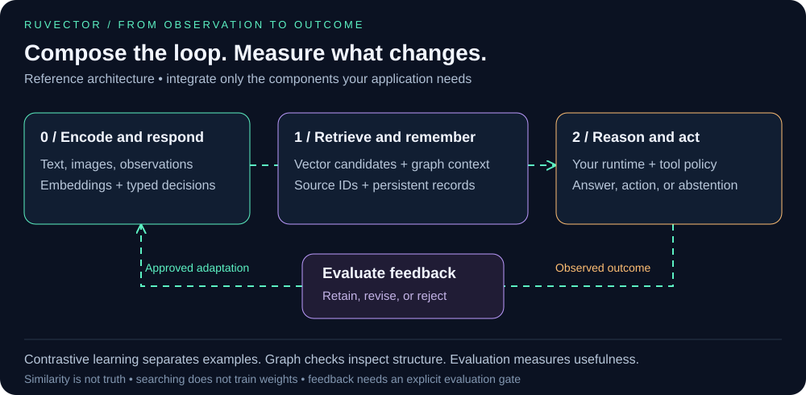
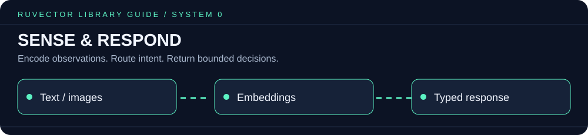
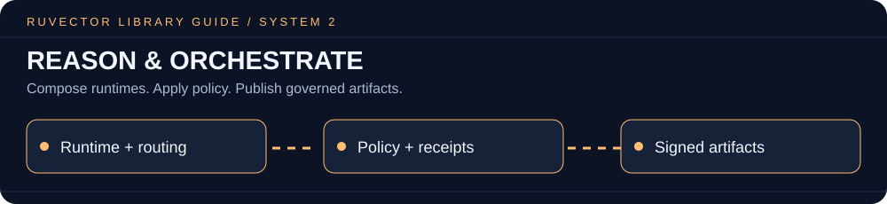

# RuVector tutorials and examples

[Quick starts](../README.md#quick-start-choose-your-track) · [Library catalog](../README.md#library-and-capability-map) · [Deployment](../README.md#deployment-surfaces)

Start with a language tutorial, then choose a system capability. Each example has its own dependencies and runtime requirements.

## Start with a working memory loop

| Track | Tutorial | What to verify |
| :--- | :--- | :--- |
| npm `ruvector` | [Node.js](./nodejs/README.md) | Write records, exit, and retrieve in another process |
| Python `ruvector` | [Python installation and SDK](../docs/python/README.md) | Save a collection, load it, and search |
| Rust `ruvector-core` | [Rust](./rust/README.md) | Insert, reopen the same store, and recover the record |
| Claude Code MCP | [Setup and project instructions](../README.md#claude-code-setup) | Connect and complete a permitted read |

## System 0: Sense and respond

* [Local ONNX embeddings](./onnx-embeddings/README.md)
* [ONNX embeddings in WASM](./onnx-embeddings-wasm/README.md)
* [Typed local decisions](../npm/packages/typesafe/README.md)
* [Browser search with React](./wasm-react/README.md)
* [Browser search with vanilla JavaScript](./wasm-vanilla/README.md)
* [Edge examples](./edge/README.md)

## System 1: Learn and remember

* [Graph queries and relationships](./graph/README.md)
* [Knowledge graph embeddings](../npm/packages/kge/README.md)
* [MinCut graph diagnostics](./mincut/README.md)
* [MRAgent memory reconstruction](./mragent/README.md)
* [SONA adaptation](../crates/sona/README.md)
* [Contrastive training](../crates/ruvllm/src/training/README.md)

## System 2: Reason and orchestrate

* [RuVLLM runtime](./ruvLLM/README.md)
* [Agent to agent swarm](./a2a-swarm/README.md)
* [REFRAG document pipeline](./refrag-pipeline/README.md)
* [RVF artifacts](./rvf/README.md)
* [Google Cloud deployment examples](./google-cloud/README.md)
* [Python Salesforce Agentforce](./python-salesforce-agentforce/README.md)

## Check before adopting an example

Use its documented setup directory, dependencies, and feature flags. Fixed or random vectors demonstrate API mechanics; semantic search requires a consistent embedding model. Compare learning changes against a frozen baseline on separate evaluation data. A successful tutorial run does not establish a production latency or accuracy guarantee.

[Research examples](./exo-ai-2025/README.md) · [Agentic version control](./agentic-jujutsu/README.md) · [Graph CLI guide](./docs/graph-cli-usage.md)
