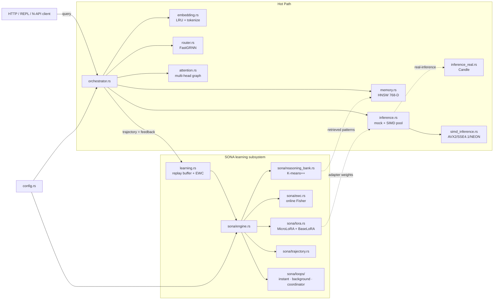
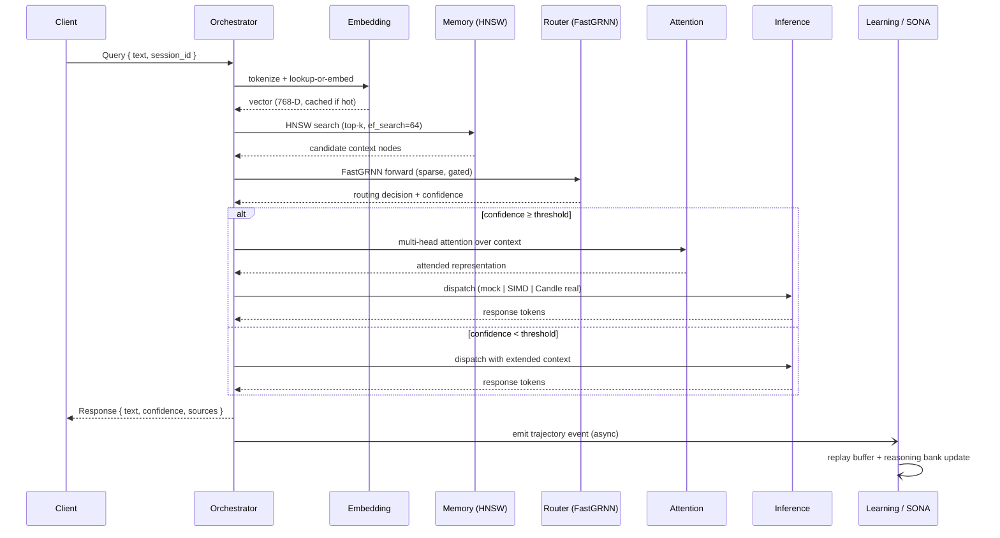
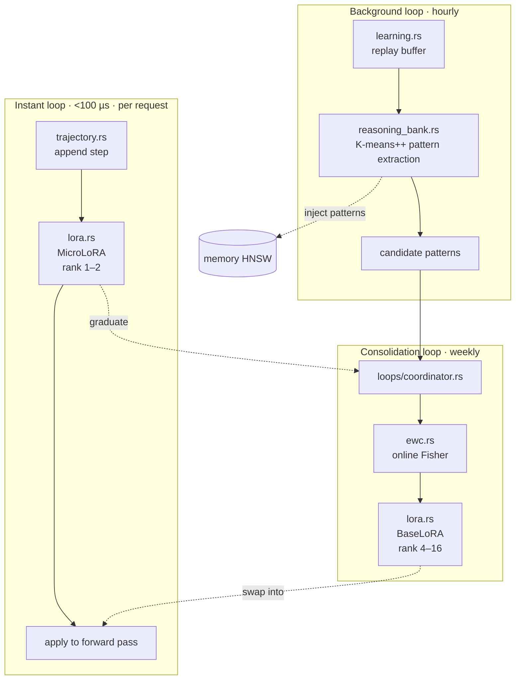

# System Architecture

How the components fit together, how a request flows through them, and how
the three temporal learning loops are arranged.

## Component Diagram

The orchestrator is the spine. Every other module is either a hot-path
dependency that the orchestrator calls per request, or a learning subsystem
that consumes events the orchestrator emits.

A few invariants the diagram encodes:

- The hot path is fully synchronous from the orchestrator's point of view —
  every box in `HotPath` returns within the sub-millisecond budget.
- Learning is decoupled. `learning.rs` and the `SONA` subsystem subscribe to
  events the orchestrator emits; they never block the request path.
- Adapter weights flow back into inference (`Lora -.-> Inf`) but only at safe
  swap points; the inline forward path uses whatever LoRA layer is currently
  active.
- The reasoning bank feeds memory by injecting distilled patterns as new
  vectors — they live in the same HNSW index as raw embeddings.

## Request Flow

What happens, in order, when a query arrives at `/query` or at the equivalent
library entry point.

Highlights:

- The embedding LRU is the first thing checked. Cache hits skip tokenization
  entirely.
- HNSW parameters (`m=16`, `ef_construction=100`, `ef_search=64`) trade off
  recall against latency. See [Configuration Guide](configuration-guide.md)
  for tuning.
- Router confidence below `confidence_threshold` (default 0.7) triggers a
  fallback path that pulls more context. This is the only branch in the
  hot path.
- The trajectory event posted to `learning.rs` is fire-and-forget — the
  orchestrator returns to the client before SONA touches it.

## SONA Learning Hierarchy

Three loops at three time scales. The instant loop runs inline; the
background loop runs as a tokio task; the coordinator runs on a long timer.

Why three loops:

- **Instant** has microseconds. It can only afford a rank-1 or rank-2 LoRA
  update. It captures per-request adaptation.
- **Background** has hours. It can afford K-means++ over the replay buffer
  to find recurring reasoning patterns and inject them into HNSW as
  distilled context.
- **Consolidation** has a week. It computes online Fisher Information across
  the accumulated MicroLoRA deltas and promotes the stable directions into
  BaseLoRA, which sits in the rank 4–16 range and only swaps in at safe
  points.

The full design lives in [SONA Overview](SONA/00-OVERVIEW.md) — start there
and follow the chapter sequence (`01`, `02`, …) for each component.

## Module Narratives

### `orchestrator.rs`

Owns the request pipeline. Holds Arc'd handles to each subsystem
(`Embedding`, `Memory`, `Router`, `Attention`, `Inference`, `Learning`),
threads a `Query` through them in order, and emits a trajectory event on
the way out. Stateless beyond those handles — every request is independent.

The orchestrator is also where the confidence-threshold branch lives: if the
router returns a confidence below the configured floor, the pipeline takes
the extended-context path instead of the standard one. This is the only
control-flow decision in the hot path.

### `embedding.rs`

Combines a tokenizer with an LRU cache keyed by token-stream hash. Cache
hits skip tokenization entirely. Cache misses run the tokenizer, then
project to the configured embedding dimension (default 768). The
implementation uses `dashmap` for the cache so concurrent requests do not
contend on a single mutex.

### `memory.rs`

Wraps an HNSW index over 768-D vectors. Three knobs in the config control
its behavior: `m` (graph connectivity), `ef_construction` (build quality),
`ef_search` (query quality). Inserts are batched and write-back is async via
the `writeback_batch_size` and `writeback_interval_ms` settings.

The HNSW implementation comes from `ruvector-core` (path dependency to
`../../crates/ruvector-core`). Distance kernels use `simsimd` 5.9 with
runtime SIMD detection.

### `router.rs`

A FastGRNN with sparse forward and adaptive gating. Input dim defaults to
128, hidden dim 64, sparsity 0.9 (90% of weights are zero on the hot path),
LoRA rank 8, confidence threshold 0.7. The router decides which inference
path to dispatch on and what attention pattern to apply.

The bench `benches/router.rs` exercises forward and training across dim
64–512 to track scaling behavior.

### `attention.rs`

Multi-head graph attention over the subgraph the router selected from
memory. Hidden width matches the embedding dimension (768-D). The bench
`benches/attention.rs` measures throughput on variable-size subgraphs to
catch quadratic-cost regressions.

### `inference.rs`, `inference_real.rs`, `simd_inference.rs`

Three layers, one dispatcher.

- `inference.rs` exposes the public dispatch API. It owns a SIMD pool and
  a mock backend for development without a real model.
- `simd_inference.rs` hosts the AVX2 / SSE4.1 / NEON kernels. Path is
  selected at runtime, never at compile time. `ruvllm-simd-demo` prints
  which path won.
- `inference_real.rs` is gated by the `real-inference` feature. It pulls
  in `candle-*` 0.8 and `hf-hub` 0.3 and runs the actual base model.

### `learning.rs`

The replay buffer plus the EWC consolidator plus the async writeback that
keeps them durable. This file is the bridge between the orchestrator's
fire-and-forget trajectory events and the SONA subsystem.

Defaults: `quality_threshold` 0.7 (only trajectories above this are
replayed), `replay_capacity` 10 000, `batch_size` 32, `learning_rate`
0.001, `ewc_lambda` 0.4, `training_interval_ms` 3 600 000 (one hour),
`min_samples` 100. See [Configuration Guide](configuration-guide.md) for
the tuning patterns.

### `compression.rs`

Quantization helpers used both by the host inference path (when q4 weights
are loaded) and by the ESP32 sub-crate (which embeds quantized weights at
build time). INT8, INT4, and binary modes share a common interface.

### `training.rs`

The pre-training driver. Used by the `ruvllm-pretrain` binary. Not on the
hot path — invoked offline.

### `napi.rs`

Node.js bindings, gated by the `napi` feature. Exposes a thin wrapper
around the orchestrator to JavaScript consumers. See
[API Reference](api-reference.md).

### SONA submodule (`src/sona/`)

The learning subsystem. Six files plus three loops:

| File | Role |
|---|---|
| `engine.rs` | Top-level SONA orchestrator. Wires together the trajectory store, reasoning bank, LoRA layers, and EWC. |
| `lora.rs` | MicroLoRA (rank 1–2, fast) and BaseLoRA (rank 4–16, stable). Both implement the same forward interface. |
| `ewc.rs` | Online Fisher Information accumulation and the EWC++ penalty term. |
| `reasoning_bank.rs` | K-means++ over reasoning trajectories. Distilled centroids become injected memory entries. |
| `trajectory.rs` | Per-request reasoning trace. Sub-microsecond append. |
| `loops/instant.rs` | The <1 ms inline path: trajectory append → MicroLoRA forward → ship. |
| `loops/background.rs` | Hourly task: walk the replay buffer, run K-means++, update reasoning bank. |
| `loops/coordinator.rs` | Weekly task: EWC++ Fisher pass, graduate stable MicroLoRA directions into BaseLoRA. |

Each file is documented in depth under `docs/SONA/`.

### `config.rs`, `error.rs`, `types.rs`

The plumbing layer. `config.rs` parses `config/example.toml` style files
into typed structs. `error.rs` defines the `thiserror` enum (see
[Code Standards](code-standards.md)). `types.rs` holds the shared
request/response types so they don't pull a circular import between
`orchestrator.rs` and the subsystems.

## Cross-Cutting Concerns

- **Concurrency.** The orchestrator can be called from many threads. All
  shared state goes through `dashmap`, `parking_lot::RwLock`, or
  per-task channels.
- **Backpressure.** `max_concurrent_requests` (default 10) caps inflight
  work so the SIMD pool and the inference backends do not get swamped.
- **Metrics.** The `metrics` feature enables Prometheus export; every
  subsystem above emits per-stage timing counters.
- **Persistence.** `storage` (default on) enables the on-disk HNSW
  store; without it the index is in-memory only.

## See also

- [SONA Overview](SONA/00-OVERVIEW.md)
- [Codebase Summary](codebase-summary.md)
- [Configuration Guide](configuration-guide.md)
- [API Reference](api-reference.md)
